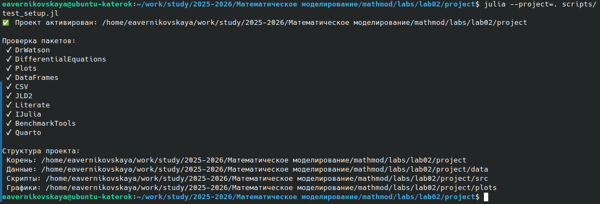
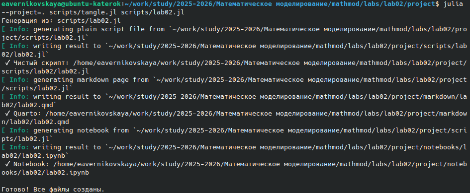
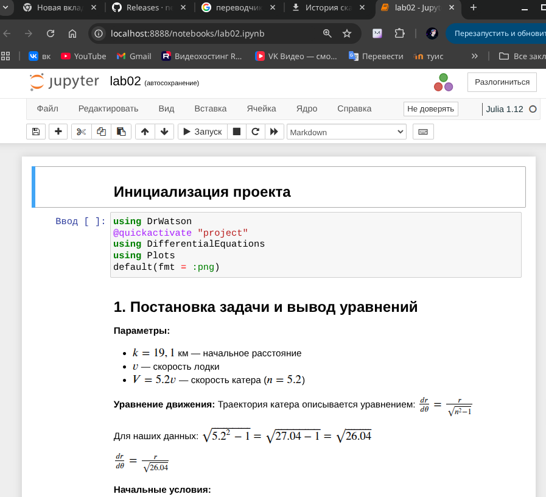

---
# Preamble

## Author
author:
  name: Верниковская Екатерина Андреевна
  degrees: DSc
  email: 11322361366@pfur.ru
  affiliation:
    - name: Российский университет дружбы народов
      country: Российская Федерация
      postal-code: 117198
      city: Москва
      address: ул. Миклухо-Маклая, д. 6

## Title
title: Отчёт по лабораторной работе №2
subtitle: Математическое моделирование
license: CC BY
date: 2026-05-03

## Generic options
lang: ru-RU
crossref:
  lof-title: Список иллюстраций
  lot-title: Список таблиц
  lol-title: Листинги

## Fonts 
mainfont: PT Serif 
romanfont: PT Serif 
sansfont: PT Sans 
monofont: PT Mono 
mainfontoptions: Ligatures=TeX 
romanfontoptions: Ligatures=TeX 
sansfontoptions: Ligatures=TeX,Scale=MatchLowercase 
monofontoptions: Scale=MatchLowercase,Scale=0.9

## Formats
format:
### Pdf output format
  beamer:
    toc: true
    toc-title: Содержание
    number-sections: true
    colorlinks: false
    toc-depth: 2
    slide_level: 2
    aspectratio: 169
    section-titles: true
    theme: metropolis
    themeoptions: progressbar=frametitle,sectionpage=progressbar,numbering=fraction
    pdf-engine: xelatex
    fontenc: T2A
#### Language
    babel-lang: russian
    babel-otherlangs: english

### Html output
  revealjs:
    transition: slide
    margin: 0.2
    smaller: false
    output-ext: html
    theme: beige
    logo: _resources/image/logo_rudn.png
---

# Вводная часть

## Цель работы

Решить задачу о погоне

## Задание

На море в тумане катер береговой охраны преследует лодку браконьеров. Через определенный промежуток времени туман рассеивается, и лодка обнаруживается на расстоянии 19,1 км от катера. Затем лодка снова скрывается в тумане и уходит прямолинейно в неизвестном направлении. Известно, что скорость катера в 5,2 раза больше скорости браконьерской лодки.

1. Запиcать уравнение, описывающее движение катера, с начальными условиями для двух случаев (в зависимости от расположения катера относительно лодки в начальный момент времени)
2. Построить траекторию движения катера и лодки для двух случаев
3. Найти точку пересечения траектории катера и лодки 

# Выполнение лабораторной работы

## Создание проекта для лабораторной работы

{#fig-001 width=90%}

## Решение задачи

{#fig-002 width=20%}

## Решение задачи

{#fig-003 width=80%}

## Решение задачи

{#fig-004 width=40%}

## Решение задачи

{#fig-005 width=90%}

## Решение задачи

{#fig-006 width=70%}

## Решение задачи

{#fig-007 width=70%}

## Решение задачи

{#fig-008 width=70%}

## Решение задачи

{#fig-009 width=50%}

# Подведение итогов

## Выводы

В ходе выполнения лабораторной работы №2 мы решили задачу о погоне (варинат 67). Записали уравнение, описывающее движение катера, с начальными условиями, построили графики траектории движения катера и лодки и нашли точки пересечения траектории катера и лодки (всё для 2х случаев)

## Список литературы

1. [Лаборатораня работа №2](https://esystem.rudn.ru/pluginfile.php/3094827/mod_resource/content/2/%D0%9B%D0%B0%D0%B1%D0%BE%D1%80%D0%B0%D1%82%D0%BE%D1%80%D0%BD%D0%B0%D1%8F%20%D1%80%D0%B0%D0%B1%D0%BE%D1%82%D0%B0%20%E2%84%96%201.pdf)

2. [Варианты заданий](https://esystem.rudn.ru/pluginfile.php/3094828/mod_resource/content/2/%D0%97%D0%B0%D0%B4%D0%B0%D0%BD%D0%B8%D0%B5%20%D0%BA%20%D0%BB%D0%B0%D0%B1%D0%BE%D1%80%D0%B0%D1%82%D0%BE%D1%80%D0%BD%D0%BE%D0%B9%20%D1%80%D0%B0%D0%B1%D0%BE%D1%82%D0%B5%20%E2%84%96%205%20%281%29.pdf)
