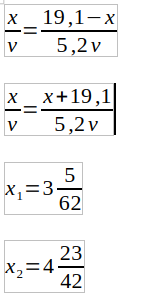
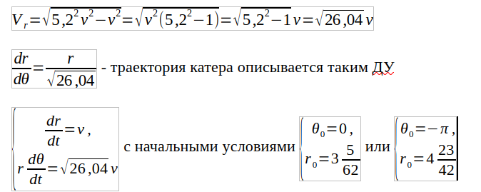
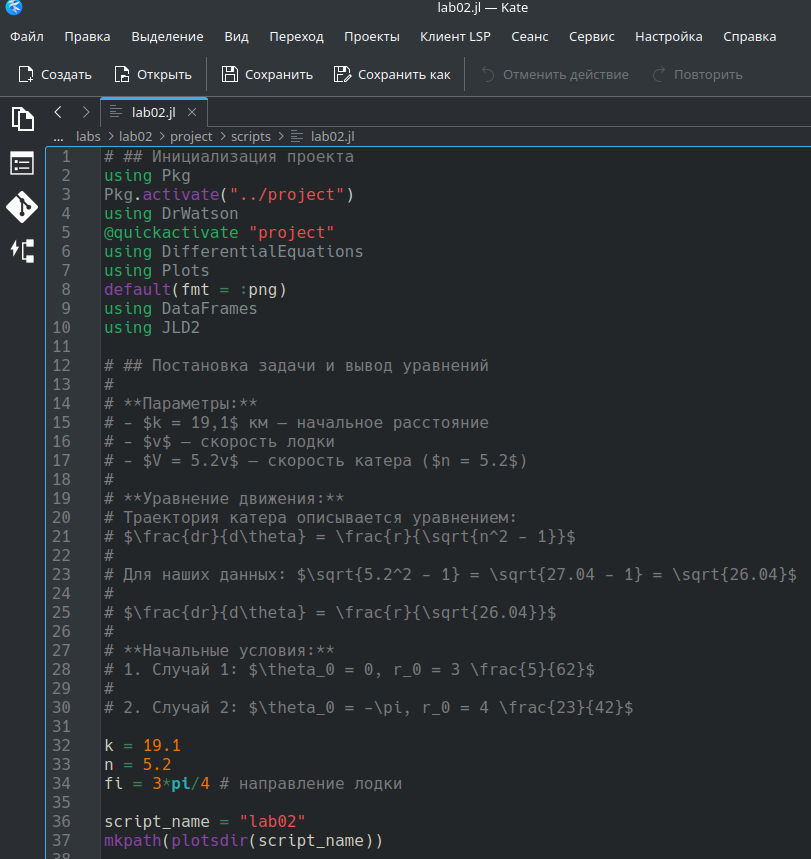
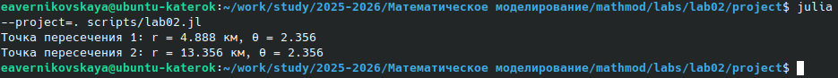
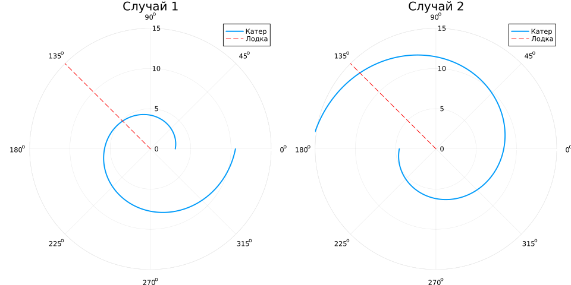
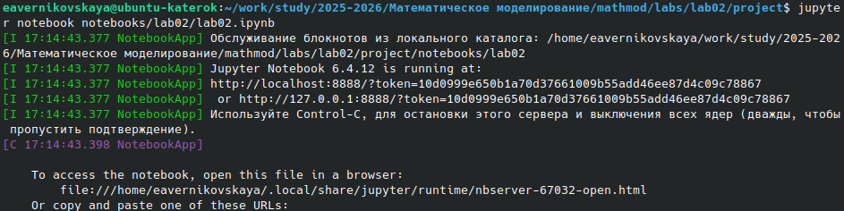

---
## Author
author:
  name: Верниковская Екатерина Андреевна
  degrees: DSc
  orcid: 0000-0002-0877-7063
  email: kulyabov-ds@rudn.ru
  affiliation:
    - name: Российский университет дружбы народов
      country: Российская Федерация
      postal-code: 117198
      city: Москва
      address: ул. Миклухо-Маклая, д. 6

## Title
title: "Отчёт по лабораторной работе №2"
subtitle: "Дисциплина: Математическое моделирование"
license: "CC BY"
---

# Цель работы

Решить задачу о погоне

# Задание

Вариант 67.

На море в тумане катер береговой охраны преследует лодку браконьеров. Через определенный промежуток времени туман рассеивается, и лодка обнаруживается на расстоянии 19,1 км от катера. Затем лодка снова скрывается в тумане и уходит прямолинейно в неизвестном направлении. Известно, что скорость катера в 5,2 раза больше скорости браконьерской лодки.

1. Запиcать уравнение, описывающее движение катера, с начальными условиями для двух случаев (в зависимости от расположения катера относительно лодки в начальный момент времени)
2. Построить траекторию движения катера и лодки для двух случаев
3. Найти точку пересечения траектории катера и лодки 

# Выполнение лабораторной работы

## Создание проекта для лабораторной работы

Создали проект и проверили структуру рабочего каталога ([рис. @fig-001])

{#fig-001 width=70%}

## Решение задачи

Траектория катера должна быть такой, чтобы и катер, и лодка все время были на одном расстоянии от полюса, только в этом случае траектория катера пересечется с траекторией лодки.

Поэтому для начала катер береговой охраны должен двигаться некоторое время прямолинейно, пока не окажется на том же расстоянии от полюса, что и лодка браконьеров. После этого катер береговой охраны должен двигаться вокруг полюса удаляясь от него с той же скоростью, что и лодка браконьеров.

Чтобы найти расстояние x (расстояние после которого катер начнет двигаться вокруг полюса), необходимо составить простое уравнение. Пусть через время t катер и лодка окажутся на одном расстоянии x от полюса. За это время лодка пройдет x, а катер k-x (или k+x, в зависимости от начального положения катера относительно полюса). Время, за которое они пройдут это расстояние, вычисляется как x/v или k-x/2v (во втором  случае x+k/2v ). Так как время одно и то же, то эти величины одинаковы. Тогда неизвестное расстояние x можно найти из следующего уравнения ([рис. @fig-002]):

{#fig-002 width=70%}

После того, как катер береговой охраны окажется на одном расстоянии от полюса, что и лодка, он должен сменить прямолинейную траекторию и начать двигаться вокруг полюса удаляясь от него со скоростью лодки v. Для этого скорость катера раскладываем на две составляющие: радиальная скорость и тангенциальная скорость. Радиальная скорость - это скорость, с которой катер удаляется от полюса. Нам нужно, чтобы эта скорость была равна скорости лодки, поэтому полагаем dr/dt=v. Тангенциальная скорость – это линейная скорость вращения катера относительно полюса. Она равна произведению угловой скорости d(theta)/dt на радиус r. Решение исходной задачи сводится к решению системы из двух
дифференциальных уравнений ([рис. @fig-003]): 

{#fig-003 width=70%}

Далее написали код (lab02.jl) на языке Julia ([рис. @fig-004]):

```
using Pkg
Pkg.activate("../project")
using DrWatson
@quickactivate "project"
using DifferentialEquations
using Plots
default(fmt = :png)
using DataFrames
using JLD2

k = 19.1
n = 5.2
fi = 3*pi/4 # направление лодки

script_name = "lab02"
mkpath(plotsdir(script_name))

# Функция ДУ
function f(r, p, theta)
    return r / sqrt(n^2 - 1)
end

r0_1 = k / (n + 1)
tspan1 = (0.0, 2*pi)
prob1 = ODEProblem(f, r0_1, tspan1)
sol1 = solve(prob1, Tsit5(), saveat=0.01)

r0_2 = k / (n - 1)
tspan2 = (-pi, pi)
prob2 = ODEProblem(f, r0_2, tspan2)
sol2 = solve(prob2, Tsit5(), saveat=0.01)

# Данные для траектории лодки
theta_boat = [fi, fi]
r_boat = [0, 15]

# График 1
p1 = plot(sol1.t, sol1.u, proj=:polar, lims=(0,15), title="Случай 1", label="Катер", lw=2)
plot!(p1, theta_boat, r_boat, label="Лодка", linestyle=:dash, color=:red)

# График 2
p2 = plot(sol2.t, sol2.u, proj=:polar, lims=(0,15), title="Случай 2", label="Катер", lw=2)
plot!(p2, theta_boat, r_boat, label="Лодка", linestyle=:dash, color=:red)

final_plot = plot(p1, p2, layout=(1,2), size=(1000, 500))

# Точки пересечения:
r_meet1 = sol1(fi)
r_meet2 = sol2(fi)

println("Точка пересечения 1: r = ", round(r_meet1, digits=3), " км, θ = ", round(fi, digits=3))
println("Точка пересечения 2: r = ", round(r_meet2, digits=3), " км, θ = ", round(fi, digits=3))

# Сохранение графика
savefig(final_plot, plotsdir(script_name, "result.png"))
```

{#fig-004 width=70%}

Далее выполнили код командой ```julia --project=. scripts/lab02.jl``` и посмотрели результирующие графики в каталоге *plots/* ([рис. @fig-005]), ([рис. @fig-006])

{#fig-005 width=70%}

{#fig-006 width=70%}

Создали производные форматы: ```julia --project=. scripts/tangle.jl scripts/lab02.jl``` ([рис. @fig-007])

{#fig-007 width=70%}

Далее выполнили Jupyter-ноутбук командой: ```jupyter notebook notebooks/lab02/lab02.ipynb``` ([рис. @fig-008]), ([рис. @fig-009])

{#fig-008 width=70%}

{#fig-009 width=70%}



# Выводы

В ходе выполнения лабораторной работы №2 мы решили задачу о погоне (варинат 67). Записали уравнение, описывающее движение катера, с начальными условиями, построили графики траектории движения катера и лодки и нашли точки пересечения траектории катера и лодки (всё для 2х случаев)

# Список литературы

1. [Лаборатораня работа №2](https://esystem.rudn.ru/pluginfile.php/3094827/mod_resource/content/2/%D0%9B%D0%B0%D0%B1%D0%BE%D1%80%D0%B0%D1%82%D0%BE%D1%80%D0%BD%D0%B0%D1%8F%20%D1%80%D0%B0%D0%B1%D0%BE%D1%82%D0%B0%20%E2%84%96%201.pdf)

2. [Варианты заданий](https://esystem.rudn.ru/pluginfile.php/3094828/mod_resource/content/2/%D0%97%D0%B0%D0%B4%D0%B0%D0%BD%D0%B8%D0%B5%20%D0%BA%20%D0%BB%D0%B0%D0%B1%D0%BE%D1%80%D0%B0%D1%82%D0%BE%D1%80%D0%BD%D0%BE%D0%B9%20%D1%80%D0%B0%D0%B1%D0%BE%D1%82%D0%B5%20%E2%84%96%205%20%281%29.pdf)
