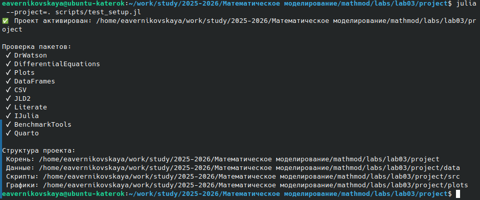
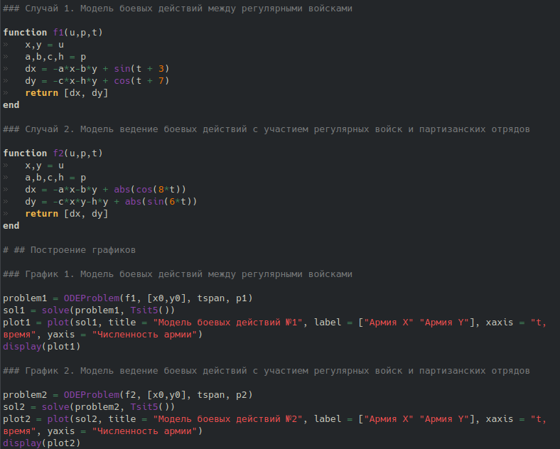
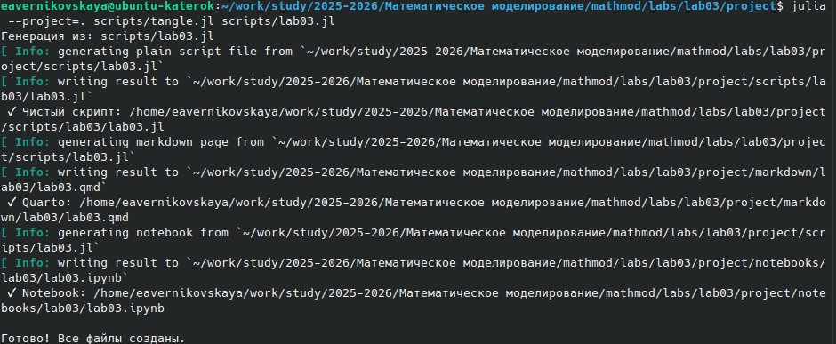

---
# Preamble

title: Колебания цепочек
subtitle: Групповой проект. Этап 1.
author:
  - Дворкина Е.В.,
  - Чемоданова А.А.,
  - Серёгина И.А.,
  - Волгин И.А.,
  - Александрова У.В.,
  - Голощапов Я.В.
institute:
  - Российский университет дружбы народов, Москва, Россия
date: 19 марта 2025

## Generic options
lang: ru-RU
crossref:
  lof-title: Список иллюстраций
  lot-title: Список таблиц
  lol-title: Листинги

## Fonts 
mainfont: PT Serif 
romanfont: PT Serif 
sansfont: PT Sans 
monofont: PT Mono 
mainfontoptions: Ligatures=TeX 
romanfontoptions: Ligatures=TeX 
sansfontoptions: Ligatures=TeX,Scale=MatchLowercase 
monofontoptions: Scale=MatchLowercase,Scale=0.9

## Formats
format:
### Pdf output format
  beamer:
    toc: true
    toc-title: Содержание
    number-sections: true
    colorlinks: false
    toc-depth: 2
    slide_level: 2
    aspectratio: 169
    section-titles: true
    theme: metropolis
    themeoptions: progressbar=frametitle,sectionpage=progressbar,numbering=fraction
    pdf-engine: xelatex
    fontenc: T2A
#### Language
    babel-lang: russian
    babel-otherlangs: english

### Html output
  revealjs:
    transition: slide
    margin: 0.2
    smaller: false
    output-ext: html
    theme: beige
    logo: _resources/image/logo_rudn.png
---

# Вводная часть

## Цель работы

Решить задачу о боевых действях. Построить графики изменения численности войск армии Х и армии У для двух случаев

## Задание

Между страной Х и страной У идет война. Численность состава войск исчисляется от начала войны, и являются временными функциями x(t) и y(t). В начальный момент времени страна Х имеет армию численностью 44 200 человек, а в распоряжении страны У армия численностью в 54 100 человек. Для упрощения модели считаем, что коэффициенты a, b, c, h постоянны. Также считаем P(t) и Q(t) непрерывные функции

## Задание

Построить графики изменения численности войск армии Х и армии У для следующих случаев:

1. Модель боевых действий между регулярными войсками  
  $\frac{\partial x}{\partial t} = -0,312x(t)-0,456y(t)+sin(t+3)$  
  $\frac{\partial y}{\partial t} = -0,256x(t)-0,34y(t)+cos(t+7)$

2. Модель ведение боевых действий с участием регулярных войск и партизанских отрядов  
  $\frac{\partial x}{\partial t} = -0,318x(t)-0,615y(t)+|cos(8t)|$  
  $\frac{\partial y}{\partial t} = -0,312x(t)y(t)-0,512y(t)+|sin(6t)|$

# Выполнение лабораторной работы

## Создание проекта для лабораторной работы

{#fig-001 width=90%}

## Решение задачи

{#fig-002 width=60%}

## Решение задачи

{#fig-003 width=70%}

## Решение задачи

{#fig-004 width=70%}

## Решение задачи

{#fig-005 width=70%}

## Решение задачи

{#fig-006 width=70%}

## Решение задачи

{#fig-007 width=50%}

# Подведение итогов

## Выводы

В ходе выполнения лабораторной работы №2 мы решили задачу о боевых действиях (варинат 67). Построили графики изменения численности войск армии Х и армии У для двух случаев

## Список литературы

1. [Лаборатораня работа №3](https://esystem.rudn.ru/pluginfile.php/3094831/mod_resource/content/2/%D0%9B%D0%B0%D0%B1%D0%BE%D1%80%D0%B0%D1%82%D0%BE%D1%80%D0%BD%D0%B0%D1%8F%20%D1%80%D0%B0%D0%B1%D0%BE%D1%82%D0%B0%20%E2%84%96%202.pdf)

2. [Варианты заданий](https://esystem.rudn.ru/pluginfile.php/3094832/mod_resource/content/2/%D0%9B%D0%B0%D0%B1%D0%BE%D1%80%D0%B0%D1%82%D0%BE%D1%80%D0%BD%D0%B0%D1%8F%20%D1%80%D0%B0%D0%B1%D0%BE%D1%82%D0%B0%20%E2%84%96%204.pdf)
