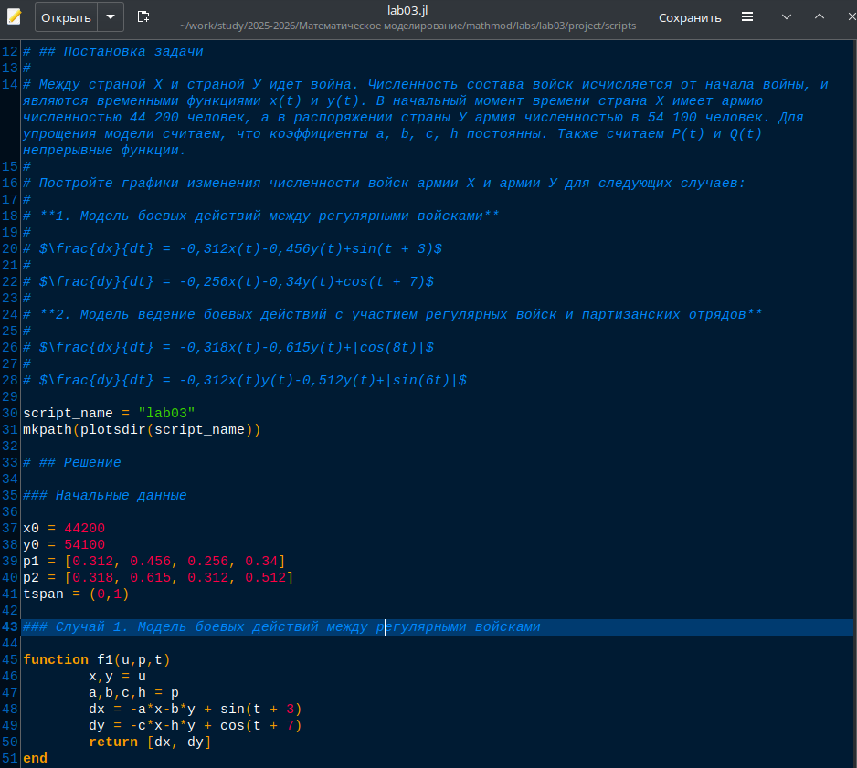
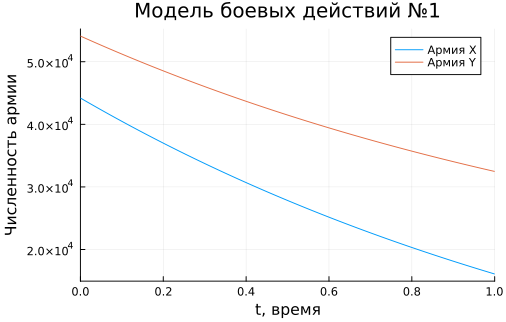
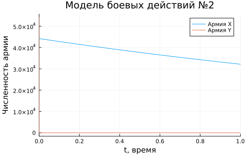
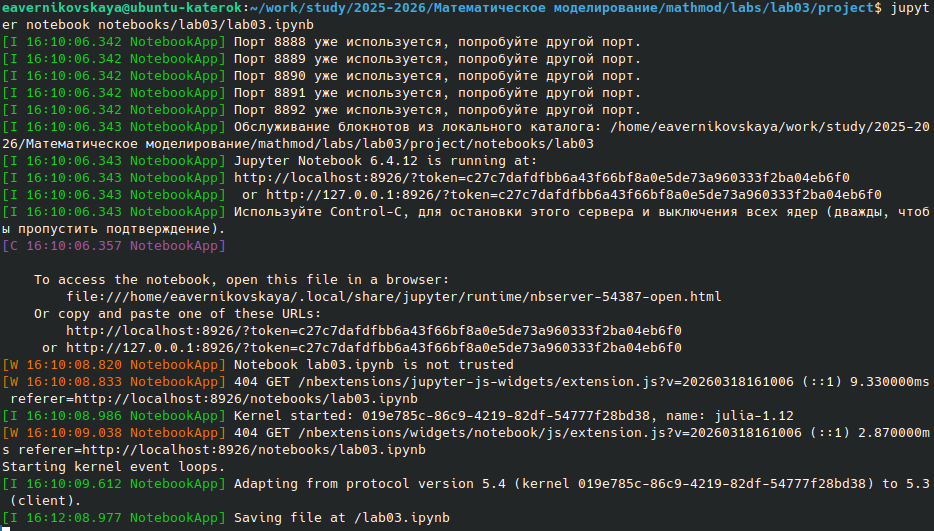
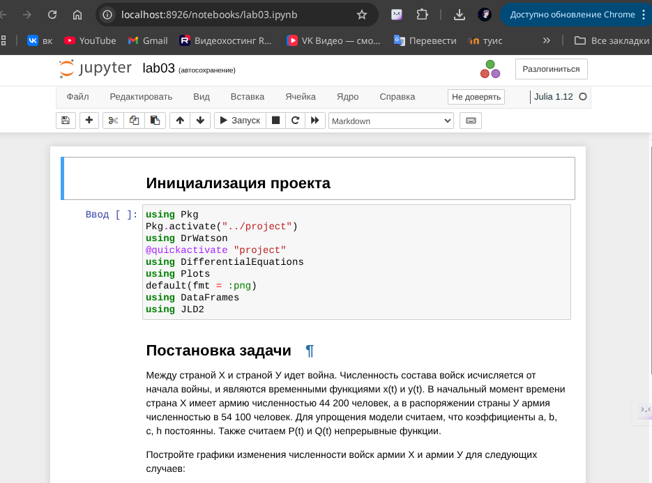

---
## Author
author:
  name: Верниковская Екатерина Андреевна
  degrees: DSc
  orcid: 0000-0002-0877-7063
  email: kulyabov-ds@rudn.ru
  affiliation:
    - name: Российский университет дружбы народов
      country: Российская Федерация
      postal-code: 117198
      city: Москва
      address: ул. Миклухо-Маклая, д. 6

## Title
title: "Отчёт по лабораторной работе №3"
subtitle: "Дисциплина: Математическое моделирование"
license: "CC BY"
---

# Цель работы

Решить задачу о боевых действях. Построить графики изменения численности войск армии Х и армии У для двух случаев

# Задание

Вариант 67.

Между страной Х и страной У идет война. Численность состава войск исчисляется от начала войны, и являются временными функциями x(t) и y(t). В начальный момент времени страна Х имеет армию численностью 44 200 человек, а в распоряжении страны У армия численностью в 54 100 человек. Для упрощения модели считаем, что коэффициенты a, b, c, h постоянны. Также считаем P(t) и Q(t) непрерывные функции

Построить графики изменения численности войск армии Х и армии У для следующих случаев:


1. Модель боевых действий между регулярными войсками  
  $\frac{\partial x}{\partial t} = -0,312x(t)-0,456y(t)+sin(t+3)$  
  $\frac{\partial y}{\partial t} = -0,256x(t)-0,34y(t)+cos(t+7)$

2. Модель ведение боевых действий с участием регулярных войск и партизанских отрядов  
  $\frac{\partial x}{\partial t} = -0,318x(t)-0,615y(t)+|cos(8t)|$  
  $\frac{\partial y}{\partial t} = -0,312x(t)y(t)-0,512y(t)+|sin(6t)|$

# Выполнение лабораторной работы

## Создание проекта для лабораторной работы

Создали проект и проверили структуру рабочего каталога ([рис. @fig-001])

{#fig-001 width=70%}

## Решение задачи

Написали код (lab03.jl) на языке Julia ([рис. @fig-002]):

```
using Pkg
Pkg.activate("../project")
using DrWatson
@quickactivate "project"
using DifferentialEquations
using Plots
default(fmt = :png)
using DataFrames
using JLD2

script_name = "lab03"
mkpath(plotsdir(script_name))

### Начальные данные

x0 = 44200
y0 = 54100
p1 = [0.312, 0.456, 0.256, 0.34]
p2 = [0.318, 0.615, 0.312, 0.512]
tspan = (0,1)

### Случай 1. Модель боевых действий между регулярными войсками

function f1(u,p,t)
	x,y = u
	a,b,c,h = p
	dx = -a*x-b*y + sin(t + 3)
	dy = -c*x-h*y + cos(t + 7)
	return [dx, dy]
end

### Случай 2. Модель ведение боевых действий с участием регулярных войск и партизанских отрядов

function f2(u,p,t)
	x,y = u
	a,b,c,h = p
	dx = -a*x-b*y + abs(cos(8*t))
	dy = -c*x*y-h*y + abs(sin(6*t))
	return [dx, dy]
end

### График 1. Модель боевых действий между регулярными войсками

problem1 = ODEProblem(f1, [x0,y0], tspan, p1)
sol1 = solve(problem1, Tsit5())
plot1 = plot(sol1, title = "Модель боевых действий №1", label = ["Армия X" "Армия Y"], xaxis = "t, время", yaxis = "Численность армии")
display(plot1)

### График 2. Модель ведение боевых действий с участием регулярных войск и партизанских отрядов

problem2 = ODEProblem(f2, [x0,y0], tspan, p2)
sol2 = solve(problem2, Tsit5())
plot2 = plot(sol2, title = "Модель боевых действий №2", label = ["Армия X" "Армия Y"], xaxis = "t, время", yaxis = "Численность армии")
display(plot2)

savefig(plot1, plotsdir(script_name, "result1.png"))
savefig(plot2, plotsdir(script_name, "result2.png"))
```

{#fig-002 width=70%}

Далее выполнили код командой ```julia --project=. scripts/lab03.jl``` и посмотрели результирующие графики в каталоге *plots/* ([рис. @fig-003]), ([рис. @fig-004])

{#fig-003 width=70%}

{#fig-004 width=70%}

По первому графику видно, что при данных параметрах модели армия Y побеждает армию X. По второму графику видно, что побеждает армия X, а численность армии Y падает до 0 почти с самого начала и быстро

Создали производные форматы: ```julia --project=. scripts/tangle.jl scripts/lab03.jl``` ([рис. @fig-005])

{#fig-005 width=70%}

Далее выполнили Jupyter-ноутбук командой: ```jupyter notebook notebooks/lab03/lab03.ipynb``` ([рис. @fig-006]), ([рис. @fig-007])

{#fig-006 width=70%}

{#fig-007 width=70%}



# Выводы

В ходе выполнения лабораторной работы №2 мы решили задачу о боевых действиях (варинат 67). Построили графики изменения численности войск армии Х и армии У для двух случаев

# Список литературы

1. [Лаборатораня работа №3](https://esystem.rudn.ru/pluginfile.php/3094831/mod_resource/content/2/%D0%9B%D0%B0%D0%B1%D0%BE%D1%80%D0%B0%D1%82%D0%BE%D1%80%D0%BD%D0%B0%D1%8F%20%D1%80%D0%B0%D0%B1%D0%BE%D1%82%D0%B0%20%E2%84%96%202.pdf)

2. [Варианты заданий](https://esystem.rudn.ru/pluginfile.php/3094832/mod_resource/content/2/%D0%9B%D0%B0%D0%B1%D0%BE%D1%80%D0%B0%D1%82%D0%BE%D1%80%D0%BD%D0%B0%D1%8F%20%D1%80%D0%B0%D0%B1%D0%BE%D1%82%D0%B0%20%E2%84%96%204.pdf)
