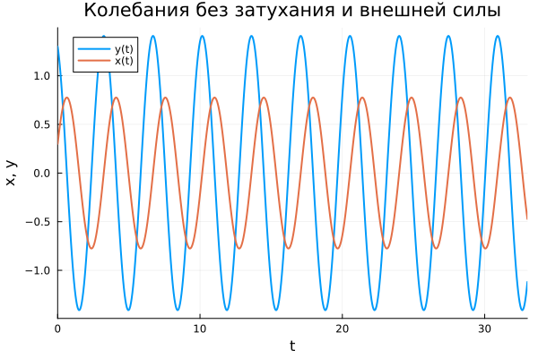
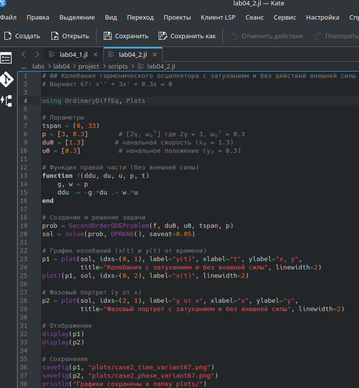
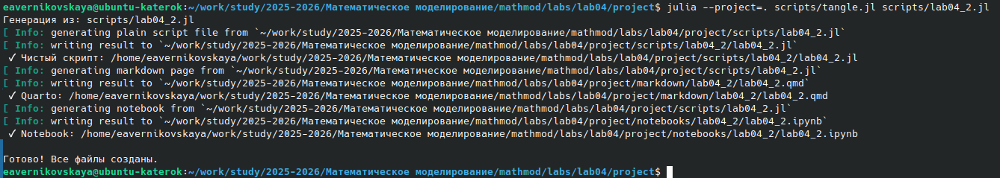
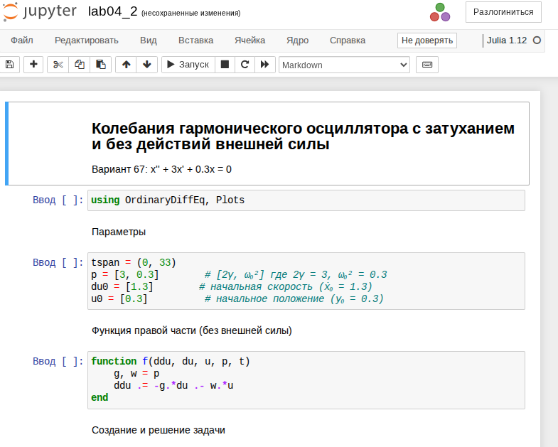
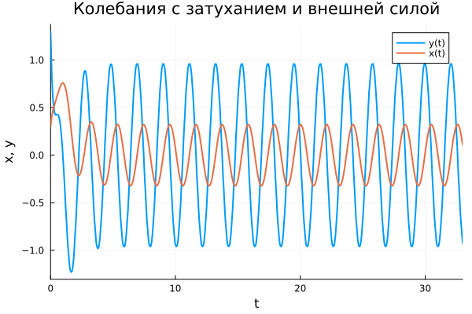
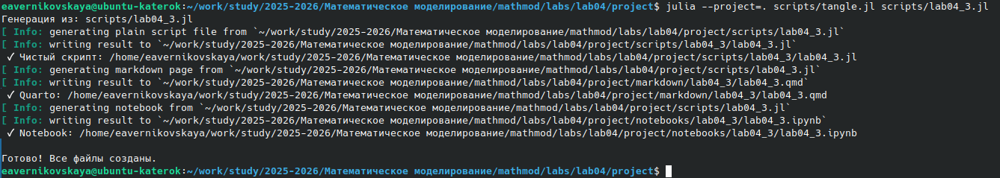
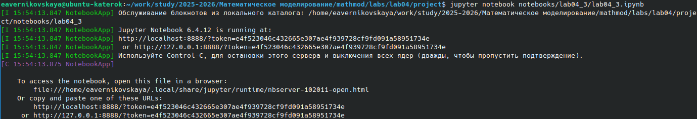

---
# Preamble

## Author
author:
  name: Верниковская Екатерина Андреевна
  degrees: DSc
  email: 11322361366@pfur.ru
  affiliation:
    - name: Российский университет дружбы народов
      country: Российская Федерация
      postal-code: 117198
      city: Москва
      address: ул. Миклухо-Маклая, д. 6

## Title
title: Отчёт по лабораторной работе №4
subtitle: Математическое моделирование
license: CC BY
date: 2026-04-02

## Generic options
lang: ru-RU
crossref:
  lof-title: Список иллюстраций
  lot-title: Список таблиц
  lol-title: Листинги

## Fonts
mainfont: PT Serif
romanfont: PT Serif
sansfont: PT Sans
monofont: PT Mono
mainfontoptions: Ligatures=TeX
romanfontoptions: Ligatures=TeX
sansfontoptions: Ligatures=TeX,Scale=MatchLowercase
monofontoptions: Scale=MatchLowercase,Scale=0.9

## Formats
format:
### Pdf output format
  beamer:
    toc: true
    toc-title: Содержание
    number-sections: true
    colorlinks: false
    toc-depth: 2
    slide_level: 2
    aspectratio: 169
    section-titles: true
    theme: metropolis
    themeoptions: progressbar=frametitle,sectionpage=progressbar,numbering=fraction
    pdf-engine: xelatex
    fontenc: T2A
#### Language
    babel-lang: russian
    babel-otherlangs: english

### Html output
  revealjs:
    transition: slide
    margin: 0.2
    smaller: false
    output-ext: html
    theme: beige
    logo: _resources/image/logo_rudn.png
---

# Вводная часть

## Цель работы

Изучить модель линейного гармонического осциллятора и исследовать его динамику при различных параметрах системы

## Задание

Вариант 67.

Построить фазовый портрет гармонического осциллятора и решение уравнения гармонического осциллятора для следующих случаев:

1. Колебания гармонического осциллятора без затуханий и без действий внешней силы x'' + 3.3x = 0

2. Колебания гармонического осциллятора c затуханием и без действий внешней силы x'' + 3x' + 0.3x = 0

3. Колебания гармонического осциллятора c затуханием и под действием внешней силы x'' + 3.3x' + 3x = 3.3sin(3t)

На интервале $t \in [0; 33]$ (шаг 0.05) с начальными условиями $x_0$ = 1.3, $y_0$ = 0.3

# Выполнение лабораторной работы

## Создание проекта для лабораторной работы

{#fig-001 width=90%}

## Решение задачи №1

{#fig-002 width=50%}

## Решение задачи №1

{#fig-003 width=70%}

## Решение задачи №1

{#fig-004 width=70%}

## Решение задачи №1

{#fig-005 width=90%}

## Решение задачи №1

{#fig-006 width=90%}

## Решение задачи №1

{#fig-007 width=60%}

## Решение задачи №2

{#fig-008 width=40%}

## Решение задачи №2

{#fig-009 width=70%}

## Решение задачи №2

{#fig-010 width=70%}

## Решение задачи №2

{#fig-011 width=90%}

## Решение задачи №2

{#fig-012 width=90%}

## Решение задачи №2

{#fig-013 width=60%}

## Решение задачи №3

{#fig-014 width=40%}

## Решение задачи №3

{#fig-015 width=70%}

## Решение задачи №3

{#fig-016 width=70%}

## Решение задачи №3

{#fig-017 width=90%}

## Решение задачи №3

{#fig-018 width=90%}

## Решение задачи №3

{#fig-019 width=70%}

# Подведение итогов

## Выводы

В ходе выполнения лабораторной работы №4 мы изучили модель линейного гармонического осциллятора и исследовали его динамику при различных параметрах системы

## Список литературы

1. [Лаборатораня работа №4](https://esystem.rudn.ru/pluginfile.php/3094835/mod_resource/content/2/%D0%9B%D0%B0%D0%B1%D0%BE%D1%80%D0%B0%D1%82%D0%BE%D1%80%D0%BD%D0%B0%D1%8F%20%D1%80%D0%B0%D0%B1%D0%BE%D1%82%D0%B0%20%E2%84%96%203.pdf)

2. [Варианты заданий](https://esystem.rudn.ru/pluginfile.php/3094836/mod_resource/content/3/%D0%97%D0%B0%D0%B4%D0%B0%D0%BD%D0%B8%D0%B5%20%D0%BA%20%D0%9B%D0%B0%D0%B1%D0%BE%D1%80%D0%B0%D1%82%D0%BE%D1%80%D0%BD%D0%BE%D0%B9%20%D1%80%D0%B0%D0%B1%D0%BE%D1%82%D0%B5%20%E2%84%96%201%20%281%29.pdf)
