---
## Author
author:
  name: Верниковская Екатерина Андреевна
  degrees: DSc
  orcid: 0000-0002-0877-7063
  email: kulyabov-ds@rudn.ru
  affiliation:
    - name: Российский университет дружбы народов
      country: Российская Федерация
      postal-code: 117198
      city: Москва
      address: ул. Миклухо-Маклая, д. 6

## Title
title: "Отчёт по лабораторной работе №4"
subtitle: "Дисциплина: Математическое моделирование"
license: "CC BY"
---

# Цель работы

Изучить модель линейного гармонического осциллятора и исследовать его динамику при различных параметрах системы

# Задание

Вариант 67.

Построить фазовый портрет гармонического осциллятора и решение уравнения гармонического осциллятора для следующих случаев:

1. Колебания гармонического осциллятора без затуханий и без действий внешней силы x'' + 3.3x = 0

2. Колебания гармонического осциллятора c затуханием и без действий внешней силы x'' + 3x' + 0.3x = 0

3. Колебания гармонического осциллятора c затуханием и под действием внешней силы x'' + 3.3x' + 3x = 3.3sin(3t)

На интервале $t \in [0; 33]$ (шаг 0.05) с начальными условиями $x_0$ = 1.3, $y_0$ = 0.3

# Выполнение лабораторной работы

## Создание проекта для лабораторной работы

Создали проект и проверили структуру рабочего каталога ([рис. @fig-001])

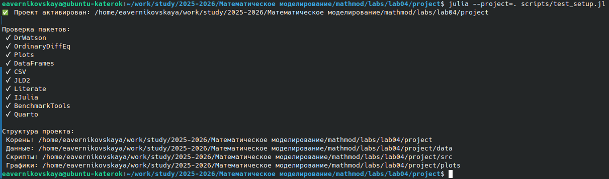{#fig-001 width=70%}

## Решение задачи №1

Написали код (lab04_1.jl) на языке Julia ([рис. @fig-002]):

```
# ## Колебания гармонического осциллятора без затуханий и без действий внешней силы
# Вариант 67: x'' + 3.3x = 0

using DrWatson
@quickactivate "project"
using OrdinaryDiffEq
using Plots
default(fmt = :png)

# Настройки графики для Quarto
gr()
default(fmt = :png, size = (800, 450))

# Параметры
tspan = (0, 33)
p = [0, 3.3]        # [2γ, ω₀²] где 2γ = 0, ω₀² = 3.3
du0 = [1.3]        # начальная скорость (ẋ₀ = 1.3)
u0 = [0.3]          # начальное положение (y₀ = 0.3)

# Функция правой части (без внешней силы)
function f(ddu, du, u, p, t)
    g, w = p
    ddu .= -g.*du .- w.*u
end

# Создание и решение задачи
prob = SecondOrderODEProblem(f, du0, u0, tspan, p)
sol = solve(prob, DPRKN6(), saveat=0.05)

# График колебаний (x(t) и y(t) от времени)
p1 = plot(sol, idxs=(0, 1), label="y(t)", xlabel="t", ylabel="x, y",
          title="Колебания без затухания и внешней силы", linewidth=2)
plot!(p1, sol, idxs=(0, 2), label="x(t)", linewidth=2)

# Фазовый портрет (y от x)
p2 = plot(sol, idxs=(2, 1), label="y от x", xlabel="x", ylabel="y",
          title="Фазовый портрет без затухания и внешней силы", linewidth=2)

# Сохранение
mkpath(plotsdir("lab04_1"))
savefig(p1, plotsdir("lab04_1", "case1_time_variant67.png"))
savefig(p2, plotsdir("lab04_1", "case1_phase_variant67.png"))
```

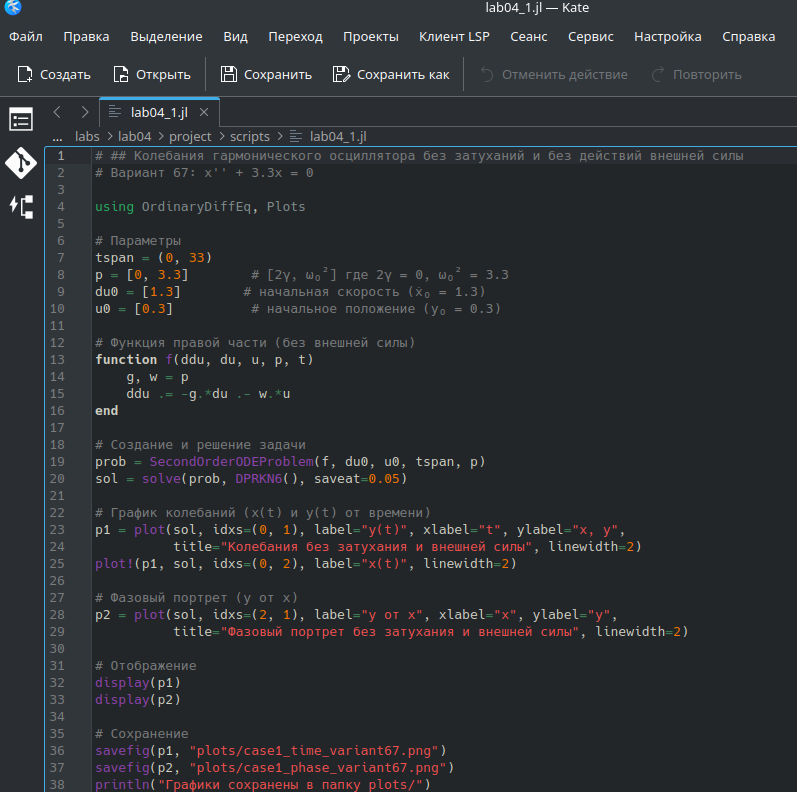{#fig-002 width=70%}

Далее выполнили код командой ```julia --project=. scripts/lab04_1.jl``` и посмотрели результирующие графики в каталоге *plots/* ([рис. @fig-003]), ([рис. @fig-004])

{#fig-003 width=70%}

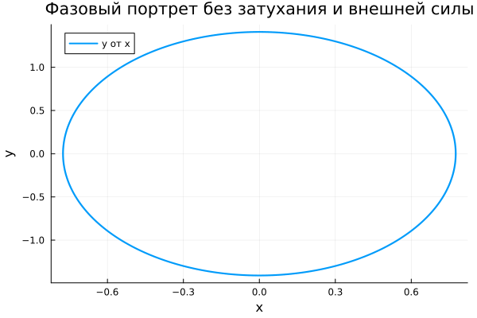{#fig-004 width=70%}

Создали производные форматы: ```julia --project=. scripts/tangle.jl scripts/lab04_1.jl``` ([рис. @fig-005])

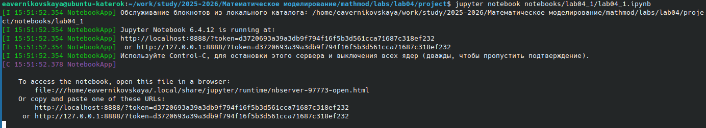{#fig-005 width=70%}

Далее выполнили Jupyter-ноутбук командой: ```jupyter notebook notebooks/lab04_1/lab04_1.ipynb``` ([рис. @fig-006]), ([рис. @fig-007])

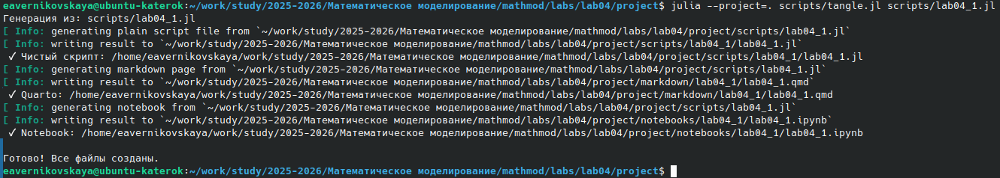{#fig-006 width=70%}

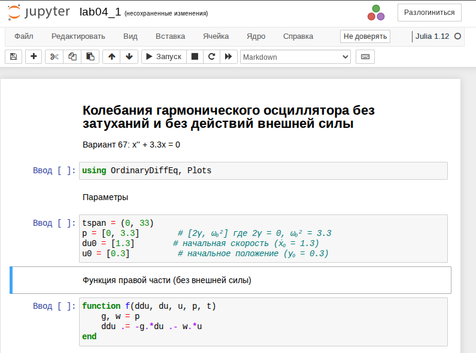{#fig-007 width=70%}

## Решение задачи №2

Написали код (lab04_2.jl) на языке Julia ([рис. @fig-008]):

```
# ## Колебания гармонического осциллятора с затуханием и без действий внешней силы
# Вариант 67: x'' + 3x' + 0.3x = 0

using DrWatson
@quickactivate "project"
using OrdinaryDiffEq
using Plots
default(fmt = :png)

# Настройки графики для Quarto
gr()
default(fmt = :png, size = (800, 450))

# Параметры
tspan = (0, 33)
p = [3, 0.3]        # [2γ, ω₀²] где 2γ = 3, ω₀² = 0.3
du0 = [1.3]        # начальная скорость (ẋ₀ = 1.3)
u0 = [0.3]          # начальное положение (y₀ = 0.3)

# Функция правой части (без внешней силы)
function f(ddu, du, u, p, t)
    g, w = p
    ddu .= -g.*du .- w.*u
end

# Создание и решение задачи
prob = SecondOrderODEProblem(f, du0, u0, tspan, p)
sol = solve(prob, DPRKN6(), saveat=0.05)

# График колебаний (x(t) и y(t) от времени)
p1 = plot(sol, idxs=(0, 1), label="y(t)", xlabel="t", ylabel="x, y",
          title="Колебания c затуханием и без внешней силы", linewidth=2)
plot!(p1, sol, idxs=(0, 2), label="x(t)", linewidth=2)

# Фазовый портрет (y от x)
p2 = plot(sol, idxs=(2, 1), label="y от x", xlabel="x", ylabel="y",
          title="Фазовый портрет с затуханием и без внешней силы", linewidth=2)

# Сохранение
mkpath(plotsdir("lab04_2"))
savefig(p1, plotsdir("lab04_2", "case2_time_variant67.png"))
savefig(p2, plotsdir("lab04_2", "case2_phase_variant67.png"))
```

{#fig-008 width=70%}

Далее выполнили код командой ```julia --project=. scripts/lab04_2.jl``` и посмотрели результирующие графики в каталоге *plots/* ([рис. @fig-009]), ([рис. @fig-010])

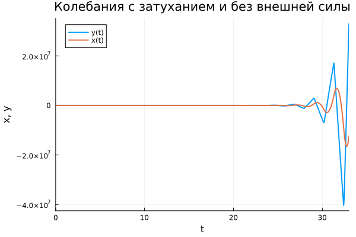{#fig-009 width=70%}

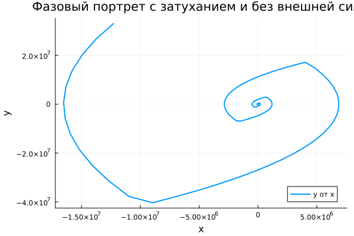{#fig-010 width=70%}

Создали производные форматы: ```julia --project=. scripts/tangle.jl scripts/lab04_2.jl``` ([рис. @fig-011])

{#fig-011 width=70%}

Далее выполнили Jupyter-ноутбук командой: ```jupyter notebook notebooks/lab04_2/lab04_2.ipynb``` ([рис. @fig-012]), ([рис. @fig-013])

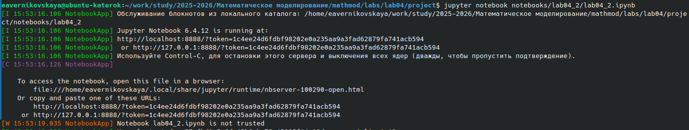{#fig-012 width=70%}

{#fig-013 width=70%}

## Решение задачи №3

Написали код (lab04_3.jl) на языке Julia ([рис. @fig-014]):

```
# ## Колебания гармонического осциллятора с затуханием и действием внешней силы
# Вариант 67: x'' + 3.3x' + 3x = 3.3sin(3t)

using DrWatson
@quickactivate "project"
using OrdinaryDiffEq
using Plots
default(fmt = :png)

# Настройки графики для Quarto
gr()
default(fmt = :png, size = (800, 450))

# Параметры
tspan = (0, 33)
p = [3.3, 3]        # [2γ, ω₀²] где 2γ = 3.3, ω₀² = 3
du0 = [1.3]        # начальная скорость (ẋ₀ = 1.3)
u0 = [0.3]          # начальное положение (y₀ = 0.3)

# Внешняя сила
f_ext(t) = 3.3 * sin(3 * t)

# Функция правой части (с внешней силой)
function f(ddu, du, u, p, t)
    g, w = p
    ddu .= -g.*du .- w.*u .+ f_ext(t)
end

# Создание и решение задачи
prob = SecondOrderODEProblem(f, du0, u0, tspan, p)
sol = solve(prob, DPRKN6(), saveat=0.05)

# График колебаний (x(t) и y(t) от времени)
p1 = plot(sol, idxs=(0, 1), label="y(t)", xlabel="t", ylabel="x, y",
          title="Колебания c затуханием и внешней силой", linewidth=2)
plot!(p1, sol, idxs=(0, 2), label="x(t)", linewidth=2)

# Фазовый портрет (y от x)
p2 = plot(sol, idxs=(2, 1), label="y от x", xlabel="x", ylabel="y",
          title="Фазовый портрет с затуханием и внешней силой", linewidth=2)

# Сохранение
mkpath(plotsdir("lab04_3"))
savefig(p1, plotsdir("lab04_3", "case3_time_variant67.png"))
savefig(p2, plotsdir("lab04_3", "case3_phase_variant67.png"))
```

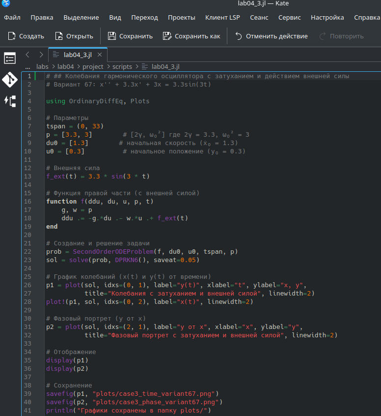{#fig-014 width=70%}

Далее выполнили код командой ```julia --project=. scripts/lab04_3.jl``` и посмотрели результирующие графики в каталоге *plots/* ([рис. @fig-015]), ([рис. @fig-016])

{#fig-015 width=70%}

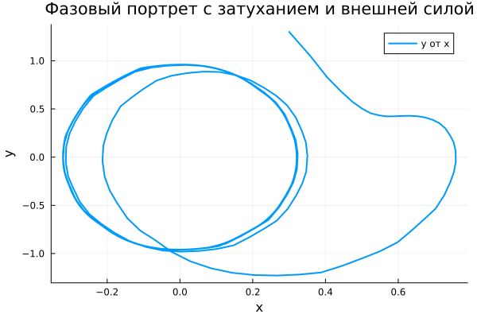{#fig-016 width=70%}

Создали производные форматы: ```julia --project=. scripts/tangle.jl scripts/lab04_3.jl``` ([рис. @fig-017])

{#fig-017 width=70%}

Далее выполнили Jupyter-ноутбук командой: ```jupyter notebook notebooks/lab04_3/lab04_3.ipynb``` ([рис. @fig-018]), ([рис. @fig-019])

{#fig-018 width=70%}

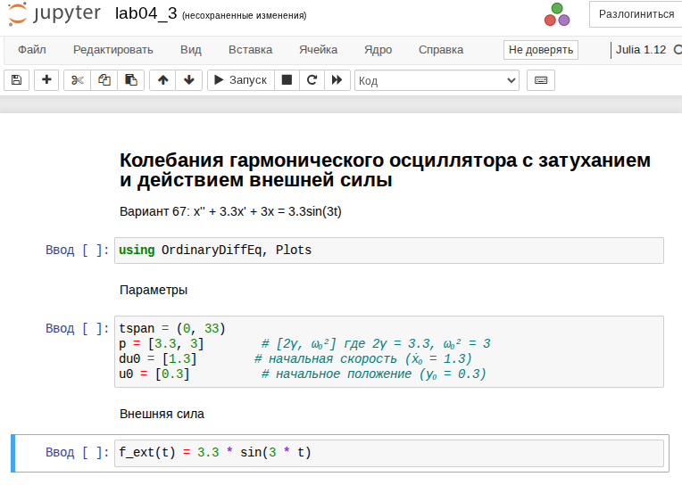{#fig-019 width=70%}







# Выводы

В ходе выполнения лабораторной работы №4 мы изучили модель линейного гармонического осциллятора и исследовали его динамику при различных параметрах системы

# Список литературы

1. [Лаборатораня работа №4](https://esystem.rudn.ru/pluginfile.php/3094835/mod_resource/content/2/%D0%9B%D0%B0%D0%B1%D0%BE%D1%80%D0%B0%D1%82%D0%BE%D1%80%D0%BD%D0%B0%D1%8F%20%D1%80%D0%B0%D0%B1%D0%BE%D1%82%D0%B0%20%E2%84%96%203.pdf)

2. [Варианты заданий](https://esystem.rudn.ru/pluginfile.php/3094836/mod_resource/content/3/%D0%97%D0%B0%D0%B4%D0%B0%D0%BD%D0%B8%D0%B5%20%D0%BA%20%D0%9B%D0%B0%D0%B1%D0%BE%D1%80%D0%B0%D1%82%D0%BE%D1%80%D0%BD%D0%BE%D0%B9%20%D1%80%D0%B0%D0%B1%D0%BE%D1%82%D0%B5%20%E2%84%96%201%20%281%29.pdf)
