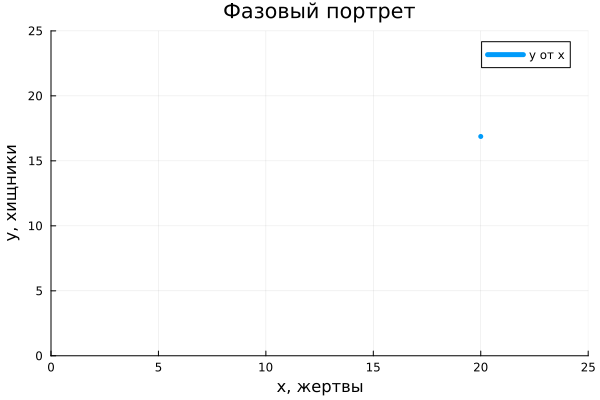
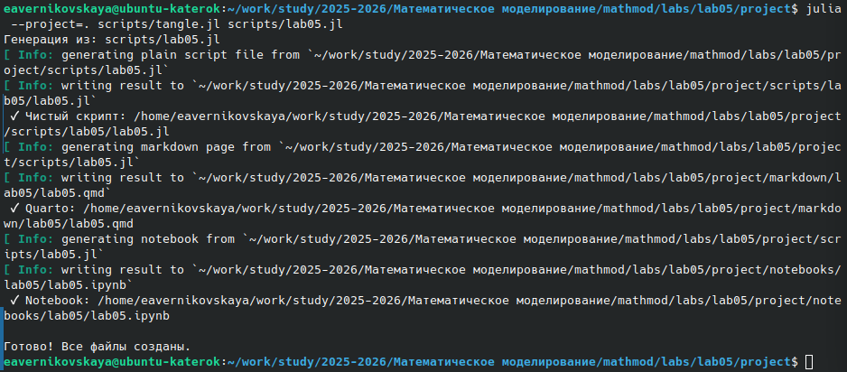
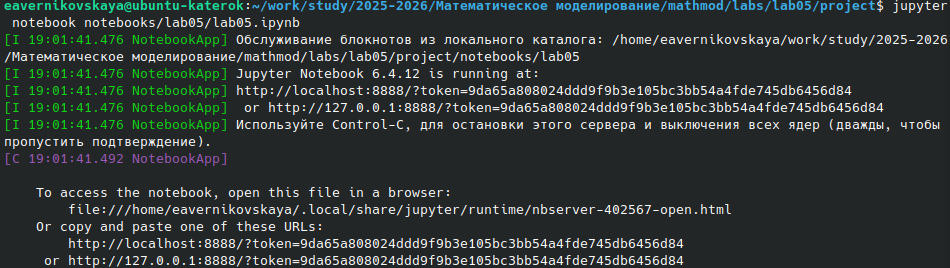
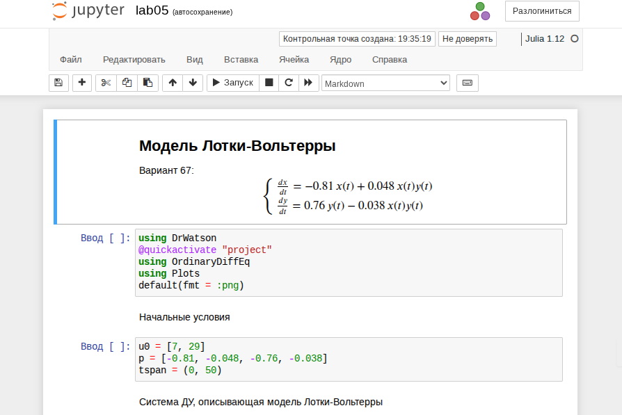

---
# Preamble

## Author
author:
  name: Верниковская Екатерина Андреевна
  degrees: DSc
  email: 11322361366@pfur.ru
  affiliation:
    - name: Российский университет дружбы народов
      country: Российская Федерация
      postal-code: 117198
      city: Москва
      address: ул. Миклухо-Маклая, д. 6

## Title
title: Отчёт по лабораторной работе №5
subtitle: Математическое моделирование
license: CC BY
date: 2026-04-14

## Generic options
lang: ru-RU
crossref:
  lof-title: Список иллюстраций
  lot-title: Список таблиц
  lol-title: Листинги

## Fonts
mainfont: PT Serif
romanfont: PT Serif
sansfont: PT Sans
monofont: PT Mono
mainfontoptions: Ligatures=TeX
romanfontoptions: Ligatures=TeX
sansfontoptions: Ligatures=TeX,Scale=MatchLowercase
monofontoptions: Scale=MatchLowercase,Scale=0.9

## Formats
format:
### Pdf output format
  beamer:
    toc: true
    toc-title: Содержание
    number-sections: true
    colorlinks: false
    toc-depth: 2
    slide_level: 2
    aspectratio: 169
    section-titles: true
    theme: metropolis
    themeoptions: progressbar=frametitle,sectionpage=progressbar,numbering=fraction
    pdf-engine: xelatex
    fontenc: T2A
#### Language
    babel-lang: russian
    babel-otherlangs: english

### Html output
  revealjs:
    transition: slide
    margin: 0.2
    smaller: false
    output-ext: html
    theme: beige
    logo: _resources/image/logo_rudn.png
---

# Вводная часть

## Цель работы

Изучить модель хищник-жертва 

## Задание

Вариант 67.

Для модели "хищник-жертва" ([-@eq-uravnenie]): 

$$ \begin{cases}  \frac{dx}{dt} = -0.81\,x(t) + 0.048\,x(t)y(t) \\  \frac{dy}{dt} = 0.76\,y(t) - 0.038\,x(t)y(t)  \end{cases} $${#eq-uravnenie}

Построить график зависимости численности хищников от численности жертв, а также графики изменения численности хищников и численности жертв при следующих начальных условиях: $x_0 = 7$, $y_0 = 29$. Найти стационарное состояние системы.

# Выполнение лабораторной работы

## Создание проекта для лабораторной работы

{#fig-001 width=70%}

## Решение задачи

{#fig-002 width=70%}

## Решение задачи

{#fig-003 width=70%}

## Решение задачи

{#fig-004 width=70%}

## Поиск стационарного состояния системы

{#fig-005 width=70%}

## Поиск стационарного состояния системы

{#fig-006 width=70%}

## Поиск стационарного состояния системы

{#fig-007 width=70%}

## Создание производных форматов

{#fig-008 width=70%}

## Выполнение Jupyter-ноутбук

{#fig-009 width=70%}

## Выполнение Jupyter-ноутбук

{#fig-010 width=70%}

# Подведение итогов

## Выводы

В ходе выполнения лабораторной работы №5 мы изучили модель хищник-жертва, построили график зависимости численности хищников от численности жертв, графики изменения численности хищников и численности жертв при следующих начальных условиях, а также нашли стационарное состояние системы

## Список литературы

1. [Лаборатораня работа №5](https://esystem.rudn.ru/pluginfile.php/3094839/mod_resource/content/2/%D0%9B%D0%B0%D0%B1%D0%BE%D1%80%D0%B0%D1%82%D0%BE%D1%80%D0%BD%D0%B0%D1%8F%20%D1%80%D0%B0%D0%B1%D0%BE%D1%82%D0%B0%20%E2%84%96%204.pdf)

2. [Варианты заданий](https://esystem.rudn.ru/pluginfile.php/3094840/mod_resource/content/2/%D0%97%D0%B0%D0%B4%D0%B0%D0%BD%D0%B8%D0%B5%20%D0%BA%20%D0%9B%D0%B0%D0%B1%D0%BE%D1%80%D0%B0%D1%82%D0%BE%D1%80%D0%BD%D0%BE%D0%B9%20%D1%80%D0%B0%D0%B1%D0%BE%D1%82%D0%B5%20%E2%84%96%203%20%281%29.pdf)
