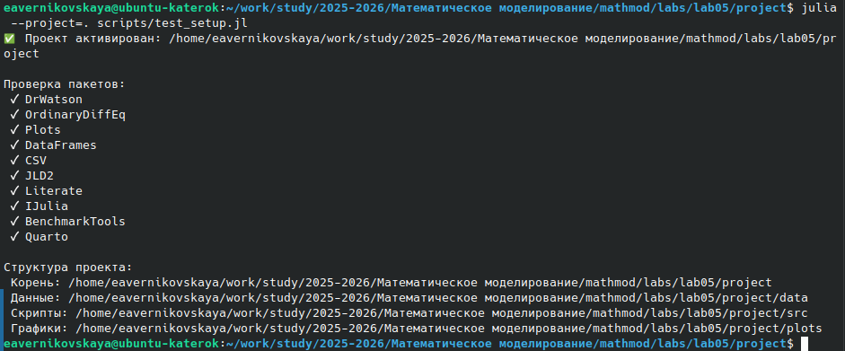
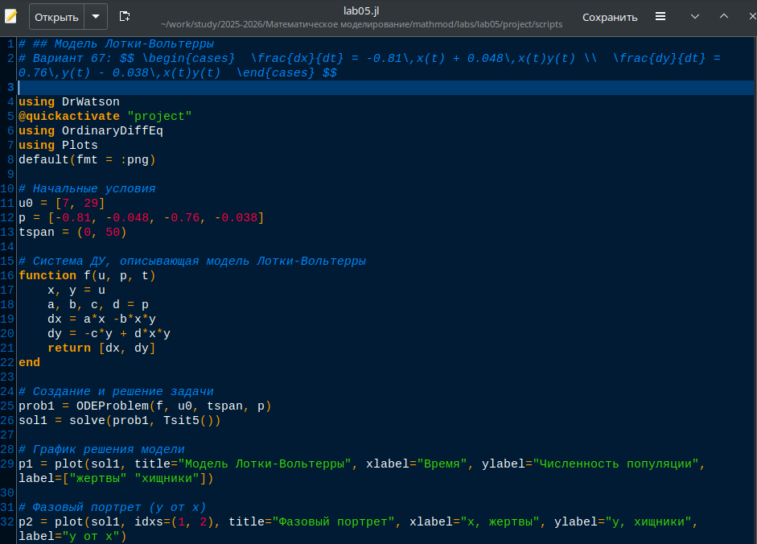
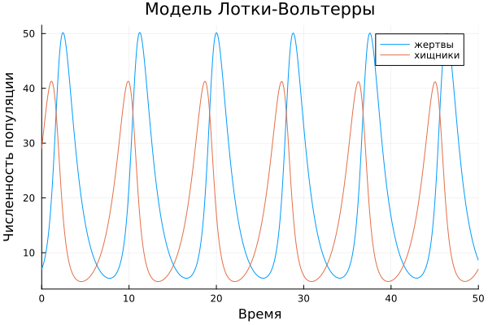
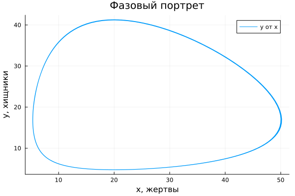
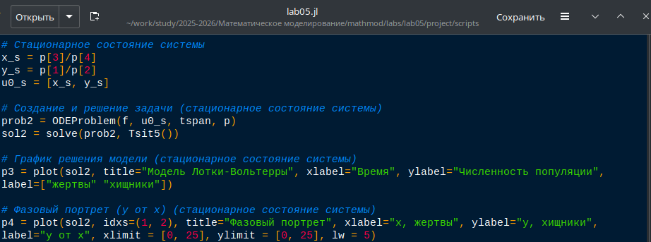
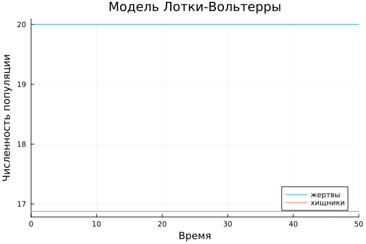

---
## Author
author:
  name: Верниковская Екатерина Андреевна
  degrees: DSc
  orcid: 0000-0002-0877-7063
  email: kulyabov-ds@rudn.ru
  affiliation:
    - name: Российский университет дружбы народов
      country: Российская Федерация
      postal-code: 117198
      city: Москва
      address: ул. Миклухо-Маклая, д. 6

## Title
title: "Отчёт по лабораторной работе №5"
subtitle: "Дисциплина: Математическое моделирование"
license: "CC BY"
---

# Цель работы

Изучить модель хищник-жертва 

# Задание

Вариант 67.

Для модели "хищник-жертва" ([-@eq-uravnenie]): 

$$ \begin{cases}  \frac{dx}{dt} = -0.81\,x(t) + 0.048\,x(t)y(t) \\  \frac{dy}{dt} = 0.76\,y(t) - 0.038\,x(t)y(t)  \end{cases} $${#eq-uravnenie}

Построить график зависимости численности хищников от численности жертв, а также графики изменения численности хищников и численности жертв при следующих начальных условиях: $x_0 = 7$, $y_0 = 29$. Найти стационарное состояние системы.

# Выполнение лабораторной работы

## Создание проекта для лабораторной работы

Создали проект и проверили структуру рабочего каталога ([рис. @fig-001])

{#fig-001 width=70%}

## Решение задачи

Написали код (lab05.jl) на языке Julia ([рис. @fig-002]):

```
# Начальные условия
u0 = [7, 29]
p = [-0.81, -0.048, -0.76, -0.038]
tspan = (0, 50)

# Cистема ДУ, описывающая модель Лотки-Вольтерры
function f(u, p, t)
    x, y = u
    a, b, c, d = p
    dx = a*x -b*x*y
    dy = -c*y + d*x*y
    return [dx, dy]
end

# Создание и решение задачи
prob1 = ODEProblem(f, u0, tspan, p)
sol1 = solve(prob1, Tsit5())

# График решения модели
p1 = plot(sol1, title="Модель Лотки-Вольтерры", xlabel="Время", ylabel="Численность популяции", label=["жертвы" "хищники"])

# Фазовый портрет (y от x)
p2 = plot(sol1, idxs=(1, 2), title="Фазовый портрет", xlabel="x, жертвы", ylabel="y, хищники", label="y от x")
```

{#fig-002 width=70%}

Далее выполнили код командой ```julia --project=. scripts/lab05.jl``` и посмотрели результирующие графики в каталоге *plots/* ([рис. @fig-003]), ([рис. @fig-004])

{#fig-003 width=70%}

{#fig-004 width=70%}

## Поиск стационарного состояния системы

Далее нашли стационарное состояние системы ([-@eq-uravnenie]). Для этого приравняли её правые части к 0. Получилось, что стационарное состояние системы будет в точке $x_0 = \frac{0.76}{0.038}$, $y_0 = \frac{0.81}{0.048}$. Если начальные значения задать в стационарном состоянии $x(0) = x_0$, $y(0) = y_0$, то в любой момент времени численность популяций изменяться не будет. При малом отклонении от положения равновесия численности как хищника, так и жертвы с течением времени не возвращаются к равновесным значениям, а совершают периодические колебания вокруг стационарной точки.

Написали код (lab05.jl) на языке Julia ([рис. @fig-005]):

```
# Стационарное состояние системы
x_s = p[3]/p[4]
y_s = p[1]/p[2]
u0_s = [x_s, y_s]

# Создание и решение задачи (стационарное состояние системы)
prob2 = ODEProblem(f, u0_s, tspan, p)
sol2 = solve(prob2, Tsit5())

# График решения модели (стационарное состояние системы)
p3 = plot(sol2, title="Модель Лотки-Вольтерры", xlabel="Время", ylabel="Численность популяции", label=["жертвы" "хищники"])

# Фазовый портрет (y от x) (стационарное состояние системы)
p4 = plot(sol2, idxs=(1, 2), title="Фазовый портрет", xlabel="x, жертвы", ylabel="y, хищники", label="y от x", xlimit = [0, 25], ylimit = [0, 25], lw = 5)
```

{#fig-005 width=70%}

Далее выполнили код командой ```julia --project=. scripts/lab05.jl``` и посмотрели результирующие графики в каталоге *plots/* ([рис. @fig-006]), ([рис. @fig-007])

{#fig-006 width=70%}

{#fig-007 width=70%}

Создали производные форматы: ```julia --project=. scripts/tangle.jl scripts/lab05.jl``` ([рис. @fig-008])

{#fig-008 width=70%}

Далее выполнили Jupyter-ноутбук командой: ```jupyter notebook notebooks/lab05/lab05.ipynb``` ([рис. @fig-009]), ([рис. @fig-010])

{#fig-009 width=70%}

{#fig-010 width=70%}



# Выводы

В ходе выполнения лабораторной работы №5 мы изучили модель хищник-жертва, построили график зависимости численности хищников от численности жертв, графики изменения численности хищников и численности жертв при следующих начальных условиях, а также нашли стационарное состояние системы

# Список литературы

1. [Лаборатораня работа №5](https://esystem.rudn.ru/pluginfile.php/3094839/mod_resource/content/2/%D0%9B%D0%B0%D0%B1%D0%BE%D1%80%D0%B0%D1%82%D0%BE%D1%80%D0%BD%D0%B0%D1%8F%20%D1%80%D0%B0%D0%B1%D0%BE%D1%82%D0%B0%20%E2%84%96%204.pdf)

2. [Варианты заданий](https://esystem.rudn.ru/pluginfile.php/3094840/mod_resource/content/2/%D0%97%D0%B0%D0%B4%D0%B0%D0%BD%D0%B8%D0%B5%20%D0%BA%20%D0%9B%D0%B0%D0%B1%D0%BE%D1%80%D0%B0%D1%82%D0%BE%D1%80%D0%BD%D0%BE%D0%B9%20%D1%80%D0%B0%D0%B1%D0%BE%D1%82%D0%B5%20%E2%84%96%203%20%281%29.pdf)
