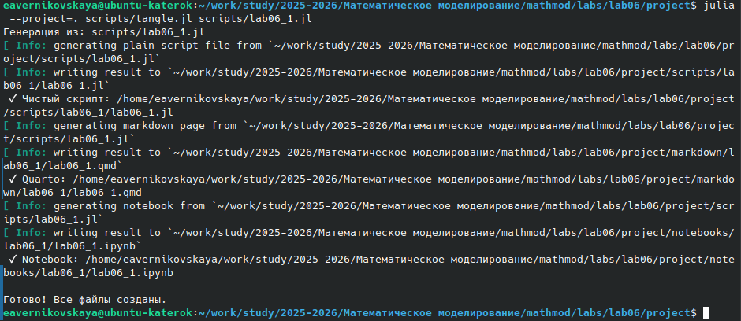
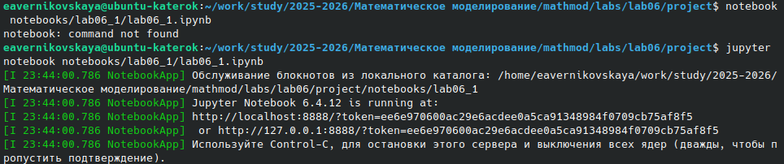
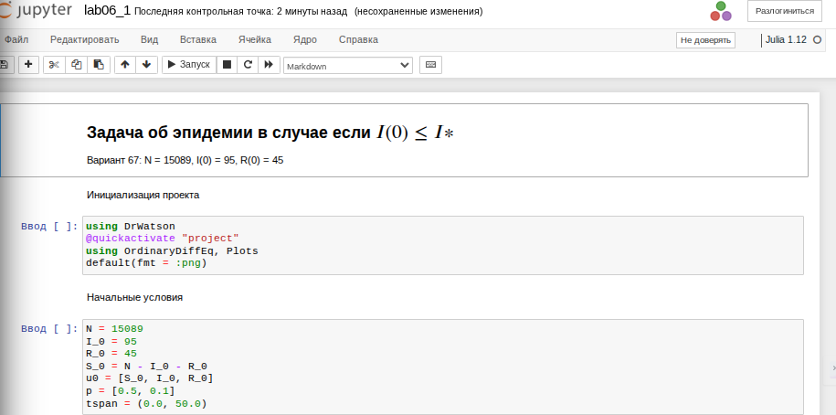
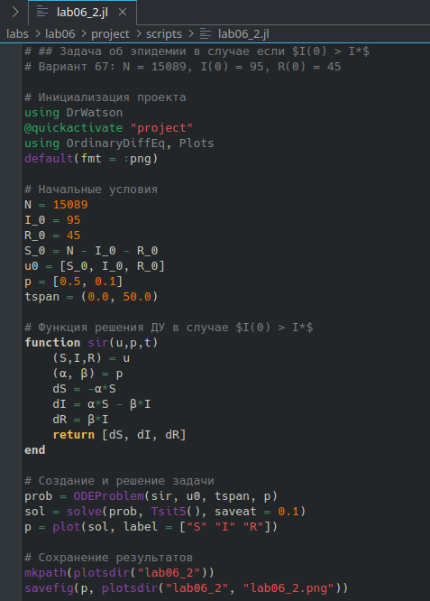
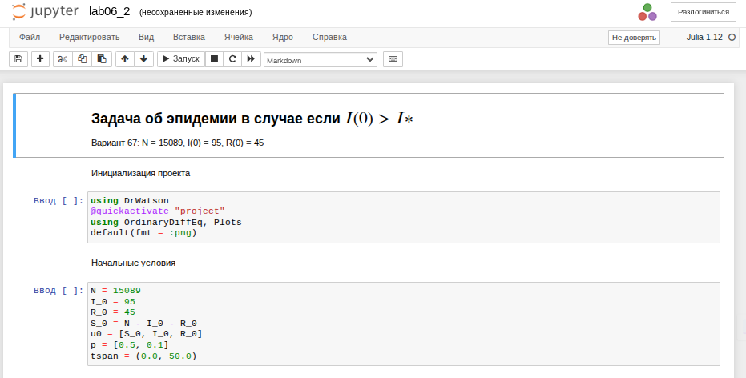

---
# Preamble

## Author
author:
  name: Верниковская Екатерина Андреевна
  degrees: DSc
  email: 11322361366@pfur.ru
  affiliation:
    - name: Российский университет дружбы народов
      country: Российская Федерация
      postal-code: 117198
      city: Москва
      address: ул. Миклухо-Маклая, д. 6

## Title
title: Отчёт по лабораторной работе №6
subtitle: Математическое моделирование
license: CC BY
date: 2026-04-29

## Generic options
lang: ru-RU
crossref:
  lof-title: Список иллюстраций
  lot-title: Список таблиц
  lol-title: Листинги

## Fonts
mainfont: PT Serif
romanfont: PT Serif
sansfont: PT Sans
monofont: PT Mono
mainfontoptions: Ligatures=TeX
romanfontoptions: Ligatures=TeX
sansfontoptions: Ligatures=TeX,Scale=MatchLowercase
monofontoptions: Scale=MatchLowercase,Scale=0.9

## Formats
format:
### Pdf output format
  beamer:
    toc: true
    toc-title: Содержание
    number-sections: true
    colorlinks: false
    toc-depth: 2
    slide_level: 2
    aspectratio: 169
    section-titles: true
    theme: metropolis
    themeoptions: progressbar=frametitle,sectionpage=progressbar,numbering=fraction
    pdf-engine: xelatex
    fontenc: T2A
#### Language
    babel-lang: russian
    babel-otherlangs: english

### Html output
  revealjs:
    transition: slide
    margin: 0.2
    smaller: false
    output-ext: html
    theme: beige
    logo: _resources/image/logo_rudn.png
---

# Вводная часть

## Цель работы

Изучить задачу об эпидемии (модель SIR). Построить графики изменения числа особей в каждой из трех групп для 2х случаев

## Задание

Вариант 67.

На одном острове вспыхнула эпидемия. Известно, что из всех проживающих на острове (N=15 089) в момент начала эпидемии (t=0) число заболевших людей (являющихся распространителями инфекции) I(0)=95, А число здоровых людей с иммунитетом к болезни R(0)=45. Таким образом, число людей восприимчивых к болезни, но пока здоровых, в начальный момент времени S(0)=N-I(0)- R(0).

Построить графики изменения числа особей в каждой из трех групп. Рассмотреть, как будет протекать эпидемия в случае: 

- если $I(0) \le I^*$ 
- если $I(0) > I^*$

# Выполнение лабораторной работы

## Создание проекта для лабораторной работы

{#fig-001 width=70%}

## Решение задачи для 1-ого случая

{#fig-002 width=30%}

## Решение задачи для 1-ого случая

{#fig-003 width=70%}

## Решение задачи для 1-ого случая

{#fig-004 width=70%}

## Решение задачи для 1-ого случая

{#fig-005 width=70%}

## Решение задачи для 1-ого случая

{#fig-006 width=70%}

## Решение задачи для 2-ого случая

{#fig-007 width=30%}

## Решение задачи для 2-ого случая

{#fig-008 width=70%}

## Решение задачи для 2-ого случая

{#fig-009 width=70%}

## Решение задачи для 2-ого случая

{#fig-010 width=70%}

## Решение задачи для 2-ого случая

{#fig-011 width=70%}

# Подведение итогов

## Выводы

В ходе выполнения лабораторной работы №6 мы изучили задачу об эпидемии (модель SIR), а также  построили графики изменения числа особей в каждой из трех групп для 2х случаев

## Список литературы

1. [Лаборатораня работа №6](https://esystem.rudn.ru/pluginfile.php/3094844/mod_resource/content/2/%D0%97%D0%B0%D0%B4%D0%B0%D0%BD%D0%B8%D0%B5%20%D0%BA%20%D0%BB%D0%B0%D0%B1%D0%BE%D1%80%D0%B0%D1%82%D0%BE%D1%80%D0%BD%D0%BE%D0%B9%20%D1%80%D0%B0%D0%B1%D0%BE%D1%82%D0%B5%20%E2%84%96%207%20%283%29.pdf)

2. [Варианты заданий](https://esystem.rudn.ru/pluginfile.php/3094843/mod_resource/content/2/%D0%9B%D0%B0%D0%B1%D0%BE%D1%80%D0%B0%D1%82%D0%BE%D1%80%D0%BD%D0%B0%D1%8F%20%D1%80%D0%B0%D0%B1%D0%BE%D1%82%D0%B0%20%E2%84%96%205.pdf)
