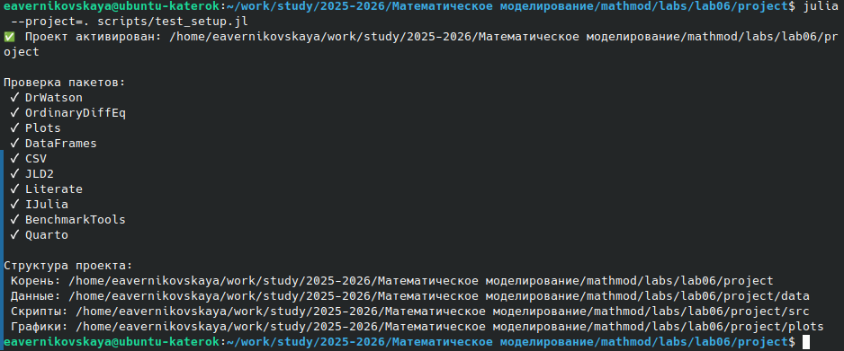
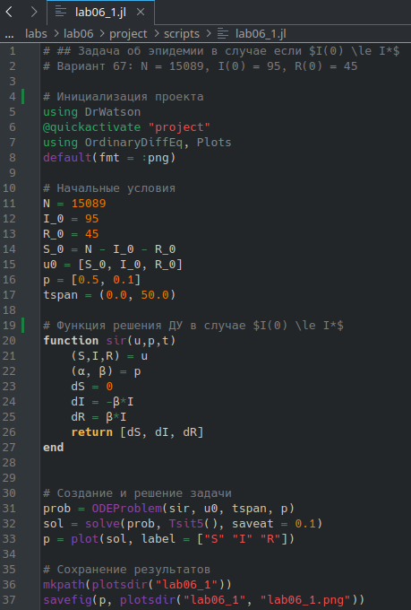
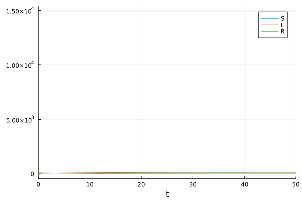
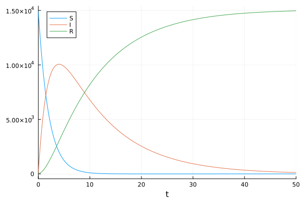
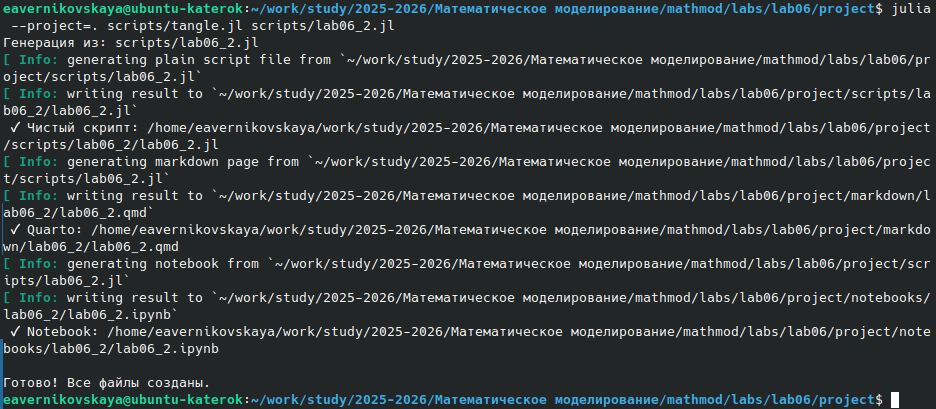
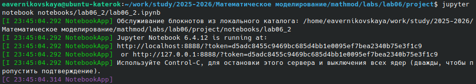

---
## Author
author:
  name: Верниковская Екатерина Андреевна
  degrees: DSc
  orcid: 0000-0002-0877-7063
  email: kulyabov-ds@rudn.ru
  affiliation:
    - name: Российский университет дружбы народов
      country: Российская Федерация
      postal-code: 117198
      city: Москва
      address: ул. Миклухо-Маклая, д. 6

## Title
title: "Отчёт по лабораторной работе №6"
subtitle: "Дисциплина: Математическое моделирование"
license: "CC BY"
---

# Цель работы

Изучить задачу об эпидемии (модель SIR). Построить графики изменения числа особей в каждой из трех групп для 2х случаев

# Задание

Вариант 67.

На одном острове вспыхнула эпидемия. Известно, что из всех проживающих на острове (N=15 089) в момент начала эпидемии (t=0) число заболевших людей (являющихся распространителями инфекции) I(0)=95, А число здоровых людей с иммунитетом к болезни R(0)=45. Таким образом, число людей восприимчивых к болезни, но пока здоровых, в начальный момент времени S(0)=N-I(0)- R(0).

Построить графики изменения числа особей в каждой из трех групп. Рассмотреть, как будет протекать эпидемия в случае: 

- если $I(0) \le I^*$ 
- если $I(0) > I^*$

# Выполнение лабораторной работы

## Теория

Рассмотрим простейшую модель эпидемии. Предположим, что некая популяция, состоящая из N особей, (считаем, что популяция изолирована) подразделяется на три группы. Первая группа - это восприимчивые к болезни, но пока здоровые особи, обозначим их через S(t). Вторая группа - это число
инфицированных особей, которые также при этом являются распространителями инфекции, обозначим их I(t). А третья группа, обозначающаяся через R(t) - это здоровые особи с иммунитетом к болезни. 

До того, как число заболевших не превышает критического значения $I^*$, считаем, что все больные изолированы и не заражают здоровых. Когда $I(0) > I^*$, тогда инфицирование способны заражать восприимчивых к болезни особей.

Таким образом, скорость изменения числа S(t) меняется по следующему закону:

$$ \frac{dS}{dt} = \begin{cases} -\alpha S, \text{ если } I(t) > I^* \\ 0, \text{ если } I(t) \le I^* \end{cases} $$

Поскольку каждая восприимчивая к болезни особь, которая, в конце концов, заболевает, сама становится инфекционной, то скорость изменения числа инфекционных особей представляет разность за единицу времени между заразившимися и теми, кто уже болеет и лечится, т.е.:

$$ \frac{dI}{dt} = \begin{cases} \alpha S - \beta I, \text{ если } I(t) > I^* \\ -\beta I, \text{ если } I(t) \le I^* \end{cases} $$

А скорость изменения выздоравливающих особей (при этом приобретающие иммунитет к болезни)

$$ \frac{dR}{dt} = \beta I$$

Постоянные пропорциональности $\alpha$, $\beta$ - это коэффициенты заболеваемости и выздоровления соответственно.

## Создание проекта для лабораторной работы

Создали проект и проверили структуру рабочего каталога ([рис. @fig-001])

{#fig-001 width=70%}

## Решение задачи для 1-ого случая

Написали код (lab06_1.jl) на языке Julia ([рис. @fig-002]):

```
# ## Задача об эпидемии в случае если $I(0) \le I^*$
# Вариант 67: N = 15089, I(0) = 95, R(0) = 45

# Инициализация проекта
using DrWatson
@quickactivate "project"
using OrdinaryDiffEq, Plots
default(fmt = :png)

# Начальные условия
N = 15089
I_0 = 95
R_0 = 45
S_0 = N - I_0 - R_0
u0 = [S_0, I_0, R_0]
p = [0.5, 0.1]
tspan = (0.0, 50.0)

# Функция решения ДУ в случае $I(0) \le I^*$
function sir(u,p,t)
    (S,I,R) = u
    (α, β) = p
    dS = 0
    dI = -β*I
    dR = β*I
    return [dS, dI, dR]
end


# Создание и решение задачи
prob = ODEProblem(sir, u0, tspan, p)
sol = solve(prob, Tsit5(), saveat = 0.1)
p = plot(sol, label = ["S" "I" "R"])

# Сохранение результатов
mkpath(plotsdir("lab06_1"))
savefig(p, plotsdir("lab06_1", "lab06_1.png"))
```

{#fig-002 width=70%}

Далее выполнили код командой ```julia --project=. scripts/lab06_1.jl``` и посмотрели результирующие графики в каталоге *plots/* ([рис. @fig-003])

{#fig-003 width=70%}

Создали производные форматы: ```julia --project=. scripts/tangle.jl scripts/lab06_1.jl``` ([рис. @fig-004])

{#fig-004 width=70%}

Далее выполнили Jupyter-ноутбук командой: ```jupyter notebook notebooks/lab06_1/lab06_1.ipynb``` ([рис. @fig-005]), ([рис. @fig-006])

{#fig-005 width=70%}

{#fig-006 width=70%}

## Решение задачи для 2-ого случая

Написали код (lab06_2.jl) на языке Julia ([рис. @fig-007]):

```
# ## Задача об эпидемии в случае если $I(0) > I^*$
# Вариант 67: N = 15089, I(0) = 95, R(0) = 45

# Инициализация проекта
using DrWatson
@quickactivate "project"
using OrdinaryDiffEq, Plots
default(fmt = :png)

# Начальные условия
N = 15089
I_0 = 95
R_0 = 45
S_0 = N - I_0 - R_0
u0 = [S_0, I_0, R_0]
p = [0.5, 0.1]
tspan = (0.0, 50.0)

# Функция решения ДУ в случае $I(0) > I^*$
function sir(u,p,t)
    (S,I,R) = u
    (α, β) = p
    dS = -α*S
    dI = α*S - β*I
    dR = β*I
    return [dS, dI, dR]
end

# Создание и решение задачи
prob = ODEProblem(sir, u0, tspan, p)
sol = solve(prob, Tsit5(), saveat = 0.1)
p = plot(sol, label = ["S" "I" "R"])

# Сохранение результатов
mkpath(plotsdir("lab06_2"))
savefig(p, plotsdir("lab06_2", "lab06_2.png"))
```

{#fig-007 width=70%}

Далее выполнили код командой ```julia --project=. scripts/lab06_2.jl``` и посмотрели результирующие графики в каталоге *plots/* ([рис. @fig-008])

{#fig-008 width=70%}

Создали производные форматы: ```julia --project=. scripts/tangle.jl scripts/lab06_2.jl``` ([рис. @fig-009])

{#fig-009 width=70%}

Далее выполнили Jupyter-ноутбук командой: ```jupyter notebook notebooks/lab06_2/lab06_2.ipynb``` ([рис. @fig-010]), ([рис. @fig-011])

{#fig-010 width=70%}

{#fig-011 width=70%}





# Выводы

В ходе выполнения лабораторной работы №6 мы изучили задачу об эпидемии (модель SIR), а также  построили графики изменения числа особей в каждой из трех групп для 2х случаев

# Список литературы

1. [Лаборатораня работа №6](https://esystem.rudn.ru/pluginfile.php/3094844/mod_resource/content/2/%D0%97%D0%B0%D0%B4%D0%B0%D0%BD%D0%B8%D0%B5%20%D0%BA%20%D0%BB%D0%B0%D0%B1%D0%BE%D1%80%D0%B0%D1%82%D0%BE%D1%80%D0%BD%D0%BE%D0%B9%20%D1%80%D0%B0%D0%B1%D0%BE%D1%82%D0%B5%20%E2%84%96%207%20%283%29.pdf)

2. [Варианты заданий](https://esystem.rudn.ru/pluginfile.php/3094843/mod_resource/content/2/%D0%9B%D0%B0%D0%B1%D0%BE%D1%80%D0%B0%D1%82%D0%BE%D1%80%D0%BD%D0%B0%D1%8F%20%D1%80%D0%B0%D0%B1%D0%BE%D1%82%D0%B0%20%E2%84%96%205.pdf)
