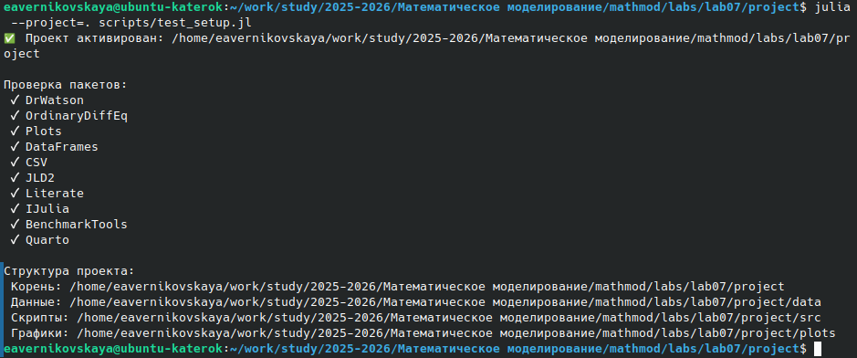
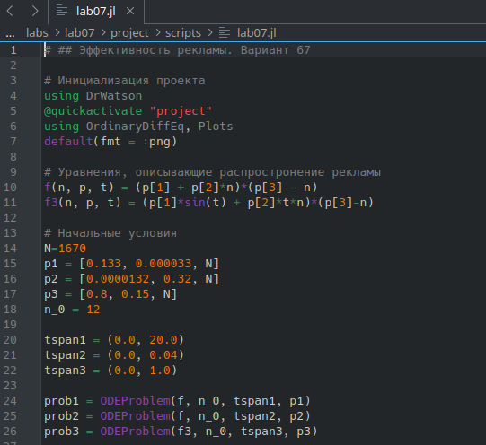
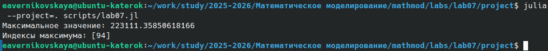
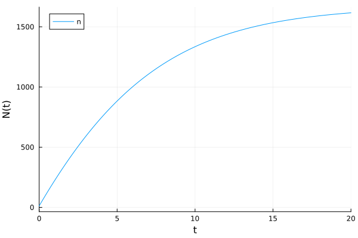
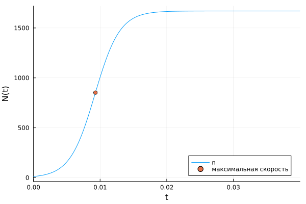
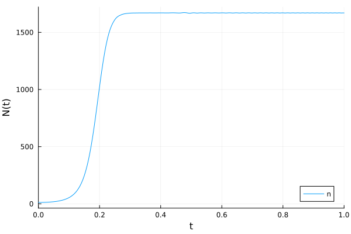
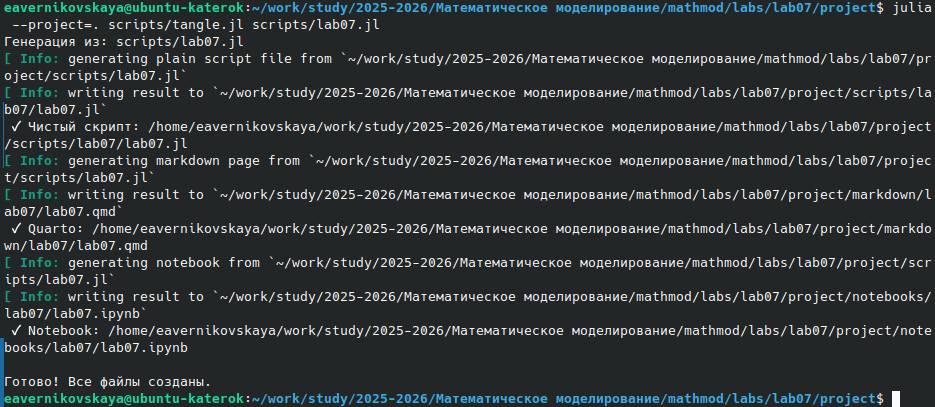
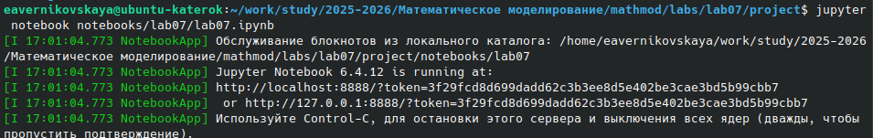
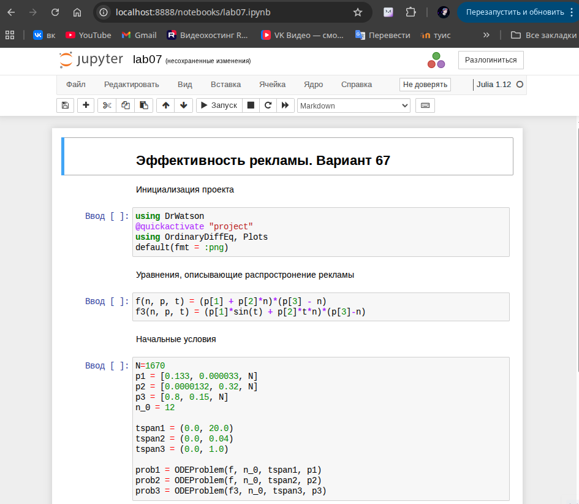

---
## Author
author:
  name: Верниковская Екатерина Андреевна
  degrees: DSc
  orcid: 0000-0002-0877-7063
  email: kulyabov-ds@rudn.ru
  affiliation:
    - name: Российский университет дружбы народов
      country: Российская Федерация
      postal-code: 117198
      city: Москва
      address: ул. Миклухо-Маклая, д. 6

## Title
title: "Отчёт по лабораторной работе №7"
subtitle: "Дисциплина: Математическое моделирование"
license: "CC BY"
---

# Цель работы

Изучить задачу об эффективности рекламы, построить 3 графика распространения рекламы для 3 разных случаев

# Задание

Вариант 67.

Построить график распространения рекламы, математическая модель которой описывается следующим уравнением:

1. $\frac{dn}{dt} = (0.133 + 0.000033*n(t))(N - n(t))$
2. $\frac{dn}{dt} = (0.0000132 + 0.32*n(t))(N - n(t))$
3. $\frac{dn}{dt} = (0.8*t + 0.15*sin(t)*n(t))(N - n(t))$

При этом объем аудитории N = 1670, в начальный момент о товаре знает 12 человек. Для случая 2 определить в какой момент времени скорость распространения рекламы будет иметь максимальное значение.

# Выполнение лабораторной работы

## Создание проекта для лабораторной работы

Создали проект и проверили структуру рабочего каталога ([рис. @fig-001])

{#fig-001 width=70%}

## Решение задачи

Написали код (lab07.jl) на языке Julia ([рис. @fig-002]):

```
# ## Эффективность рекламы. Вариант 67

# Инициализация проекта
using DrWatson
@quickactivate "project"
using OrdinaryDiffEq, Plots
default(fmt = :png)

# Уравнения, описывающие распростронение рекламы
f(n, p, t) = (p[1] + p[2]*n)*(p[3] - n)
f3(n, p, t) = (p[1]*sin(t) + p[2]*t*n)*(p[3]-n)

# Начальные условия
N=1670
p1 = [0.133, 0.000033, N]
p2 = [0.0000132, 0.32, N]
p3 = [0.8, 0.15, N]
n_0 = 12

tspan1 = (0.0, 20.0)
tspan2 = (0.0, 0.04)
tspan3 = (0.0, 1.0)

prob1 = ODEProblem(f, n_0, tspan1, p1)
prob2 = ODEProblem(f, n_0, tspan2, p2)
prob3 = ODEProblem(f3, n_0, tspan3, p3)

# Решение и построение графика для 1-ого случая: $\frac{dn}{dt} = (0.133 + 0.000033*n(t))(N - n(t))$
sol1 = solve(prob1, Tsit5(), saveat = 0.01)
p1 = plot(sol1, yaxis = "N(t)", label="n")

# Решение и построение графика для 2-ого случая: $\frac{dn}{dt} = (0.0000132 + 0.32*n(t))(N - n(t))$
sol2 = solve(prob2, Tsit5(), saveat = 0.0001)

# Поиск максимального значения для случая 2
dev = [sol2(i, Val{1}) for i in 0:0.0001:0.04]
println("Максимальное значение: ", maximum(dev))

findall(x -> x == maximum(dev), dev)
println("Индексы максимума: ", findall(x -> x == maximum(dev), dev))

x = sol2.t[94]
y = sol2.u[94]

p2 = plot(sol2, yaxis="N(t)", label="n")
scatter!((x,y), leg=:bottomright, label="максимальная скорость")

# Решение и построение графика для 3-ого случая: $\frac{dn}{dt} = (0.8*t + 0.15*sin(t)*n(t))(N - n(t))$
sol3 = solve(prob3, Tsit5(), saveat = 0.0001)
p3 = plot(sol3, markersize =:15, yaxis="N(t)", label="n")

# Сохранение результатов
mkpath(plotsdir("lab07"))
savefig(p1, plotsdir("lab07", "lab07_1.png"))
savefig(p2, plotsdir("lab07", "lab07_2.png"))
savefig(p3, plotsdir("lab07", "lab07_3.png"))
```

{#fig-002 width=70%}

Далее выполнили код командой ```julia --project=. scripts/lab07.jl``` и посмотрели результирующие графики в каталоге *plots/* ([рис. @fig-003]), ([рис. @fig-004]), ([рис. @fig-005]), ([рис. @fig-006])

{#fig-003 width=70%}

{#fig-004 width=70%}

{#fig-005 width=70%}

{#fig-006 width=70%}

В первом случае $\alpha_1(t)$ на порядки выше, чем $\alpha_2(t)$, поэтому мы получили модель
Мальтуса. Во втором и третьем случае получили логистическую кривую.

Создали производные форматы: ```julia --project=. scripts/tangle.jl scripts/lab07.jl``` ([рис. @fig-007])

{#fig-007 width=70%}

Далее выполнили Jupyter-ноутбук командой: ```jupyter notebook notebooks/lab07/lab07.ipynb``` ([рис. @fig-008]), ([рис. @fig-009])

{#fig-008 width=70%}

{#fig-009 width=70%}



# Выводы

В ходе выполнения лабораторной работы №7 мы изучили задачу об эффективности рекламы, а также построили 3 графика распространения рекламы для 3 разных случаев

# Список литературы

1. [Лаборатораня работа №7](https://esystem.rudn.ru/pluginfile.php/3094847/mod_resource/content/2/%D0%9B%D0%B0%D0%B1%D0%BE%D1%80%D0%B0%D1%82%D0%BE%D1%80%D0%BD%D0%B0%D1%8F%20%D1%80%D0%B0%D0%B1%D0%BE%D1%82%D0%B0%20%E2%84%96%206.pdf)

2. [Варианты заданий](https://esystem.rudn.ru/pluginfile.php/3094848/mod_resource/content/2/%D0%97%D0%B0%D0%B4%D0%B0%D0%BD%D0%B8%D0%B5%20%D0%BA%20%D0%BB%D0%B0%D0%B1%D0%BE%D1%80%D0%B0%D1%82%D0%BE%D1%80%D0%BD%D0%BE%D0%B9%20%D1%80%D0%B0%D0%B1%D0%BE%D1%82%D0%B5%20%E2%84%96%202%20%20%281%29.pdf)
