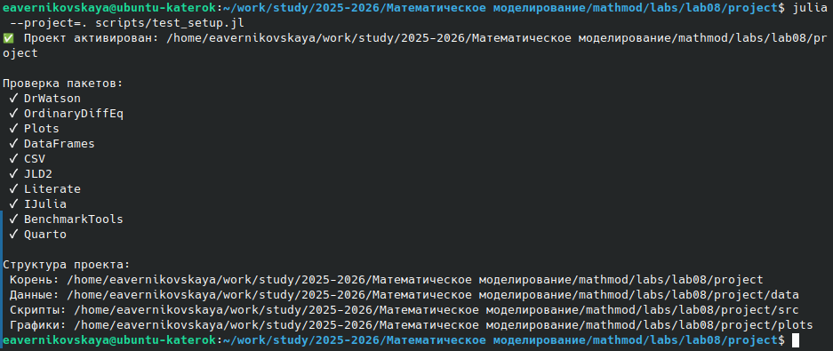
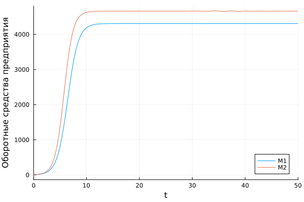
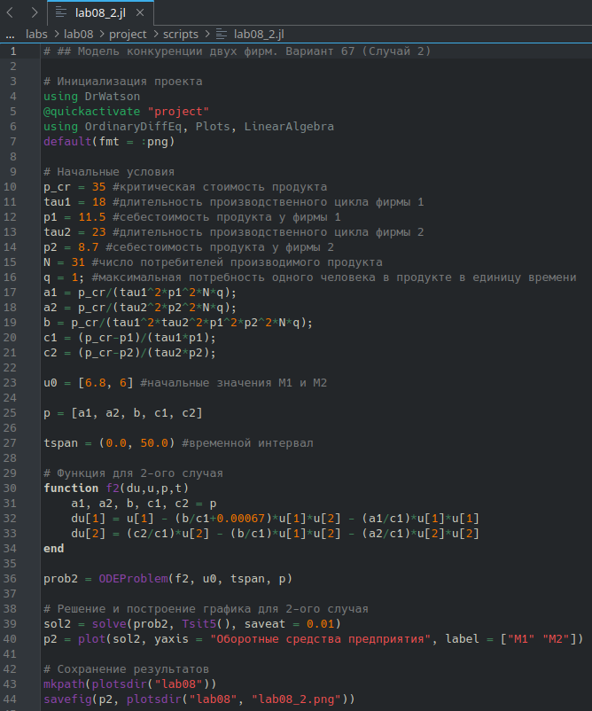
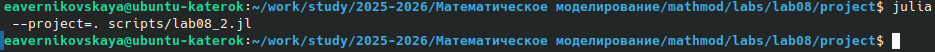
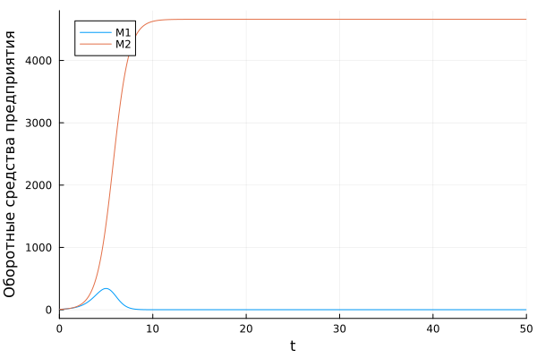
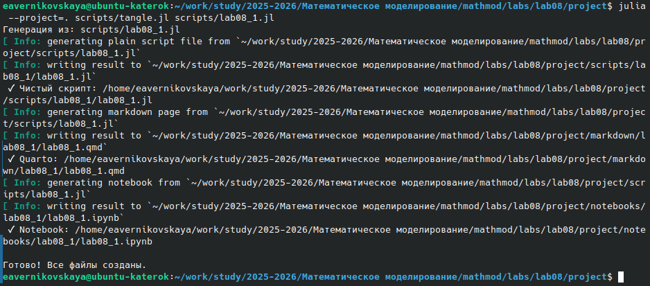
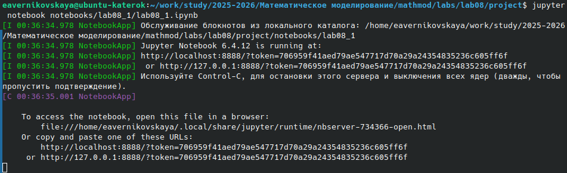
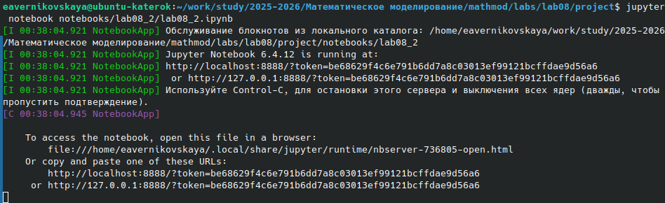

---
# Preamble

## Author
author:
  name: Верниковская Екатерина Андреевна
  degrees: DSc
  email: 11322361366@pfur.ru
  affiliation:
    - name: Российский университет дружбы народов
      country: Российская Федерация
      postal-code: 117198
      city: Москва
      address: ул. Миклухо-Маклая, д. 6

## Title
title: Отчёт по лабораторной работе №8
subtitle: Математическое моделирование
license: CC BY
date: 2026-05-26

## Generic options
lang: ru-RU
crossref:
  lof-title: Список иллюстраций
  lot-title: Список таблиц
  lol-title: Листинги

## Fonts
mainfont: PT Serif
romanfont: PT Serif
sansfont: PT Sans
monofont: PT Mono
mainfontoptions: Ligatures=TeX
romanfontoptions: Ligatures=TeX
sansfontoptions: Ligatures=TeX,Scale=MatchLowercase
monofontoptions: Scale=MatchLowercase,Scale=0.9

## Formats
format:
### Pdf output format
  beamer:
    toc: true
    toc-title: Содержание
    number-sections: true
    colorlinks: false
    toc-depth: 2
    slide_level: 2
    aspectratio: 169
    section-titles: true
    theme: metropolis
    themeoptions: progressbar=frametitle,sectionpage=progressbar,numbering=fraction
    pdf-engine: xelatex
    fontenc: T2A
#### Language
    babel-lang: russian
    babel-otherlangs: english

### Html output
  revealjs:
    transition: slide
    margin: 0.2
    smaller: false
    output-ext: html
    theme: beige
    logo: _resources/image/logo_rudn.png
---

# Вводная часть

## Цель работы

Изучить модель конкуренции двух фирм, построить 2 графика изменения оборотных средств фирмы 1 и фирмы 2 без учета постоянных издержек и с веденной нормировкой для 2 разных случаев

## Задание

Вариант 67.

1. Построить графики изменения оборотных средств фирмы 1 и фирмы 2 без учета постоянных издержек и с веденной нормировкой для случая 1
2. Построить графики изменения оборотных средств фирмы 1 и фирмы 2 без учета постоянных издержек и с веденной нормировкой для случая 2

## Задание

**Случай 1:**

$$
\begin{cases}                                 
  \dfrac{dM_1}{d\theta} = M_1-\dfrac{b}{c_1}M_1M_2-\dfrac{a_1}{c_1}M_1^2,\\\\
  \dfrac{dM_2}{d\theta} = \dfrac{c_2}{c_1}M2-\dfrac{b}{c_1}M_1M_2-\dfrac{a_2}{c_1}M_2^2,
\end{cases}
$$

где $a_1=\dfrac{p_{cr}}{\tau_{1}^2\tilde p_1^2Nq}, \, \, a_2=\dfrac{p_{cr}}{\tau_{2}^2\tilde p_2^2Nq}, \, \, b=\dfrac{p_{cr}}{\tau_{1}^2\tilde p_1^2\tau_{2}^2\tilde p_2^2Nq}, \, \, c_1=\dfrac{p_{cr} - \tilde{p_1}}{\tau_{1}\tilde p_1}, \, \, c_2=\dfrac{p_{cr} - \tilde{p_1}}{\tau_{2}\tilde p_2}$

Также введена нормировка $t=c_1\theta$.

## Задание

**Случай 2:**

$$
\begin{cases}                                 
  \dfrac{dM_1}{d\theta} = M_1-(\dfrac{b}{c_1}+0.00067)M_1M_2-\dfrac{a_1}{c_1}M_1^2,\\\\
  \dfrac{dM_2}{d\theta} = \dfrac{c_2}{c_1}M_2-\dfrac{b}{c_1}M_1M_2-\dfrac{a_2}{c_1}M_2^2,
\end{cases}
$$

## Задание

Для обоих случаев рассмотрим задачу со следующими начальными условиями и параметрами:
$$M_0^1=6.8, M_0^2=6, p_{cr}=35,N=31, q=1, \tau_1=18,$$
$$\tau_2=23, \tilde{p_1}=11.5, \tilde{p_2}=8.7$$

# Выполнение лабораторной работы

## Создание проекта для лабораторной работы

{#fig-001 width=80%}

## Решение задачи (случай 1)

{#fig-002 width=35%}

## Решение задачи (случай 1)

{#fig-003 width=90%}

## Решение задачи (случай 1)

{#fig-004 width=70%}

## Решение задачи (случай 2)

{#fig-005 width=40%}

## Решение задачи (случай 2)

{#fig-006 width=90%}

## Решение задачи (случай 2)

{#fig-007 width=70%}

## Производные форматы и Jupyter-ноутбук

{#fig-008 width=80%}

## Производные форматы и Jupyter-ноутбук

{#fig-009 width=80%}

## Производные форматы и Jupyter-ноутбук

{#fig-010 width=50%}

## Производные форматы и Jupyter-ноутбук

{#fig-011 width=80%}

## Производные форматы и Jupyter-ноутбук

{#fig-012 width=80%}

## Производные форматы и Jupyter-ноутбук

{#fig-013 width=50%}

# Подведение итогов

## Выводы

В ходе выполнения лабораторной работы №8 мы изучили модель конкуренции двух фирм, а также построили 2 графика изменения оборотных средств фирмы 1 и фирмы 2 без учета постоянных издержек и с веденной нормировкой для 2 разных случаев

## Список литературы

1. [Лаборатораня работа №8](https://esystem.rudn.ru/pluginfile.php/3094851/mod_resource/content/2/%D0%9B%D0%B0%D0%B1%D0%BE%D1%80%D0%B0%D1%82%D0%BE%D1%80%D0%BD%D0%B0%D1%8F%20%D1%80%D0%B0%D0%B1%D0%BE%D1%82%D0%B0%20%E2%84%96%207.pdf)

2. [Варианты заданий](https://esystem.rudn.ru/pluginfile.php/3094852/mod_resource/content/2/%D0%97%D0%B0%D0%B4%D0%B0%D0%BD%D0%B8%D0%B5%20%D0%BA%20%D0%BB%D0%B0%D0%B1%D0%BE%D1%80%D0%B0%D1%82%D0%BE%D1%80%D0%BD%D0%BE%D0%B9%20%D1%80%D0%B0%D0%B1%D0%BE%D1%82%D0%B5%20%E2%84%96%207.pdf)
