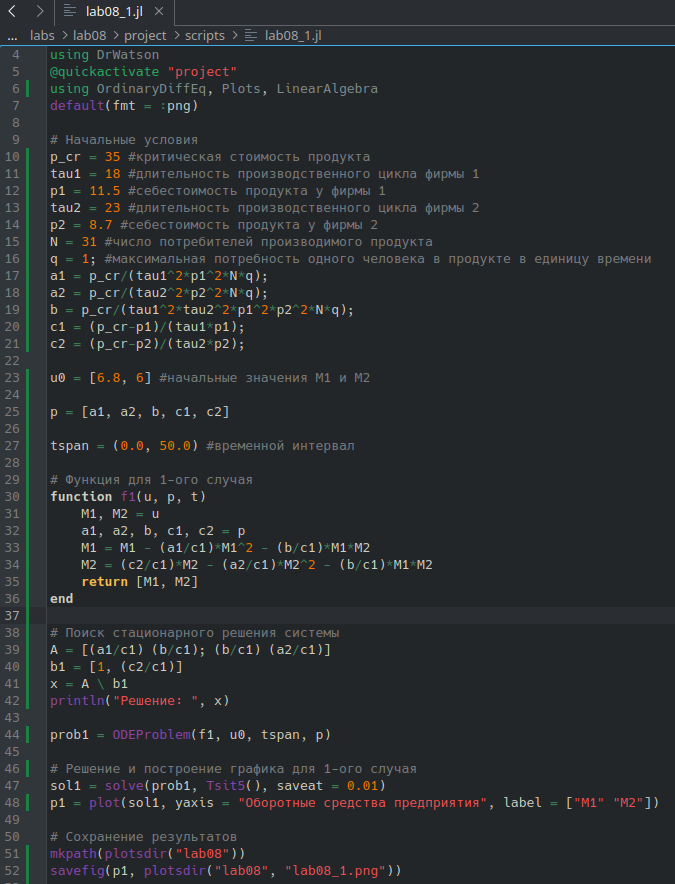
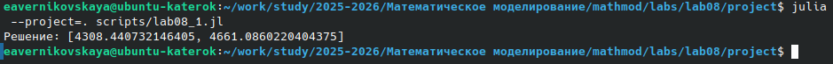
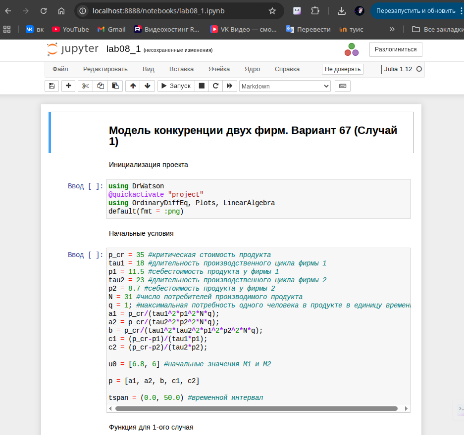
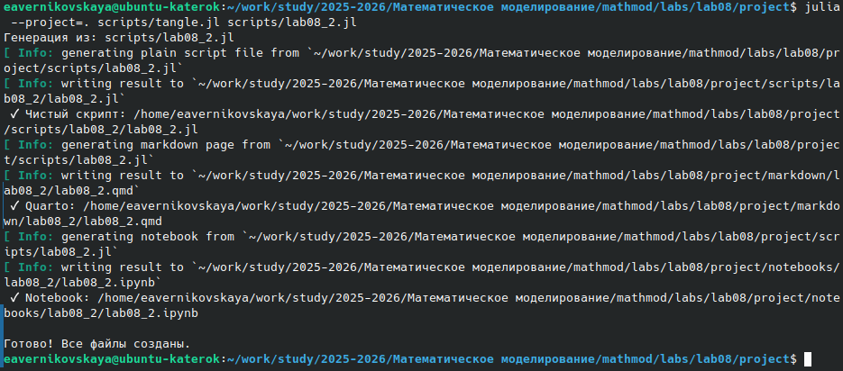
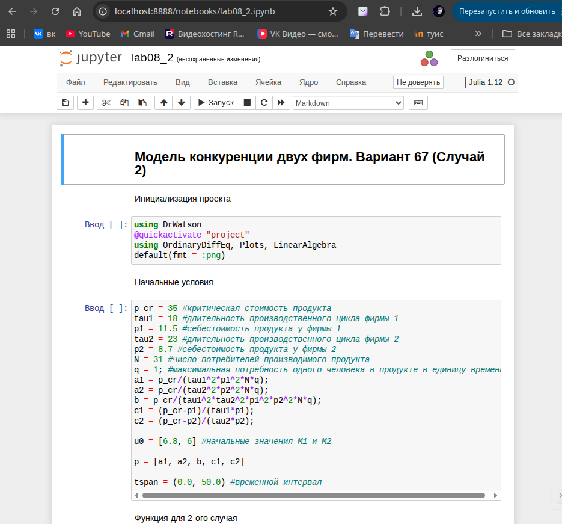

---
## Author
author:
  name: Верниковская Екатерина Андреевна
  degrees: DSc
  orcid: 0000-0002-0877-7063
  email: kulyabov-ds@rudn.ru
  affiliation:
    - name: Российский университет дружбы народов
      country: Российская Федерация
      postal-code: 117198
      city: Москва
      address: ул. Миклухо-Маклая, д. 6

## Title
title: "Отчёт по лабораторной работе №8"
subtitle: "Дисциплина: Математическое моделирование"
license: "CC BY"
---

# Цель работы

Изучить модель конкуренции двух фирм, построить 2 графика изменения оборотных средств фирмы 1 и фирмы 2 без учета постоянных издержек и с веденной нормировкой для 2 разных случаев

# Задание

Вариант 67.

**Случай 1.** Рассмотрим две фирмы, производящие взаимозаменяемые товары одинакового качества и находящиеся в одной рыночной нише. Считаем, что в рамках нашей модели конкурентная борьба ведётся только рыночными методами. То есть, конкуренты могут влиять на противника путем изменения параметров своего производства: себестоимость, время цикла, но не могут прямо вмешиваться в ситуацию на рынке («назначать» цену или влиять на потребителей каким-либо иным способом.) Будем считать, что постоянные издержки пренебрежимо малы, и в модели учитывать не будем. В этом случае динамика изменения объемов продаж фирмы 1 и фирмы 2 описывается следующей системой уравнений ([-@eq-uravnenie-1]):

$$
\begin{cases}                                 
  \dfrac{dM_1}{d\theta} = M_1-\dfrac{b}{c_1}M_1M_2-\dfrac{a_1}{c_1}M_1^2,\\\\
  \dfrac{dM_2}{d\theta} = \dfrac{c_2}{c_1}M2-\dfrac{b}{c_1}M_1M_2-\dfrac{a_2}{c_1}M_2^2,
\end{cases}
$${#eq-uravnenie-1}

где $a_1=\dfrac{p_{cr}}{\tau_{1}^2\tilde p_1^2Nq}, \, \, a_2=\dfrac{p_{cr}}{\tau_{2}^2\tilde p_2^2Nq}, \, \, b=\dfrac{p_{cr}}{\tau_{1}^2\tilde p_1^2\tau_{2}^2\tilde p_2^2Nq}, \, \, c_1=\dfrac{p_{cr} - \tilde{p_1}}{\tau_{1}\tilde p_1}, \, \, c_2=\dfrac{p_{cr} - \tilde{p_1}}{\tau_{2}\tilde p_2}$

Также введена нормировка $t=c_1\theta$.

**Случай 2.** Рассмотрим модель, когда, помимо экономического фактора влияния (изменение себестоимости, производственного цикла, использование кредита и т.п.), используются еще и социально-психологические факторы - формирование общественного предпочтения одного товара другому, не зависимо от их качества и цены. В этом случае взаимодействие двух фирм будет зависеть друг от друга, соответственно коэффициент перед M M1 2 будет отличаться. Пусть в рамках рассматриваемой модели динамика изменения объемов продаж фирмы 1 и фирмы 2 описывается следующей системой уравнений ([-@eq-uravnenie-2]):

$$
\begin{cases}                                 
  \dfrac{dM_1}{d\theta} = M_1-(\dfrac{b}{c_1}+0.00067)M_1M_2-\dfrac{a_1}{c_1}M_1^2,\\\\
  \dfrac{dM_2}{d\theta} = \dfrac{c_2}{c_1}M_2-\dfrac{b}{c_1}M_1M_2-\dfrac{a_2}{c_1}M_2^2,
\end{cases}
$${#eq-uravnenie-2}

Для обоих случаев рассмотрим задачу со следующими начальными условиями и параметрами:
$$M_0^1=6.8, \, M_0^2=6,\\ p_{cr}=35, \,N=31, q=1, \\ \tau_1=18, \, \tau_2=23,\\ \tilde{p_1}=11.5, \, \tilde{p_2}=8.7$$

**Замечание:** Значения $p_{cr}$, $\tilde{p_1}$ и $\tilde{p_2}$, $N$ указаны в тысячах единиц, а значения $M_1$ и $M_2$ указаны в млн. единиц.

*Обозначения:*

- $N$ - число потребителей производимого продукта.
- $\tau$ - длительность производственного цикла
- $p$ - рыночная цена товара
- $\tilde{p}$ - себестоимость продукта, то есть переменные издержки на производство единицы
продукции.
- $q$ - максимальная потребность одного человека в продукте в единицу времени
- $\theta = \dfrac{t}{c_1}$ - безразмерное время

1. Построить графики изменения оборотных средств фирмы 1 и фирмы 2 без учета постоянных издержек и с веденной нормировкой для случая 1
2. Построить графики изменения оборотных средств фирмы 1 и фирмы 2 без учета постоянных издержек и с веденной нормировкой для случая 2

# Выполнение лабораторной работы

## Создание проекта для лабораторной работы

Создали проект и проверили структуру рабочего каталога ([рис. @fig-001])

{#fig-001 width=70%}

## Решение задачи (случай 1)

Написали код (lab08_1.jl) на языке Julia для решения 1-ого случая ([-@eq-uravnenie-1]) ([рис. @fig-002]):

```
# ## Модель конкуренции двух фирм. Вариант 67 (Случай 1)

# Инициализация проекта
using DrWatson
@quickactivate "project"
using OrdinaryDiffEq, Plots, LinearAlgebra
default(fmt = :png)

# Начальные условия
p_cr = 35 #критическая стоимость продукта
tau1 = 18 #длительность производственного цикла фирмы 1
p1 = 11.5 #себестоимость продукта у фирмы 1
tau2 = 23 #длительность производственного цикла фирмы 2
p2 = 8.7 #себестоимость продукта у фирмы 2
N = 31 #число потребителей производимого продукта
q = 1; #максимальная потребность одного человека в продукте в единицу времени
a1 = p_cr/(tau1^2*p1^2*N*q);
a2 = p_cr/(tau2^2*p2^2*N*q);
b = p_cr/(tau1^2*tau2^2*p1^2*p2^2*N*q);
c1 = (p_cr-p1)/(tau1*p1);
c2 = (p_cr-p2)/(tau2*p2);

u0 = [6.8, 6] #начальные значения M1 и M2

p = [a1, a2, b, c1, c2]

tspan = (0.0, 50.0) #временной интервал

# Функция для 1-ого случая
function f1(u, p, t)
    M1, M2 = u
    a1, a2, b, c1, c2 = p
    M1 = M1 - (a1/c1)*M1^2 - (b/c1)*M1*M2
    M2 = (c2/c1)*M2 - (a2/c1)*M2^2 - (b/c1)*M1*M2
    return [M1, M2]
end

# Поиск стационарного решения системы
A = [(a1/c1) (b/c1); (b/c1) (a2/c1)]
b1 = [1, (c2/c1)]
x = A \ b1
println("Решение: ", x)

prob1 = ODEProblem(f1, u0, tspan, p)

# Решение и построение графика для 1-ого случая
sol1 = solve(prob1, Tsit5(), saveat = 0.01)
p1 = plot(sol1, yaxis = "Оборотные средства предприятия", label = ["M1" "M2"])

# Сохранение результатов
mkpath(plotsdir("lab08"))
savefig(p1, plotsdir("lab08", "lab08_1.png"))
```

{#fig-002 width=70%}

Далее выполнили код командой ```julia --project=. scripts/lab08_1.jl``` и посмотрели результирующие графики в каталоге *plots/* ([рис. @fig-003]), ([рис. @fig-004])

{#fig-003 width=70%}

{#fig-004 width=70%}

## Решение задачи (случай 2)

Написали код (lab08_2.jl) на языке Julia для решения 2-ого случая ([-@eq-uravnenie-2]) ([рис. @fig-005]):

```
# ## Модель конкуренции двух фирм. Вариант 67 (Случай 2)

# Инициализация проекта
using DrWatson
@quickactivate "project"
using OrdinaryDiffEq, Plots, LinearAlgebra
default(fmt = :png)

# Начальные условия
p_cr = 35 #критическая стоимость продукта
tau1 = 18 #длительность производственного цикла фирмы 1
p1 = 11.5 #себестоимость продукта у фирмы 1
tau2 = 23 #длительность производственного цикла фирмы 2
p2 = 8.7 #себестоимость продукта у фирмы 2
N = 31 #число потребителей производимого продукта
q = 1; #максимальная потребность одного человека в продукте в единицу времени
a1 = p_cr/(tau1^2*p1^2*N*q);
a2 = p_cr/(tau2^2*p2^2*N*q);
b = p_cr/(tau1^2*tau2^2*p1^2*p2^2*N*q);
c1 = (p_cr-p1)/(tau1*p1);
c2 = (p_cr-p2)/(tau2*p2);

u0 = [6.8, 6] #начальные значения M1 и M2

p = [a1, a2, b, c1, c2]

tspan = (0.0, 50.0) #временной интервал

# Функция для 2-ого случая
function f2(du,u,p,t)
    a1, a2, b, c1, c2 = p
    du[1] = u[1] - (b/c1+0.00067)*u[1]*u[2] - (a1/c1)*u[1]*u[1]
    du[2] = (c2/c1)*u[2] - (b/c1)*u[1]*u[2] - (a2/c1)*u[2]*u[2]
end

prob2 = ODEProblem(f2, u0, tspan, p)

# Решение и построение графика для 2-ого случая
sol2 = solve(prob2, Tsit5(), saveat = 0.01)
p2 = plot(sol2, yaxis = "Оборотные средства предприятия", label = ["M1" "M2"])

# Сохранение результатов
mkpath(plotsdir("lab08"))
savefig(p2, plotsdir("lab08", "lab08_2.png"))
```

{#fig-005 width=70%}

Далее выполнили код командой ```julia --project=. scripts/lab08_2.jl``` и посмотрели результирующие графики в каталоге *plots/* ([рис. @fig-006]), ([рис. @fig-007])

{#fig-006 width=70%}

{#fig-007 width=70%}

## Производные форматы и Jupyter-ноутбук

Создали производные форматы для lab08_1.jl: ```julia --project=. scripts/tangle.jl scripts/lab08_1.jl``` ([рис. @fig-008])

{#fig-008 width=70%}

Далее выполнили Jupyter-ноутбук для lab08_1 командой: ```jupyter notebook notebooks/lab08_1/lab08_1.ipynb``` ([рис. @fig-009]), ([рис. @fig-010])

{#fig-009 width=70%}

{#fig-010 width=70%}

Создали производные форматы для lab08_2.jl: ```julia --project=. scripts/tangle.jl scripts/lab08_2.jl``` ([рис. @fig-011])

{#fig-011 width=70%}

Далее выполнили Jupyter-ноутбук для lab08_2 командой: ```jupyter notebook notebooks/lab08_2/lab08_2.ipynb``` ([рис. @fig-012]), ([рис. @fig-013])

{#fig-012 width=70%}

{#fig-013 width=70%}





# Выводы

В ходе выполнения лабораторной работы №8 мы изучили модель конкуренции двух фирм, а также построили 2 графика изменения оборотных средств фирмы 1 и фирмы 2 без учета постоянных издержек и с веденной нормировкой для 2 разных случаев

# Список литературы

1. [Лаборатораня работа №8](https://esystem.rudn.ru/pluginfile.php/3094851/mod_resource/content/2/%D0%9B%D0%B0%D0%B1%D0%BE%D1%80%D0%B0%D1%82%D0%BE%D1%80%D0%BD%D0%B0%D1%8F%20%D1%80%D0%B0%D0%B1%D0%BE%D1%82%D0%B0%20%E2%84%96%207.pdf)

2. [Варианты заданий](https://esystem.rudn.ru/pluginfile.php/3094852/mod_resource/content/2/%D0%97%D0%B0%D0%B4%D0%B0%D0%BD%D0%B8%D0%B5%20%D0%BA%20%D0%BB%D0%B0%D0%B1%D0%BE%D1%80%D0%B0%D1%82%D0%BE%D1%80%D0%BD%D0%BE%D0%B9%20%D1%80%D0%B0%D0%B1%D0%BE%D1%82%D0%B5%20%E2%84%96%207.pdf)
