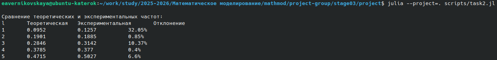

---
# Preamble

title: Колебания цепочек
subtitle: Групповой проект. Этап 4.
author:
  - Бызова Мария Олеговна
  - Верниковская Екатерина Андреевна
  - Калашникова Ольга Сергеевна
  - Богаткина Алёна Александровна
  - Сущенко Алина Николаевна
  - Кулябов Дмитрий Сергеевич. Доцент по кафедре систем телекоммуникаций. Доктор физико-математических наук по специальности 05.13.18 «Математическое моделирование, численные методы и комплексы программ». Профессор кафедры прикладной информатики и теории вероятностей РУДН. Заведующий сектором Управления информационно-технологического обеспечения, слаботочных и телекоммуникационных систем РУДН (по совместительству).
institute:
  - Российский университет дружбы народов, Москва, Россия
date: 2026-04-30

## Generic options
lang: ru-RU
crossref:
  lof-title: Список иллюстраций
  lot-title: Список таблиц
  lol-title: Листинги

## Fonts
mainfont: PT Serif
romanfont: PT Serif
sansfont: PT Sans
monofont: PT Mono
mainfontoptions: Ligatures=TeX
romanfontoptions: Ligatures=TeX
sansfontoptions: Ligatures=TeX,Scale=MatchLowercase
monofontoptions: Scale=MatchLowercase,Scale=0.9

## Formats
format:
### Pdf output format
  beamer:
    toc: true
    toc-title: Содержание
    number-sections: true
    colorlinks: false
    toc-depth: 2
    slide_level: 2
    aspectratio: 169
    section-titles: true
    theme: metropolis
    themeoptions: progressbar=frametitle,sectionpage=progressbar,numbering=fraction
    pdf-engine: xelatex
    fontenc: T2A
#### Language
    babel-lang: russian
    babel-otherlangs: english

### Html output
  revealjs:
    transition: slide
    margin: 0.2
    smaller: false
    output-ext: html
    theme: beige
    logo: _resources/image/logo_rudn.png
---

# Информация

## Состав исследовательской группы

- Бызова Мария Олеговна
- Верниковская Екатерина Андреевна
- Калашникова Ольга Сергеевна
- Богаткина Алёна Александровна
- Сущенко Алина Николаевна

## Докладчик

:::::::::::::: {.columns align=center}
::: {.column width="70%"}

  * Богаткина Алёна Александрова
  * студент учебной группы НПИбд-01-23
  * Российский университет дружбы народов
  * <https://github.com/aabogatkina>

:::
::: {.column width="30%"}


:::
::::::::::::::

# Введение

## Актуальность

Изучение колебательных процессов в кристаллических решётках является фундаментальной задачей физики конденсированного состояния. Все тела состоят из атомов, и большинство степеней свободы в кристаллах являются колебательными. Задача Ферми-Паста-Улама (FPU), возникшая на заре компьютерного моделирования, показала, что нелинейные системы могут демонстрировать удивительно сложное поведение.

## Объект и предмет исследования

- Одномерная модель твердого тела — цепочка взаимодействующих частиц
- Колебательные процессы в гармонических и ангармонических цепочках

## Цель

- Исследовать модель колебаний одномерной цепочки связанных осцилляторов в гармоническом и ангармоническом приближениях
- Описать алгоритм решения задачи моделирования
- Реализовать модель и проанализировать результаты

## Задачи

- Вывести уравнения движения для одномерной цепочки частиц
- Получить дисперсионное соотношение для гармонической цепочки
- Рассмотреть ангармоническое приближение и задачу Ферми-Паста-Улама
- Написать программу для моделирования на языке Julia
- Проанализировать полученные результаты

# Теоретическое описание задачи

## Основные понятия и уравнения. Гармоническая цепочка

Уравнение движения для $i$-й частицы:

$$
m \frac{d^2 y_i}{dt^2} = k(y_{i+1} - 2y_i + y_{i-1}), \quad i = 1 \dots N
$$

Граничные условия: $y_0 = 0$, $y_{N+1} = 0$ (неподвижные стенки)

Полная энергия системы:

$$
E = \frac{m}{2} \sum_{i=1}^{N} \left( \frac{dy_i}{dt} \right)^2 + \frac{k}{2} \sum_{i=1}^{N+1} (y_i - y_{i-1})^2
$$

## Дисперсионное соотношение

Собственные частоты нормальных мод:

$$
\omega_l = 2\omega_0 \sin\left(\frac{l\pi}{2(N+1)}\right), \quad \omega_0 = \sqrt{\frac{k}{m}}, \quad l = 1 \dots N
$$

В гармоническом приближении нормальные моды независимы и не обмениваются энергией.

## Ангармоническая цепочка. Задача Ферми-Паста-Улама

Нелинейная поправка к силе:

$$
F = -kx \left(1 - \frac{\alpha x}{d}\right)
$$

Модифицированное уравнение движения:

$$
m \frac{d^2 y_i}{dt^2} = k\left[(y_{i+1} - 2y_i + y_{i-1}) - \frac{3\alpha}{2d}\left((y_{i+1} - y_i)^2 - (y_i - y_{i-1})^2\right)\right]
$$

Ожидалась термализация, но получен эффект возврата энергии — **FPU-рекурренция**.

# Описание модели

## Параметры модели

- Масса частицы: $m = 1$
- Жесткость пружины: $k = 1$
- Равновесное расстояние: $d = 1$
- Количество частиц: $N = 32$ (как в оригинальном расчете FPU)
- Шаг по времени: $\Delta t = 0.01$
- Коэффициент ангармонизма: $\alpha = 0.5$

## Начальные условия

Начальное возбуждение задавалось в виде первой нормальной моды ($l = 1$) с амплитудой $A = 0.1$:

$$
y_i(0) = A \sin\left(\frac{\pi i}{N+1}\right), \quad v_i(0) = 0
$$

## Дискретное синус-преобразование

Для перехода в пространство нормальных мод:

$$
b_l(t) = \frac{2}{N} \sum_{j=1}^{N} y_j(t) \sin\left(\frac{\pi l j}{N+1}\right), \quad l = 1 \dots N
$$

Энергия $l$-й моды:

$$
E_l(t) = \frac{1}{2} \left( \dot{b}_l(t)^2 + \omega_l^2 b_l(t)^2 \right)
$$

# Алгоритм

## Шаг 1: Задание параметров системы

- Определение физических параметров ($m$, $k$, $d$, $N$, $\alpha$)
- Задание начальных условий ($y_i(0)$, $v_i(0)$, амплитуда $A$, номер моды $l$)

## Шаг 2: Настройка дискретизации

- Выбор шага по времени $\Delta t$ с учетом устойчивости
- Определение количества шагов $N_t$ и времени моделирования $T = N_t \cdot \Delta t$

## Шаг 3: Инициализация системы

- Задание равновесных координат: $x_i^0 = i \cdot d$
- Задание начальных смещений согласно выбранной моде

## Шаг 4: Численное интегрирование

Схема «чехарда» (leapfrog) для гармонического случая:

$$
v_i^{t+\Delta t/2} = v_i^{t-\Delta t/2} + \frac{F_i^t}{m} \Delta t, \quad y_i^{t+\Delta t} = y_i^t + v_i^{t+\Delta t/2} \Delta t
$$

Метод Верле (Velocity Verlet) для ангармонического случая.

## Шаг 5: Анализ распределения энергии по модам

- Применение дискретного синус-преобразования
- Вычисление энергии каждой моды
- Построение графиков $E_l(t)$

# Практическая часть

## Параметры модели (код)

```julia
m = 1.0       # масса частицы
k = 1.0       # жесткость пружины
d = 1.0       # равновесное расстояние
N = 32        # количество частиц
Δt = 0.01     # шаг по времени
Tmax = 100.0  # время моделирования
```

## Функция вычисления сил


```julia
function compute_forces(y)
    F = zeros(N)
    for i in 1:N
        y_left = (i > 1) ? y[i-1] : 0.0
        y_right = (i < N) ? y[i+1] : 0.0
        F[i] = k * (y_right - 2*y[i] + y_left)
    end
    return F
end
```

## Схема интегрирования «чехарда»

```julia
let
    f = compute_forces(y)
    for step in 1:Nsteps
        v .+= (f ./ m) * Δt
        y .+= v * Δt
        f = compute_forces(y)
    end
end
```

## Дискретное синус-преобразование

```julia
function dsp(x)
    b = zeros(N)
    for l in 1:N
        s = 0.0
        for j in 1:N
            s += x[j] * sin(π*l*j/(N+1))
        end
        b[l] = s * sqrt(2/(N+1))
    end
    return b
end
```

## Нелинейные силы FPU

```julia
function forces(y)
    F = zeros(N)
    for i in 1:N
        yL = (i > 1) ? y[i-1] : 0.0
        yR = (i < N) ? y[i+1] : 0.0
        ΔL = y[i] - yL
        ΔR = yR - y[i]
        F[i] = k*(yR - 2y[i] + yL) + α*(ΔR^2 - ΔL^2)
    end
    return F
end
```

# Результаты моделирования

## Задание 1. Гармоническая цепочка


Моделирование выполнено на 10000 шагов (время = 100). Схема устойчива.

## Задание 2. Измерение собственных частот

| Мода $l$ | Теоретическая $\omega_l$ | Экспериментальная $\omega_{exp}$ | Отклонение, % |
|:--------:|:------------------------:|:--------------------------------:|:-------------:|
| 1 | 0.0952 | 0.1257 | 32.05 |
| 2 | 0.1901 | 0.1885 | 0.85 |
| 3 | 0.2846 | 0.3142 | 10.37 |
| 4 | 0.3785 | 0.3770 | 0.40 |
| 5 | 0.4715 | 0.5027 | 6.60 |

## Задание 2. Измерение собственных частот



## Задание 3. Анализ распределения энергии по модам

{#fig-001 width=70%}

Энергия первой моды сохраняется, остальные моды имеют энергию, близкую к нулю. Независимость мод подтверждена.

## Задание 4. Цепочка с чередующимися массами


Моделирование цепочки с чередующимися массами выполнено на 100000 шагов.

## Задание 5. Ангармоническая цепочка. Задача Ферми-Паста-Улама

{width=70%}

Наблюдается классический FPU-возврат: энергия перетекает из первой моды в высшие, а затем возвращается обратно.

# Результаты работы

## Полученные результаты

| Задание | Результат |
|---------|-----------|
| Гармоническая цепочка | Устойчивое моделирование, 10000 шагов |
| Измерение частот | Отклонение <1% для чётных мод |
| Независимость мод | Энергия остаётся в первой моде |
| Чередующиеся массы | Модель бинарных кристаллов реализована |
| FPU-рекурренция | Классический эффект воспроизведён |

## Научные результаты

- Подтверждена независимость нормальных мод в гармоническом приближении
- Измеренные частоты для чётных мод совпадают с теорией с точностью до 1%
- Воспроизведён классический эффект Ферми-Паста-Улама — FPU-рекурренция

## Практическая значимость

Разработанный комплекс программ может использоваться для:

- демонстрации FPU-эффекта в учебном процессе
- исследования зависимости возврата от $\alpha$ и $A$
- моделирования других распределений масс

# Самооценка деятельности

## Оценка вклада участников

| Участник | Вклад |
|----------|-------|
| Бызова Мария Олеговна | Участие в теоретическом описании модели, оформление отчетов |
| Верниковская Екатерина Андреевна | Разработка алгоритмов, написание скриптов на Julia |
| Калашникова Ольга Сергеевна | Анализ результатов, подготовка презентаций |
| Богаткина Алёна Александровна | Визуализация данных, оформление графиков |
| Сущенко Алина Николаевна | Тестирование программ, вычитка отчетов |

## Оценка результатов

Все поставленные в начале проекта цели достигнуты. Разработанный комплекс программ может быть использован для:

- демонстрации явления FPU-рекурренции в учебном процессе;
- исследования зависимости времени возврата от коэффициента ангармонизма $\alpha$ и амплитуды $A$;
- моделирования других распределений масс (случайных, квазипериодических).

# Выводы

## Выводы

В ходе выполнения группового проекта полностью исследована модель колебаний одномерных цепочек. Выполнены теоретическое описание, разработка алгоритма и программная реализация на Julia. Для гармонической цепочки подтверждена независимость нормальных мод, измеренные частоты для чётных мод совпадают с теорией с точностью до 1%. На примере ангармонической цепочки воспроизведён классический эффект Ферми-Паста-Улама — рекурренция энергии мод, демонстрирующий нетривиальное поведение нелинейных систем. Все поставленные задачи выполнены в полном объёме.

## Список литературы

1. Fermi E., Pasta J., Ulam S. Studies of Nonlinear Problems // Los Alamos Scientific Laboratory Report. — 1955. — № LA-1940.
2. Dauxois T., Peyrard M., Ruffo S. The Fermi-Pasta-Ulam problem: fifty years of progress // The European Physical Journal B. — 2005. — Т. 45, № 3. — С. 297–301.
3. Медведев Д. А. и др. Моделирование физических процессов и явлений на ПК. — Новосибирск: Редакционно-издательский центр НГУ, 2010. — С. 86–91.
