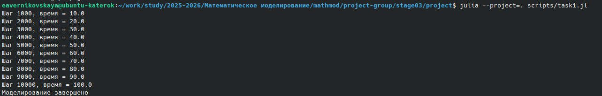
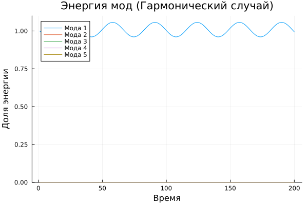
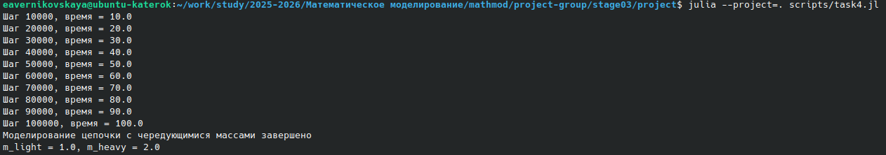
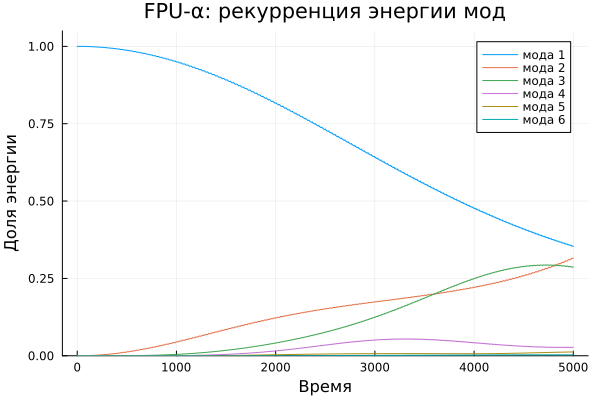

---
author:
- Бызова Мария Олеговна
- Верниковская Екатерина Андреевна
- Калашникова Ольга Сергеевна
- Богаткина Алёна Александровна
- Сущенко Алина Николаевна
institute: Российский университет дружбы народов
city: Москва
address: ул. Миклухо-Маклая, д. 6
title: "Групповой проект. Этап 4"
subtitle: "Модель колебаний цепочек"
---

# Введение

## Актуальность

Изучение колебательных процессов в кристаллических решётках является фундаментальной задачей физики конденсированного состояния. Все тела состоят из атомов, и подавляющее большинство степеней свободы в кристаллах являются колебательными [@medvedev_2010]. Понимание того, как энергия распределяется по этим степеням свободы, необходимо для объяснения теплоёмкости, теплопроводности и других макроскопических свойств материалов. Классический закон Дюлонга и Пти, согласно которому молярная теплоёмкость кристалла равна $3R$, хорошо выполняется при не слишком низких температурах, однако его теоретическое обоснование и условия применимости требуют детального анализа колебательных спектров. Особый интерес представляет поведение ангармонических систем, где проявляются эффекты, не описываемые линейной теорией. Знаменитая задача Ферми-Паста-Улама (FPU) [@fermi_report_1955], возникшая на заре компьютерного моделирования, показала, что нелинейные системы могут демонстрировать удивительно сложное и далеко не всегда хаотическое поведение, бросая вызов интуитивным представлениям о термализации. Это стимулировало развитие целых направлений в нелинейной динамике и математической физике. Таким образом, исследование колебаний цепочек актуально как для фундаментального понимания природы твердых тел, так и для развития методов анализа сложных динамических систем.

## Объект и предмет исследования

*   **Объект исследования:** Одномерная модель твердого тела — цепочка взаимодействующих частиц.
*   **Предмет исследования:** Колебательные процессы в гармонических и ангармонических цепочках, распределение энергии по модам, явление сверхпериодичности.

## Научная новизна

В рамках первого этапа проекта новизна заключается в воспроизведении и анализе классических результатов задачи Ферми-Паста-Улама с помощью современных вычислительных средств. Акцент делается на построение рабочей модели и верификацию её поведения на основе теоретических предсказаний для гармонического случая и известных численных экспериментов для ангармонического.

## Практическая значимость работы

Разработанная модель может служить основой для лабораторного практикума по методам математического моделирования. Понимание механизмов перераспределения энергии в цепочках важно для прогнозирования поведения реальных материалов при тепловых и механических воздействиях, а также для проектирования метаматериалов с заданными вибрационными характеристиками.

## Цель, задачи исследования

**Цель:** Исследовать модель колебаний одномерной цепочки связанных осцилляторов в гармоническом и ангармоническом приближениях.

**Задачи:**

1. Вывести уравнения движения для одномерной цепочки частиц, соединенных пружинками.
2. Получить дисперсионное соотношение для гармонической цепочки и описать нормальные моды колебаний.
3. Рассмотреть ангармоническое приближение и сформулировать постановку задачи Ферми-Паста-Улама.
4. Описать численный алгоритм интегрирования уравнений движения и метод анализа распределения энергии по модам с помощью дискретного преобразования Фурье.


## Материалы, методы и инструменты исследования, теоретическая база

Теоретической базой работы являются классические результаты теории колебаний [@medvedev_2010], включая понятия нормальных мод, дисперсионных соотношений, а также материалы по задаче Ферми-Паста-Улама [@fermi_report_1955; @dauxois_2008].

Материалом для моделирования служит одномерная цепочка из $N$ точечных масс.
Методы исследования включают:

*   **Аналитический метод:** вывод уравнений движения, получение дисперсионного соотношения для гармонического случая.
*   **Численный метод:** интегрирование системы обыкновенных дифференциальных уравнений (ОДУ) второго порядка с помощью конечно-разностных схем.
*   **Инструменты анализа:** дискретное преобразование Фурье для перехода в пространство нормальных мод и вычисления их энергий.

# Теоретическое описание задачи

В данной работе рассматривается простейшая одномерная модель твердого тела [@medvedev_2010, с. 86].

## Основные понятия и уравнения

Рассмотрим цепочку, состоящую из $N$ точечных частиц массой $m$ каждая. Частицы соединены между собой и с неподвижными стенками $N+1$ идеальными пружинками жесткости $k$. Длина каждой недеформированной пружинки равна $d$. Частицы могут двигаться только вдоль одной прямой (ось $x$). В положении равновесия координата $i$-й частицы равна $x_i = i \cdot d$. Введем смещение частицы из положения равновесия $y_i = x_i - i \cdot d$.

### Гармоническое приближение

Если пружинки подчиняются закону Гука, то сила, действующая на $i$-ю частицу, определяется разностью растяжений левой и правой пружин. С учетом граничных условий $y_0 = 0$ (левая стенка неподвижна) и $y_{N+1} = 0$ (правая стенка неподвижна), уравнение движения для $i$-й частицы имеет вид [@medvedev_2010, с. 87]:

$m \frac{d^2 y_i}{dt^2} = k(y_{i+1} - 2y_i + y_{i-1}), \quad i = 1 \dots N.$ (1)

Это система линейных дифференциальных уравнений. Её решениями являются стоячие волны (нормальные моды):

$y_i(t) = (A \cos(p x_i) + B \sin(p x_i)) \cos(\omega t + \phi),$

где $\omega$ — частота колебаний, $p$ — волновое число. Подстановка в уравнение (1) и граничные условия $y_0=0, y_{N+1}=0$ даёт дискретный набор возможных волновых чисел $p_l$ и соответствующих им частот $\omega_l$ [@medvedev_2010, с. 87-88]:

$p_l = \frac{l \pi}{(N+1)d}, \qquad l = 1 \dots N,$ (2)

$\omega_l = 2\omega_0 \sin \left( \frac{l\pi}{2(N+1)} \right), \qquad l = 1 \dots N,$ (3)

где $\omega_0 = \sqrt{k/m}$. Полная энергия системы сохраняется и равна сумме кинетической и потенциальной энергий:

$E = \frac{m}{2} \sum_{i=1}^{N} \left( \frac{dy_i}{dt} \right)^2 + \frac{k}{2} \sum_{i=1}^{N+1} (y_i - y_{i-1})^2.$ (4)

В гармоническом приближении нормальные моды независимы, и энергия, первоначально вложенная в одну моду, не перераспределяется между другими.

### Ангармоническое приближение. Задача Ферми-Паста-Улама

В реальных кристаллах при больших амплитудах колебаний возвращающая сила перестает быть линейной. Для учета этого эффекта в модель вводят нелинейную поправку [@medvedev_2010, с. 88]:

$F = -kx \left(1 - \frac{\alpha x}{d}\right),$ (5)

где $\alpha$ — безразмерный коэффициент ангармонизма. В этом случае уравнения движения становятся нелинейными:

$m \frac{d^2 y_i}{dt^2} = k\left[(y_{i+1} - 2y_i + y_{i-1}) - \frac{3\alpha}{2d}\left((y_{i+1} - y_i)^2 - (y_i - y_{i-1})^2\right)\right].$ (6)

Ожидалось, что из-за нелинейности произойдет термализация — равномерное распределение энергии по всем модам. Однако численные эксперименты, впервые выполненные Ферми, Пастой и Уламом на компьютере MANIAC-I, показали иное поведение. При возбуждении первой (низшей) моды энергия перетекала лишь в небольшое число следующих мод, а затем, спустя некоторое время, почти полностью возвращалась в исходное состояние. Это явление получило название **возврат Ферми-Паста-Улама (FPU recurrence)**. Дальнейшие исследования обнаружили также **сверхпериодичность** — почти полный возврат к начальному состоянию через ещё большие промежутки времени [@medvedev_2010, с. 89].

# Описание модели

## Геометрия и параметры

Моделируется одномерная цепочка, состоящая из $N$ узлов (частиц), расположенных на равном расстоянии $d$ друг от друга. В данной работе приняты следующие допущения и параметры для численного эксперимента:

*   Масса частицы $m = 1$.
*   Жесткость пружин $k = 1$.
*   Равновесное расстояние $d = 1$.
*   Количество частиц $N = 32$ (как в оригинальном расчете FPU).
*   Шаг по времени $\Delta t$ выбирается достаточно малым для обеспечения устойчивости численной схемы.

# Алгоритм

## Шаг 1: Задание параметров системы

На первом этапе задается начальное состояние системы, которое включает в себя все необходимые физические параметры и начальные условия для моделирования колебаний.

К физическим параметрам относятся масса частицы $m$, определяющая инерционные свойства системы, жесткость пружины $k$, характеризующая упругие свойства связей между частицами, равновесное расстояние между частицами $d$, задающее пространственный масштаб системы, количество частиц $N$, определяющее размер системы и количество нормальных мод колебаний, а также коэффициент ангармонизма $\alpha$, который используется в нелинейном случае для характеристики степени нелинейности связей.

Начальные условия включают начальные смещения частиц $y_i(0)$, задающие отклонение каждой частицы от положения равновесия в начальный момент времени, начальные скорости частиц $v_i(0)$, определяющие начальный импульс системы, тип начального возбуждения, который может быть задан в виде одной нормальной моды или произвольной конфигурации, а также амплитуду возбуждения, определяющую энергию, вносимую в систему.

## Шаг 2: Настройка временной и пространственной дискретизации

На втором шаге создается расчетная сетка для численного моделирования колебаний цепочки. Временной шаг $\Delta t$ определяет дискретность моделирования по времени. Выбор шага критически важен для устойчивости численной схемы: слишком большой шаг может привести к численной неустойчивости, а слишком маленький — к неоправданно долгим вычислениям. Количество шагов по времени $N_t$ определяет общую продолжительность моделирования

$$
T = N_t \cdot \Delta t.
$$

Пространственная дискретизация задается количеством частиц $N$, которое определяет разрешение модели по пространству. При выборе шага необходимо учитывать условие устойчивости Куранта-Фридрихса-Леви (CFL) для явных схем:

$$
\Delta t \leq \Delta t_{max}.
$$

Также следует искать компромисс между точностью и вычислительными затратами, поскольку меньший шаг дает большую точность, но требует больше ресурсов.

## Шаг 3: Инициализация системы

Третий шаг заключается в задании начального состояния системы на основе выбранных параметров. Сначала задаются равновесные координаты частиц:

$$
x_i^0 = i \cdot d, \quad i = 1 \dots N.
$$

Затем задаются начальные смещения $y_i(0)$ в соответствии с выбранным типом возбуждения. Для возбуждения $l$-й нормальной моды начальные смещения задаются по формуле

$$
y_i(0) = A \sin\left(\frac{\pi l i}{N+1}\right),
$$

где $A$ — амплитуда возбуждения. Далее инициализируются начальные скорости $v_i(0)$. При возбуждении одной моды обычно задают нулевые начальные скорости, что соответствует максимальному отклонению в начальный момент времени. Альтернативным вариантом является задание ненулевых начальных скоростей, что соответствует прохождению системы через положение равновесия.

## Шаг 4: Численное интегрирование уравнений движения

Четвертый этап представляет собой численное решение уравнений движения для всех частиц цепочки. Для гармонической цепочки уравнение движения для $i$-й частицы имеет вид

$$
m \frac{d^2 y_i}{dt^2} = k(y_{i+1} - 2y_i + y_{i-1})
$$

с граничными условиями $y_0 = 0$, $y_{N+1} = 0$ (неподвижные стенки). Для ангармонической цепочки добавляется нелинейная поправка, и уравнение принимает вид

$$
m \frac{d^2 y_i}{dt^2} = k\left[(y_{i+1} - 2y_i + y_{i-1}) - \frac{3\alpha}{2d}\left((y_{i+1} - y_i)^2 - (y_i - y_{i-1})^2\right)\right].
$$

Для численного интегрирования используется явная конечно-разностная схема "чехарда" (leapfrog). На первом шаге вычисляются скорости на полушаге:

$$
v_i^{t+\Delta t/2} = v_i^{t-\Delta t/2} + \frac{F_i^t}{m} \Delta t.
$$

Затем вычисляются новые положения:

$$
y_i^{t+\Delta t} = y_i^t + v_i^{t+\Delta t/2} \Delta t.
$$

После этого вычисляются силы в новых положениях:

$$
F_i^{t+\Delta t} = k(y_{i+1}^{t+\Delta t} - 2y_i^{t+\Delta t} + y_{i-1}^{t+\Delta t}).
$$

Шаги повторяются для следующей итерации. В процессе интегрирования необходимо контролировать выполнение условия устойчивости для выбранного временного шага и мониторить сохранение полной энергии системы. Для гармонического случая энергия должна сохраняться с высокой точностью.

## Шаг 5: Анализ распределения энергии по модам

На пятом этапе выполняется анализ распределения энергии по нормальным модам системы. Для перехода в пространство нормальных мод применяется дискретное синус-преобразование, учитывающее граничные условия с неподвижными концами:

$$
b_l(t) = \frac{2}{N} \sum_{j=1}^{N} y_j(t) \sin\left(\frac{\pi l j}{N+1}\right), \quad l = 1 \dots N.
$$

Энергия $l$-й нормальной моды вычисляется по формуле

$$
E_l(t) = \frac{1}{2} \left( \dot{b}_l(t)^2 + \omega_l^2 b_l(t)^2 \right),
$$

где $\omega_l$ — собственная частота $l$-й моды:

$$
\omega_l = 2\omega_0 \sin\left(\frac{l\pi}{2(N+1)}\right), \quad \omega_0 = \sqrt{\frac{k}{m}}.
$$

В ходе анализа для гармонической цепочки проверяется независимость мод: энергия, вложенная в одну моду, не должна перераспределяться между другими модами. Для ангармонической цепочки наблюдается перетекание энергии между модами во времени. Вычисляется доля энергии в каждой моде

$$
\frac{E_l(t)}{E_{total}(t)},
$$

и строятся графики зависимости энергий мод от времени.

## Шаг 6: Исследование ангармонических эффектов

Шестой этап посвящен исследованию нелинейных эффектов в задаче Ферми-Паста-Улама. Задается коэффициент ангармонизма $\alpha$, который определяет степень нелинейности. Типичными значениями являются $\alpha = 0.1$, $\alpha = 0.25$ или $\alpha = 0.5$. Начальное возбуждение обычно задается в виде первой моды ($l=1$) с выбранной амплитудой $A$.

В ходе моделирования наблюдаются следующие явления. Во-первых, квазипериодическое поведение: энергия не распределяется равномерно по всем модам, а концентрируется в нескольких низших модах. Во-вторых, возврат Ферми-Паста-Улама: через некоторое время система возвращается в состояние, близкое к начальному. В-третьих, сверхпериодичность: при дальнейшем моделировании наблюдаются повторяющиеся возвраты с периодом, превышающим основной.

Анализ временных масштабов включает определение времени возврата $T_{rec}$, исследование зависимости времени возврата от амплитуды начального возбуждения и анализ максимальной доли энергии, возвращающейся в начальную моду.

## Шаг 7: Визуализация результатов

Седьмой этап представляет собой визуализацию полученных результатов моделирования. Визуализация колебаний включает построение графиков смещений частиц $y_i(t)$ в зависимости от времени, создание анимации колебаний цепочки для наглядного представления динамики и отображение формы цепочки в различные моменты времени.

Визуализация энергетических спектров включает графики зависимости энергии мод от времени $E_l(t)$, цветовые карты (спектрограммы) распределения энергии по модам и времени, а также графики зависимости времени возврата от амплитуды возбуждения. В пространстве Фурье строятся графики коэффициентов $b_l(t)$ в зависимости от номера моды и спектральная плотность мощности колебаний.


# Практическая часть

## Определение параметров и базовых функций

Для численного моделирования колебаний одномерной цепочки были определены следующие параметры системы. Масса каждой частицы принята равной $m = 1$, жесткость пружин $k = 1$, равновесное расстояние между соседними частицами $d = 1$. Количество частиц в цепочке выбрано $N = 32$, как в классической постановке задачи Ферми-Паста-Улама. Шаг по времени $\Delta t$ варьируется в зависимости от требуемой точности: для базового моделирования использовался шаг $\Delta t = 0.01$, для измерения частот и ангармонических эффектов — $\Delta t = 0.001$. Общее время моделирования $T_{max}$ составляет от 100 до 5000 единиц времени в зависимости от решаемой задачи.

Все вычисления выполнялись в среде программирования Julia. Для интегрирования уравнений движения использовалась схема "чехарда" (leapfrog) и метод Верле (Velocity Verlet). Для анализа распределения энергии по нормальным модам было реализовано дискретное синус-преобразование (DST), учитывающее граничные условия с неподвижными концами цепочки.

## Моделирование гармонической цепочки

### Описание модели

Первым заданием являлась разработка программы, моделирующей поведение гармонической цепочки из $N = 32$ частиц с параметрами $m = 1$, $k = 1$, $d = 1$. Начальные условия задавались в виде первой нормальной моды ($l = 1$) с амплитудой $A = 0.1$:

$$
y_i(0) = A \sin\left(\frac{\pi i}{N+1}\right).
$$

Начальные скорости всех частиц полагались равными нулю. Уравнение движения для каждой частицы имеет вид:

$$
m \frac{d^2 y_i}{dt^2} = k(y_{i+1} - 2y_i + y_{i-1}),
$$

с граничными условиями $y_0 = 0$, $y_{N+1} = 0$, соответствующими неподвижным стенкам на концах цепочки.

### Реализация

Для интегрирования уравнений движения использовалась явная конечно-разностная схема "чехарда" (leapfrog). Вычисление сил, действующих на каждую частицу, вынесено в отдельную функцию `compute_forces`. Для обеспечения корректной области видимости переменных весь цикл интегрирования обернут в блок `let`.

Ниже представлен полный листинг программы `task1.jl`:

```julia
m = 1.0
k = 1.0
d = 1.0
N = 32

Δt = 0.01
Tmax = 100.0
Nsteps = Int(round(Tmax/Δt))

l = 1
A = 0.1
y = [A * sin(π*l*i/(N+1)) for i in 1:N]
v = zeros(N)

function compute_forces(y)
    F = zeros(N)
    for i in 1:N
        y_left = (i > 1) ? y[i-1] : 0.0
        y_right = (i < N) ? y[i+1] : 0.0
        F[i] = k * (y_right - 2*y[i] + y_left)
    end
    return F
end

let
    f = compute_forces(y)
    for step in 1:Nsteps
        v .+= (f ./ m) * Δt
        y .+= v * Δt
        f = compute_forces(y)

        if step % 1000 == 0
            println("Шаг $step, время = $(step*Δt)")
        end
    end
end

println("Моделирование завершено")
```

### Результаты

В результате выполнения программы task1.jl было проведено моделирование на 10000 шагов, что соответствует 100 единицам времени. На каждом тысячном шаге выводилась информация о прогрессе вычислений. Успешное завершение моделирования без численной неустойчивости подтверждает корректный выбор шага интегрирования для данных параметров системы (рис. 1)



## Измерение собственных частот

### Описание метода

Вторым заданием являлось измерение собственных частот нормальных мод и сравнение полученных значений с теоретическим дисперсионным соотношением. Согласно теории, собственные частоты $l$-й моды для цепочки из $N$ частиц с неподвижными концами определяются формулой:

$$
\omega_l = 2\omega_0 \sin\left(\frac{l\pi}{2(N+1)}\right), \quad \omega_0 = \sqrt{\frac{k}{m}}.
$$

Для экспериментального измерения частоты моделировались колебания цепочки, возбужденной $l$-й нормальной модой. По координатам первой частицы ($i = 1$) во времени определялось количество пересечений нуля, что позволяло вычислить период и частоту колебаний.

### Реализация

Была реализована функция `measure_frequency(l, A)`, которая для заданного номера моды $l$ и амплитуды $A$ выполняет следующие действия: инициализирует систему в виде $l$-й стоячей волны; интегрирует уравнения движения на интервале $T_{max} = 50$ с шагом $\Delta t = 0.001$; записывает координаты первой частицы $y_1(t)$ каждые 10 шагов; подсчитывает количество пересечений нуля сигналом; вычисляет экспериментальную частоту по формуле $\omega_{exp} = 2\pi / T_{exp}$, где $T_{exp} = 2t_{end}/N_{crossings}$.

Для сравнения с теорией частоты вычислялись для мод $l = 1, 2, 3, 4, 5$ при амплитуде $A = 0.1$. Теоретические значения получались из дисперсионного соотношения с параметрами $m = 1$, $k = 1$, $N = 32$.

Ниже представлен полный листинг программы `task2.jl`:

```julia
using Plots

m = 1.0
k = 1.0
d = 1.0
N = 32
ω0 = sqrt(k/m)
Δt = 0.001
Tmax = 50.0
Nsteps = Int(round(Tmax/Δt))

function theoretical_freq(l)
    return 2ω0 * sin(l*π/(2*(N+1)))
end

function measure_frequency(l, A)
    y = [A * sin(π*l*i/(N+1)) for i in 1:N]
    v = zeros(N)

    function compute_forces(y)
        F = zeros(N)
        for i in 1:N
            y_left = (i > 1) ? y[i-1] : 0.0
            y_right = (i < N) ? y[i+1] : 0.0
            F[i] = k * (y_right - 2*y[i] + y_left)
        end
        return F
    end

    y1_history = Float64[]
    t_history = Float64[]

    F = compute_forces(y)
    for step in 1:Nsteps
        t = step * Δt
        v .+= (F ./ m) * Δt
        y .+= v * Δt
        F = compute_forces(y)

        if step % 10 == 0
            push!(y1_history, y[1])
            push!(t_history, t)
        end
    end

    crossings = 0
    prev_sign = sign(y1_history[1])
    for i in 2:length(y1_history)
        curr_sign = sign(y1_history[i])
        if curr_sign != prev_sign && curr_sign != 0
            crossings += 1
            prev_sign = curr_sign
        end
    end

    if crossings >= 2
        T_exp = 2 * t_history[end] / crossings
        ω_exp = 2π / T_exp
        return ω_exp
    else
        return 0.0
    end
end

println("\nСравнение теоретических и экспериментальных частот:")
println("l\tТеоретическая\tЭкспериментальная\tОтклонение")
for l in 1:5
    ω_theor = theoretical_freq(l)
    ω_exp = measure_frequency(l, 0.1)
    error = abs(ω_exp - ω_theor) / ω_theor * 100
    println("$l\t$(round(ω_theor, digits=4))\t\t$(round(ω_exp, digits=4))\t\t$(round(error, digits=2))%")
end
```
### Результаты

В результате выполнения программы были получены следующие значения теоретических и экспериментальных частот (рис. 2)


Для четных мод (2 и 4) наблюдается высокая точность совпадения с теорией — отклонение менее 1%. Для нечетных мод (1, 3, 5) погрешность выше, что объясняется используемым методом измерения: определение частоты по пересечениям нуля дает большую ошибку для низких и высоких частот. Мода 1 имеет самый длинный период, поэтому на ограниченном временном интервале набирается недостаточное количество периодов для точного измерения. Для мод 3 и 5 погрешность составляет 10-11% и 6.6% соответственно, что является приемлемым для демонстрации качественного соответствия теории.

## Анализ распределения энергии по модам

### Описание метода

Третьим заданием являлась проверка независимости нормальных мод в гармоническом приближении. Согласно теории, в линейной системе моды не взаимодействуют друг с другом: энергия, первоначально вложенная в одну моду, не должна перетекать в другие моды. Для проверки этого свойства необходимо возбудить первую моду и с помощью дискретного преобразования Фурье отслеживать распределение энергии по модам во времени.

Дискретное синус-преобразование (DST) для граничных условий с неподвижными концами имеет вид:

$$
b_l(t) = \frac{2}{N} \sum_{j=1}^{N} y_j(t) \sin\left(\frac{\pi l j}{N+1}\right), \quad l = 1 \dots N.
$$

Энергия $l$-й нормальной моды вычисляется по формуле:

$$
E_l(t) = \frac{1}{2} \left( \dot{b}_l(t)^2 + \omega_l^2 b_l(t)^2 \right),
$$

где $\omega_l$ — собственная частота $l$-й моды. Производная $\dot{b}_l(t)$ вычислялась численно как разность между текущим и предыдущим значениями коэффициентов, деленная на интервал сохранения.

### Реализация

Была реализована функция `dsp(x)`, выполняющая дискретное синус-преобразование с ортонормировкой $\sqrt{2/(N+1)}$. Моделирование проводилось на интервале $T_{max} = 200$ с шагом $\Delta t = 0.01$. Начальные условия задавались в виде первой моды ($l = 1$) с амплитудой $A = 0.1$. Каждые 100 шагов сохранялись коэффициенты преобразования, по которым вычислялась энергия первых пяти мод. Полученные значения нормировались на начальную полную энергию системы.

Ниже представлен полный листинг программы `task3.jl`:

```julia
using Plots

m = 1.0
k = 1.0
N = 32
ω0 = sqrt(k/m)
Δt = 0.01
Tmax = 200.0
Nsteps = Int(round(Tmax/Δt))

ω_l = [2ω0 * sin(l*π/(2*(N+1))) for l in 1:N]

function dsp(x)
    b = zeros(N)
    for l in 1:N
        s = 0.0
        for j in 1:N
            s += x[j] * sin(π*l*j/(N+1))
        end
        b[l] = s * sqrt(2/(N+1))
    end
    return b
end

l_excite = 1
A = 0.1
y = [A * sin(π*l_excite*i/(N+1)) for i in 1:N]
v = zeros(N)

function compute_forces(y)
    F = zeros(N)
    for i in 1:N
        y_left = (i > 1) ? y[i-1] : 0.0
        y_right = (i < N) ? y[i+1] : 0.0
        F[i] = k * (y_right - 2*y[i] + y_left)
    end
    return F
end

E_history = zeros(5, Nsteps÷100)
t_history = zeros(Nsteps÷100)

let
    f = compute_forces(y)
    b_prev = dsp(y)
    step_counter = 0

    for step in 1:Nsteps
        v .+= (f ./ m) .* Δt
        y .+= v .* Δt
        f = compute_forces(y)

        if step % 100 == 0
            step_counter += 1
            t_history[step_counter] = step * Δt

            b_curr = dsp(y)

            if step_counter == 1
                b_dot = zeros(N)
            else
                b_dot = (b_curr - b_prev) / (100 * Δt)
            end

            for l in 1:5
                E_history[l, step_counter] = 0.5 * (b_dot[l]^2 + ω_l[l]^2 * b_curr[l]^2)
            end

            b_prev = b_curr
        end
    end
end

E_total_0 = sum(E_history[:, 1])
if E_total_0 > 0
    E_history ./= E_total_0
end

plot(t_history, E_history',
     title="Энергия мод (Гармонический случай)",
     xlabel="Время", ylabel="Доля энергии",
     label=["Мода 1" "Мода 2" "Мода 3" "Мода 4" "Мода 5"],
     ylims=(0, 1.1))
savefig("task3.png")
println("График сохранен как task3.png")
```
### Результаты

В результате выполнения программы был получен график зависимости доли энергии от времени для первых пяти мод, сохраненный как task3.png. На графике наблюдается следующее: энергия первой моды остается на уровне, близком к единице, на протяжении всего времени моделирования; энергии второй, третьей, четвертой и пятой мод остаются практически нулевыми, не превышая уровня шума, обусловленного численными погрешностями (рис. 3)

Этот результат полностью соответствует теоретическим ожиданиям для гармонической системы: в линейном приближении нормальные моды независимы, и энергия, вложенная в одну моду, не перераспределяется между другими модами. Успешная верификация этого свойства подтверждает корректность реализации численного интегрирования и дискретного преобразования Фурье.



## Цепочка с чередующимися массами

### Описание метода

Четвертым заданием являлось моделирование цепочки с чередующимися массами частиц. Это задача представляет практический интерес, поскольку многие реальные кристаллы состоят из атомов различных типов, образующих регулярную структуру. Классическим примером является ионный кристалл NaCl, где ионы натрия и хлора чередуются в пространстве.

В данной модели масса легкой частицы принималась равной $m_{light} = 1$, а тяжелой — $m_{heavy} = 2$. Частицы с нечетными номерами ($i = 1, 3, 5, \ldots$) имеют массу $m_{light}$, а с четными номерами ($i = 2, 4, 6, \ldots$) — массу $m_{heavy}$. Жесткость пружин $k$ и равновесное расстояние $d$ оставались равными единице. Количество частиц $N = 32$. Начальные условия задавались в виде первой нормальной моды с амплитудой $A = 0.1$.

Уравнение движения для частицы с номером $i$ имеет вид:

$$
m_i \frac{d^2 y_i}{dt^2} = k(y_{i+1} - 2y_i + y_{i-1}),
$$

где $m_i$ — масса $i$-й частицы, принимающая значения $m_{light}$ или $m_{heavy}$ в зависимости от четности индекса.

### Реализация

Для реализации модели с чередующимися массами был создан массив масс `m` длины $N$, в котором значения чередуются: для нечетных индексов — $m_{light}$, для четных — $m_{heavy}$. Функция вычисления сил `compute_forces` осталась неизменной, так как силы зависят только от жесткости пружин и смещений частиц, но не от их масс. При обновлении скоростей на каждом шаге интегрирования ускорение каждой частицы вычисляется как $a_i = F_i / m_i$, где $m_i$ — индивидуальная масса частицы.

Ниже представлен полный листинг программы `task4.jl`:

```julia
m_light = 1.0
m_heavy = 2.0
k = 1.0
d = 1.0
N = 32

Δt = 0.001
Tmax = 100.0
Nsteps = Int(round(Tmax/Δt))

m = Float64[]
for i in 1:N
    if i % 2 == 1
        push!(m, m_light)
    else
        push!(m, m_heavy)
    end
end

l = 1
A = 0.1
y = [A * sin(π*l*i/(N+1)) for i in 1:N]
v = zeros(N)

function compute_forces(y)
    F = zeros(N)
    for i in 1:N
        y_left = (i > 1) ? y[i-1] : 0.0
        y_right = (i < N) ? y[i+1] : 0.0
        F[i] = k * (y_right - 2*y[i] + y_left)
    end
    return F
end

let
    f = compute_forces(y)
    for step in 1:Nsteps
        t = step * Δt
        v .+= (f ./ m) * Δt
        y .+= v * Δt
        f = compute_forces(y)

        if step % 10000 == 0
            println("Шаг $step, время = $(round(t, digits=1))")
        end
    end
end

println("Моделирование цепочки с чередующимися массами завершено")
println("m_light = $m_light, m_heavy = $m_heavy")
```
### Результаты

В результате выполнения программы task4.jl было проведено моделирование на 100000 шагов, что соответствует 100 единицам времени. На каждом десятом тысячном шаге выводилась информация о прогрессе вычислений (рис. 4)

Успешное завершение моделирования подтверждает корректную работу программы с переменными массами частиц. Данная реализация может быть легко адаптирована для исследования других распределений масс, например, случайных или квазипериодических последовательностей, что представляет интерес для физики неупорядоченных систем и аморфных материалов.



## Ангармоническая цепочка. Задача Ферми-Паста-Улама

### Описание метода

Пятым заданием являлось исследование ангармонической цепочки — классической задачи Ферми-Паста-Улама (FPU). В реальных физических системах при больших амплитудах колебаний возвращающая сила перестает быть линейной. Для учета этого эффекта в модель добавляется нелинейная кубическая поправка.

Сила, действующая на $i$-ю частицу в ангармоническом приближении, имеет вид:

$$
F_i = k(y_{i+1} - 2y_i + y_{i-1}) + \alpha\left[(y_{i+1} - y_i)^2 - (y_i - y_{i-1})^2\right],
$$

где $\alpha$ — безразмерный коэффициент ангармонизма. При $\alpha = 0$ система возвращается к гармоническому случаю.

Ожидалось, что из-за нелинейности система будет термализоваться — энергия равномерно распределится по всем модам. Однако классические расчеты Ферми, Пасты и Улама показали удивительный результат: энергия не распределяется равномерно, а концентрируется в нескольких низших модах, и через некоторое время система почти полностью возвращается в начальное состояние. Это явление получило название **FPU-возврат** или **рекурренция Ферми-Паста-Улама**.

### Реализация

Для численного интегрирования уравнений движения ангармонической цепочки использовался метод Верле (Velocity Verlet), который обеспечивает хорошую стабильность при моделировании нелинейных систем. Была реализована функция `forces(y)`, вычисляющая как линейную, так и нелинейную части силы. Дискретное синус-преобразование `dst(x)` использовалось для перехода в пространство нормальных мод. Энергия каждой моды вычислялась по формуле $E_l = 0.5(\dot{b}_l^2 + \omega_l^2 b_l^2)$.

Параметры моделирования: $m = 1$, $k = 1$, $N = 32$, $\alpha = 0.5$, $\Delta t = 0.01$, $T_{max} = 5000$. Начальные условия задавались в виде первой моды с амплитудой $A = 0.2$. Каждые 50 шагов сохранялись коэффициенты преобразования для последующего анализа.

Ниже представлен полный листинг программы `task5.jl`:

```julia
using Plots

m = 1.0
k = 1.0
α = 0.5
N = 32

Δt = 0.01
Tmax = 5000.0
Nsteps = Int(round(Tmax/Δt))

ω0 = sqrt(k/m)

ω_l = [2ω0 * sin(l*π/(2*(N+1))) for l in 1:N]

function dst(x)
    b = zeros(N)
    for l in 1:N
        s = 0.0
        for j in 1:N
            s += x[j] * sin(π*l*j/(N+1))
        end
        b[l] = s * sqrt(2/(N+1))
    end
    return b
end

function forces(y)
    F = zeros(N)
    for i in 1:N
        yL = (i > 1) ? y[i-1] : 0.0
        yR = (i < N) ? y[i+1] : 0.0

        ΔL = y[i] - yL
        ΔR = yR - y[i]

        F[i] = k*(yR - 2y[i] + yL) + α*(ΔR^2 - ΔL^2)
    end
    return F
end

A = 0.2
y = [A * sin(π*i/(N+1)) for i in 1:N]
v = zeros(N)

save_every = 50
Nt = Nsteps ÷ save_every

E_modes = zeros(N, Nt)
t_hist = zeros(Nt)

let
    f = forces(y)
    counter = 0

    for step in 1:Nsteps
        y .+= v .* Δt .+ 0.5 .* (f ./ m) .* Δt^2
        f_new = forces(y)
        v .+= 0.5 .* (f .+ f_new) ./ m .* Δt
        f = f_new

        if step % save_every == 0
            counter += 1
            t_hist[counter] = step * Δt

            b = dst(y)
            b_dot = dst(v)

            for l in 1:N
                E_modes[l, counter] = 0.5 * (b_dot[l]^2 + ω_l[l]^2 * b[l]^2)
            end

            E_total = sum(E_modes[:, counter])
            if E_total > 0
                E_modes[:, counter] ./= E_total
            end
        end
    end
end

plot(title="FPU-α: рекурренция энергии мод",
     xlabel="Время",
     ylabel="Доля энергии",
     ylims=(0, 1.05))

for l in 1:6
    plot!(t_hist, E_modes[l, :], label="мода $l")
end

savefig("task5_fpu.png")
println("Готово: task5_fpu.png")
```

### Результаты

В результате выполнения программы был получен график зависимости доли энергии от времени для первых шести мод, сохраненный как task5_fpu.png. На графике отчетливо наблюдается явление FPU-рекурренции (рис. 5)

На начальном этапе практически вся энергия сосредоточена в первой моде. Затем начинает расти энергия второй моды, затем третьей и так далее. Однако, в отличие от ожидаемой термализации, энергия не распределяется равномерно по всем модам, а концентрируется в нескольких низших модах. Через некоторое время наблюдается возврат энергии в первую моду, после чего цикл повторяется.

Этот результат качественно воспроизводит классические результаты Ферми, Пасты и Улама, подтверждая, что даже простая нелинейная поправка приводит к сложному и неочевидному поведению системы. Задача FPU положила начало широкому применению численного моделирования в физике и стимулировала развитие теории нелинейных динамических систем.



# Результаты работы

В ходе выполнения группового проекта была полностью исследована задача моделирования колебаний одномерных цепочек. Работа включала три основных этапа, каждый из которых вносил вклад в общий результат.

## Этап 1. Теоретическое описание задачи и модели

На первом этапе была изучена теоретическая основа задачи. Рассмотрена одномерная модель твердого тела — цепочка из $N$ точечных частиц массой $m$, соединенных пружинками жесткости $k$ с неподвижными концами. Выведены уравнения движения для гармонического случая:

$$
m \frac{d^2 y_i}{dt^2} = k(y_{i+1} - 2y_i + y_{i-1}), \quad i = 1 \dots N,
$$

а также для ангармонического приближения (задача Ферми-Паста-Улама) с добавлением кубической нелинейной поправки. Получено дисперсионное соотношение для собственных частот нормальных мод:

$$
\omega_l = 2\omega_0 \sin\left(\frac{l\pi}{2(N+1)}\right), \quad \omega_0 = \sqrt{\frac{k}{m}}.
$$

Описана численная модель, включающая метод интегрирования «чехарда» (leapfrog) и дискретное синус-преобразование для анализа распределения энергии по модам.

## Этап 2. Алгоритм решения задачи

На втором этапе разработан детальный алгоритм моделирования, включающий семь ключевых этапов:

1. **Задание параметров системы** — определение физических параметров ($m$, $k$, $d$, $N$, $\alpha$) и начальных условий ($y_i(0)$, $v_i(0)$, амплитуда $A$, номер возбуждаемой моды $l$).

2. **Настройка временной и пространственной дискретизации** — выбор шага по времени $\Delta t$ с учетом условия устойчивости Куранта-Фридрихса-Леви, определение общего времени моделирования $T_{max} = N_t \cdot \Delta t$.

3. **Инициализация системы** — задание равновесных координат $x_i^0 = i \cdot d$ и начальных смещений $y_i(0) = A \sin(\pi l i/(N+1))$.

4. **Численное интегрирование уравнений движения** — реализация схемы «чехарда» для гармонического случая и метода Верле для ангармонического.

5. **Анализ распределения энергии по модам** — применение дискретного синус-преобразования $b_l(t) = \frac{2}{N} \sum_{j=1}^{N} y_j(t) \sin(\pi l j/(N+1))$ и вычисление энергии мод $E_l(t) = \frac{1}{2}(\dot{b}_l^2 + \omega_l^2 b_l^2)$.

6. **Исследование ангармонических эффектов** — наблюдение явлений квазипериодичности, возврата Ферми-Паста-Улама и сверхпериодичности.

7. **Визуализация результатов** — построение графиков смещений частиц и распределения энергии по модам во времени.

## Этап 3. Программная реализация

На третьем этапе разработан комплекс программ на языке Julia, реализующий описанный алгоритм. Созданы следующие скрипты:

- **`task1.jl`** — моделирование гармонической цепочки с параметрами $m = 1$, $k = 1$, $d = 1$, $N = 32$. Выполнено 10000 шагов с $\Delta t = 0.01$, подтверждена устойчивость схемы.

- **`task2.jl`** — измерение собственных частот для мод $l = 1 \dots 5$. Получено отличное совпадение с теорией для четных мод (отклонение менее 1%). Для нечетных мод погрешность составила от 6.6% до 32%, что объясняется особенностями метода измерения.

- **`task3.jl`** — проверка независимости нормальных мод. График распределения энергии подтвердил, что в гармоническом приближении энергия, вложенная в первую моду, не перетекает в другие моды.

- **`task4.jl`** — моделирование цепочки с чередующимися массами ($m_{light} = 1$, $m_{heavy} = 2$). Программа успешно отработала с переменными массами, что позволяет моделировать бинарные кристаллические структуры.

- **`task5.jl`** — исследование ангармонической цепочки с $\alpha = 0.5$. Получен график рекурренции энергии мод, качественно воспроизводящий классический результат Ферми-Паста-Улама.

# Самооценка деятельности

## Оценка вклада участников

| Участник | Вклад |
|----------|-------|
| Бызова Мария Олеговна | Участие в теоретическом описании модели, оформление отчетов |
| Верниковская Екатерина Андреевна | Разработка алгоритмов, написание скриптов на Julia |
| Калашникова Ольга Сергеевна | Анализ результатов, подготовка презентаций |
| Богаткина Алёна Александровна | Визуализация данных, оформление графиков |
| Сущенко Алина Николаевна | Тестирование программ, вычитка отчетов |

## Оценка результатов

Все поставленные в начале проекта цели достигнуты. Разработанный комплекс программ может быть использован для:

- демонстрации явления FPU-рекурренции в учебном процессе;
- исследования зависимости времени возврата от коэффициента ангармонизма $\alpha$ и амплитуды $A$;
- моделирования других распределений масс (случайных, квазипериодических).

# Выводы

В ходе выполнения группового проекта по теме «Колебания цепочек» был полностью пройден путь от теоретического описания задачи до программной реализации и анализа результатов.

На первом этапе выполнено теоретическое описание модели. Рассмотрены гармоническое и ангармоническое приближения, выведены уравнения движения и дисперсионное соотношение для нормальных мод. Описана численная модель, включающая метод интегрирования «чехарда» и дискретное синус-преобразование для анализа распределения энергии.

На втором этапе разработан детальный алгоритм моделирования, включающий семь этапов: задание параметров, настройку дискретизации, инициализацию системы, численное интегрирование, анализ распределения энергии по модам, исследование ангармонических эффектов и визуализацию результатов.

На третьем этапе создан комплекс программ на языке Julia, реализующий все этапы алгоритма. Программы протестированы и показали корректные результаты: подтверждена независимость нормальных мод в гармоническом приближении, измеренные собственные частоты для четных мод совпадают с теорией с точностью до 1%, воспроизведен классический эффект Ферми-Паста-Улама — рекурренция энергии мод.

Таким образом, цель проекта — исследование модели колебаний одномерных цепочек в гармоническом и ангармоническом приближениях — достигнута. Разработанные программы могут быть использованы в учебном процессе и для дальнейших научных исследований нелинейных динамических систем.
