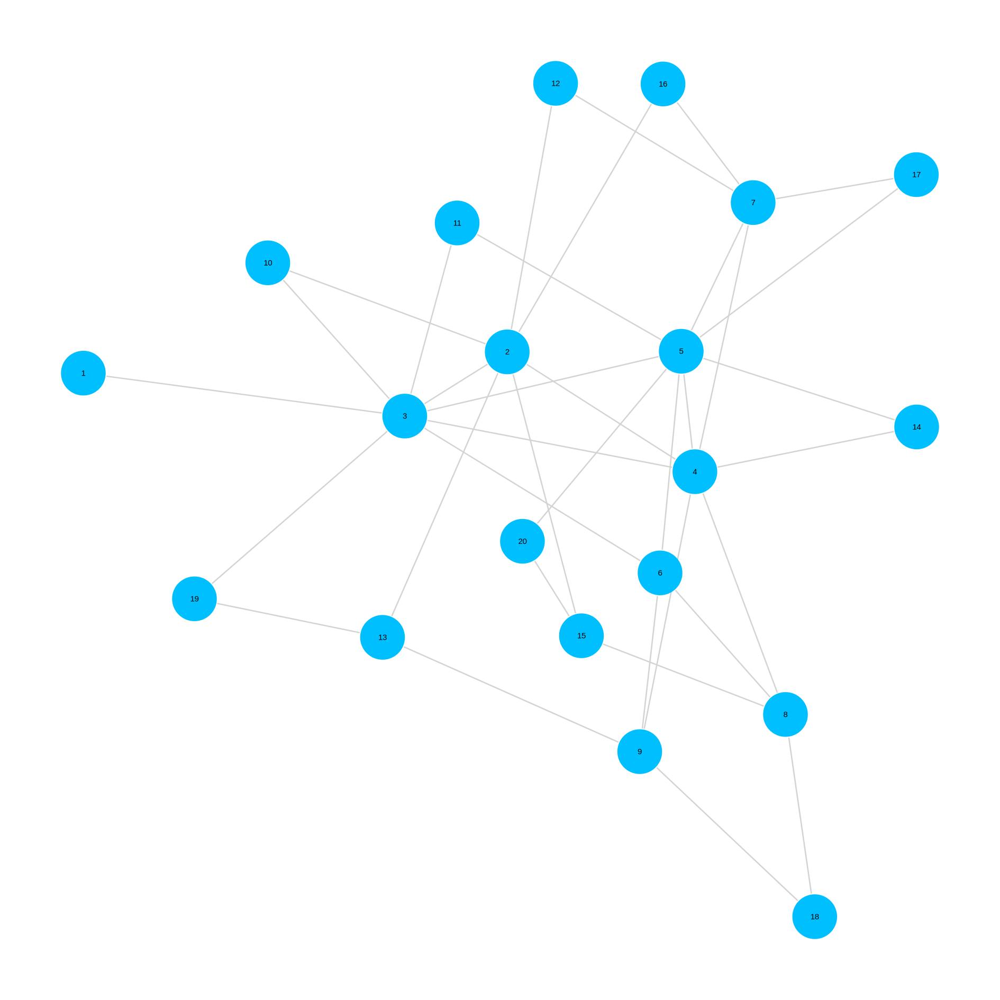
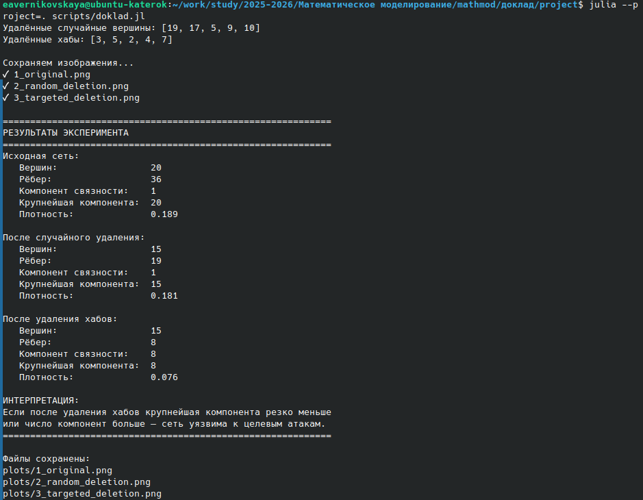

---
# Preamble

## Author
author:
  name: Верниковская E. A., НПИбд-01-23
  degrees: Student
  email: 11322361366@rudn.ru
  affiliation:
    - name: Российский университет дружбы народов
      country: Российская Федерация
      postal-code: 117198
      city: Москва
      address: ул. Миклухо-Маклая, д. 6

## Title
title: Доклад
subtitle: Сетевые модели
license: CC BY
date: 2026-04-28

## Generic options
lang: ru-RU
crossref:
  lof-title: Список иллюстраций
  lot-title: Список таблиц
  lol-title: Листинги

## Fonts 
mainfont: PT Serif 
romanfont: PT Serif 
sansfont: PT Sans 
monofont: PT Mono 
mainfontoptions: Ligatures=TeX 
romanfontoptions: Ligatures=TeX 
sansfontoptions: Ligatures=TeX,Scale=MatchLowercase 
monofontoptions: Scale=MatchLowercase,Scale=0.9

## Formats
format:
### Pdf output format
  beamer:
    toc: true
    toc-title: Содержание
    number-sections: true
    colorlinks: false
    toc-depth: 2
    slide_level: 2
    aspectratio: 169
    section-titles: true
    theme: metropolis
    themeoptions: progressbar=frametitle,sectionpage=progressbar,numbering=fraction
    pdf-engine: xelatex
    fontenc: T2A
#### Language
    babel-lang: russian
    babel-otherlangs: english

### Html output
  revealjs:
    transition: slide
    margin: 0.2
    smaller: false
    output-ext: html
    theme: beige
    logo: _resources/image/logo_rudn.png
---

## Докладчик

:::::::::::::: {.columns align=center}
::: {.column width="70%"}

  * Верниковская Екатерина Андреевна
  * Студентка
  * Российский университет дружбы народов
  * [1132236136@rudn.ru](mailto:1132236136@rudn.ru)

:::
::: {.column width="30%"}


:::
::::::::::::::

# Вводная часть

## Вводная часть 

:::::::::::::: {.columns align=top}
::: {.column width="60%"}
**Актуальность темы и проблема:**
  
  
  современный мир состоит из сложных сетевых структур - от транспортных систем и интернета до социальных и биологических сетей. Ключевая проблема заключается в том, что традиционные математические модели часто не учитывают структурные взаимосвязи между элементами системы. Сетевые модели позволяют описать и проанализировать эти связи, что делает их актуальным инструментом для решения задач оптимизации, прогнозирования и управления в самых разных областях
  
:::
::: {.column width="30%"}
**Объект и предмет исследования:**
  

  в качестве объекта исследования выступают сложные системы различной природы, а предметом являются сетевые модели, описывающие структуру связей между элементами и анализирующие происходящие в них процессы
  
:::
::::::::::::::

## Вводная часть 

:::::::::::::: {.columns align=top}
::: {.column width="30%"}
**Цель:**
  
  
  цель данного доклада - раскрыть понятие сетевых моделей и показать их роль в математическом моделировании
  
:::
::: {.column width="40%"}
**Задачи исследования:**
  
  
  изучить основные понятия и элементы сетевых моделей, рассмотреть их классификации, а также проанализировать типовые математические задачи, решаемые на сетях
  
:::
::: {.column width="30%"}
**Материалы и методы и инструменты исследования:**
  
  
 интернет-ресурсы, аналитика, методы теории графов, язык программирования Julia и специализированные пакеты для работы с сетевыми моделями
:::
::::::::::::::

# Введение

## Что такое сетевая модель в математическом моделировании?

:::::::::::::: {.columns align=top}
::: {.column width="40%"}

{width="100%"}

:::
::: {.column width="60%"}

**Сетевая модель** - это математическая модель сложных систем, представляемая в виде графа **G=(V,E)**, где:

- **V** (вершины) - объекты системы
- **E** (рёбра) - связи между ними

:::
::::::::::::::

## Значение сетевых моделей в современном мире

Основная цель сетевых моделей - исследовать структуру связей, выявлять важные элементы системы, анализировать её устойчивость и решать оптимизационные задачи

**Области применения:**

- Информатика (PageRank, кибербезопасность)
- Транспортная логистика
- Эпидемиология (распространение инфекций)
- Биология и нейронауки
- Экономика и управление проектами

# Структура сетевой модели

## Основные элементы сетевой модели

- **Вершины (узлы)** - объекты или сущности системы
- **Рёбра (связи, дуги)** - отражают отношения, взаимодействия, зависимости или потоки

Дополнительно в графах могут присутствовать петли (ребро, соединяющее вершину с самой собой) и кратные рёбра (несколько рёбер между одной и той же парой вершин), хотя в большинстве прикладных моделей они используются относительно редко

## Виды связей

- **По направленности:** 

	+ неориентированные - связи, действующие в обе стороны
	+ ориентированные - связи, имеющие направление
	
- **По наличию веса:**

	+ невзвешенные - фиксируют только факт наличия или отсутствия связи
	+ взвешенные - каждому ребру присваивается числовое значение (вес)

## Способы формального задания сетевых моделей

- **Матрица смежности** - квадратная матрица размером $n \times n$, где $n$ - количество вершин
- **Список смежности** - для каждой вершины хранится список всех смежных с ней вершин (с указанием весов при необходимости)
- **Список рёбер** - простой перечень всех рёбер в виде пар $(i, j)$ или троек $(i, j, w)$ для взвешенных графов
- **Матрица инцидентности** - матрица размером $n \times m$, элементы которой показывают связь между вершинами и рёбрами

# Классические модели структуры сложных сетей

## Случайные графы (модель Эрдёша-Реньи, 1959)

:::::::::::::: {.columns align=top}
::: {.column width="40%"}

- Каждое ребро появляется с вероятностью **p**
- Распределение степеней - пуассоновское
- Нет ярко выраженных «лидеров»
- Служит «нулевой» базой для сравнения

:::
::: {.column width="60%"}


:::
::::::::::::::

## Модели малого мира (Уоттс-Строгатц, 1998)

:::::::::::::: {.columns align=top}
::: {.column width="40%"}

- Объясняет эффект «шести рукопожатий»
- Высокая локальная кластеризация при малой средней длине пути
- **Применение:** социальные сети, нейронные сети, энергосистемы

:::
::: {.column width="50%"}


:::
::::::::::::::

## Безмасштабные сети (модель Барабаши-Альберт, 1999)

:::::::::::::: {.columns align=top}
::: {.column width="60%"}

- **Предпочтительное присоединение:** новые вершины подключаются к популярным узлам
- Распределение степеней - степенной закон
- Мало «хабов», много слабо связанных вершин
- Устойчивы к случайным сбоям, уязвимы к атакам на хабы

:::
::: {.column width="50%"}


:::
::::::::::::::

# Типовые математические задачи, решаемые на сетевых моделях

## Задача о кратчайшем пути

**Постановка:** найти путь от начальной до конечной вершины с минимальной суммарной стоимостью

**Метод решения:** алгоритм Дейкстры

**Применение:** навигационные системы, маршрутизация в компьютерных сетях, логистика

## Задача о максимальном потоке

**Постановка:** найти максимальный поток из источника в сток, не превышающий пропускные способности рёбер

**Метод решения:** алгоритм Форда-Фалкерсона

**Применение:** транспортные и трубопроводные системы, распределение ресурсов

## Задача о минимальном остовном дереве

**Постановка:** соединить все вершины графа без циклов с минимальной суммарной стоимостью

**Методы решения:** алгоритмы Прима и Краскала

**Применение:** проектирование дорожных сетей, линий электропередач, трубопроводов

## Сетевое планирование и управление проектами

**Постановка:** комплекс взаимосвязанных работ с технологическими зависимостями

**Методы:**

- **CPM** - метод критического пути
- **PERT** - для стохастической продолжительности работ

**Применение:** управление строительными проектами, разработка новых продуктов

## Задача о назначении

**Постановка:** назначить исполнителей на работы с минимальной суммарной стоимостью (каждый исполнитель - на одну работу, каждая работа - одним исполнителем)

**Метод решения:** венгерский алгоритм или сведение к потоку минимальной стоимости

**Применение:** распределение сотрудников, транспортных средств, составление расписаний

# Практическое реализация

## Практическое реализация. Эксперимент на языке Julia

**Цель:** проверить свойства безмасштабных сетей - устойчивость к случайным отказам и уязвимость к целенаправленным атакам на хабы

**Параметры:**

- Сеть Барабаши-Альберт, 20 вершин (m=2)
- Удаление 5 вершин (случайное и целенаправленное)
- Библиотеки: ```Graphs.jl```, ```GraphPlot.jl```

## Практическое реализация. Результаты эксперимента

{width=50%}

## Практическое реализация. Результаты эксперимента

{width=50%}

## Практическое реализация. Результаты эксперимента

{width=50%}

## Практическое реализация. Численные результаты

{width=60%}

## Практическое реализация. Численные результаты

\begin{table}[H]
\centering
\footnotesize
\caption{Результаты эксперимента}
\begin{tabular}{|p{3cm}|p{2cm}|p{2cm}|p{2cm}|p{2cm}|}
\hline
\textbf{Сценарий} & \textbf{Вершин} & \textbf{Рёбер} & \textbf{Компонент} & \textbf{Крупнейшая} \\ \hline
Исходная сеть & 20 & 36 & 1 & 20 \\ \hline
Случайное удаление & 15 & 19 & 1 & 15 \\ \hline
Удаление хабов & 15 & 8 & 8 & 8 \\ \hline
\end{tabular}
\end{table}

## Практическое реализация. Вывод по эксперименту

Эксперимент полностью подтверждает теоретическое положение о свойствах безмасштабных сетей:

- **При случайных отказах** сеть сохраняет связность, а крупнейшая компонента охватывает все оставшиеся вершины. Структура практически не разрушается
- **При целенаправленном выводе хабов** сеть фрагментируется на множество мелких изолированных компонент

Это демонстрирует ключевой компромисс при проектировании реальных сетевых систем (интернет, энергосети, транспортные хабы): высокая эффективность в нормальном режиме достигается ценой опасной уязвимости к атакам на ключевые узлы. Защита хабов становится критической задачей обеспечения отказоустойчивости.

# Вывод

## Вывод

Таким образом, сетевые модели - это универсальный язык описания сложных систем, где ключевое значение имеет структура связей между элементами. Они позволяют выявлять скрытые закономерности, оценивать устойчивость систем к сбоям и атакам, прогнозировать распространение процессов и решать широкий класс оптимизационных задач. Благодаря наглядности, математической строгости и вычислительной реализуемости сетевые модели стали незаменимым инструментом в самых разных областях - от управления проектами и логистики до биоинформатики и анализа социальных сетей.

## Список литературы

1. [Barabasi Albert Graph (for Scale Free Models). - geeksforgeeks, 2022](https://www.geeksforgeeks.org/dsa/barabasi-albert-graph-scale-free-models/)
2. [Network Science: Erdős-Rényi Model for Network Formation. - Ozalp Babaoglu,
2025](https://www.cs.unibo.it/babaoglu/courses/csns/slides/10-Models-Erdos-Renyi.pdf)
3. [Simulation Research on Mathematical Model of Network Node Matching Problem
Based on Fuzzy Mathematics. - IEEE, 2026](https://ieeexplore.ieee.org/document/11069019)
4. [Small world networks. - stanford, 2025](https://snap.stanford.edu/class/cs224w-2015/slides/05-smallworlds.pdf)
5. [Сети и графы. - VAE, 2023](https://habr.com/ru/articles/728546/)
