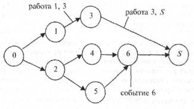
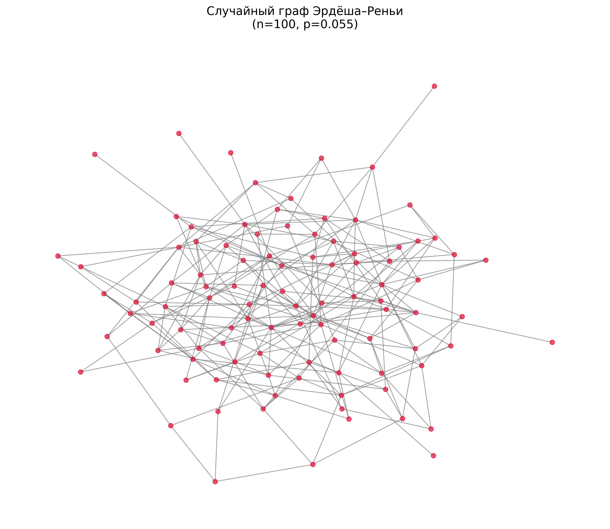
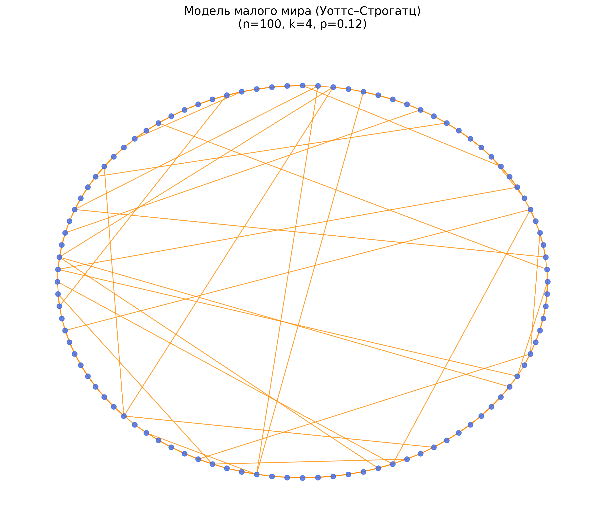
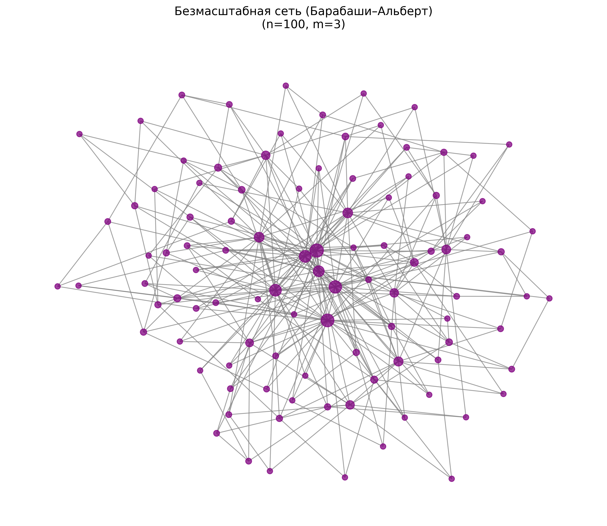
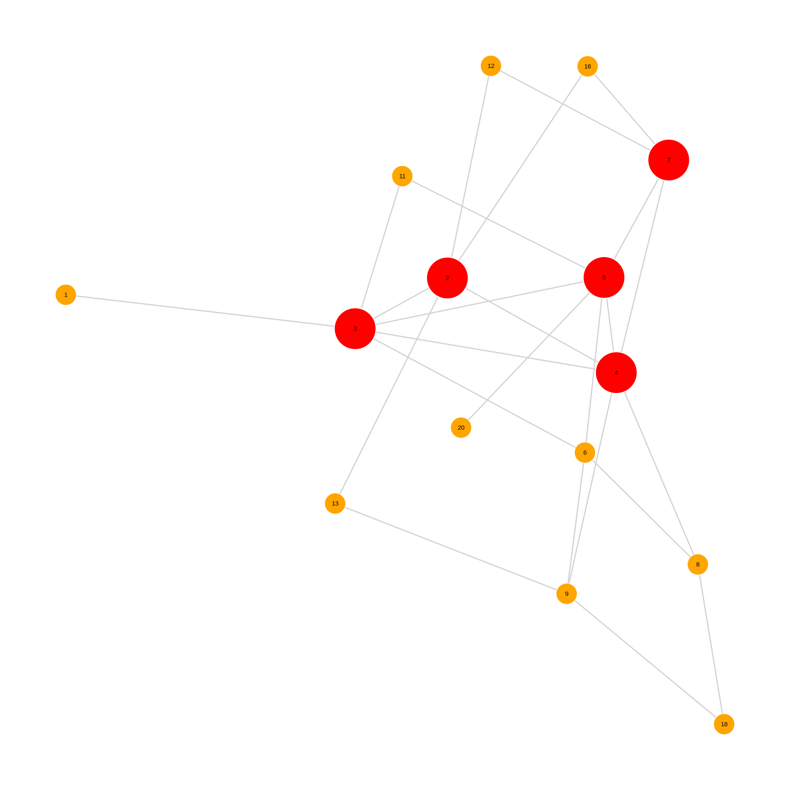
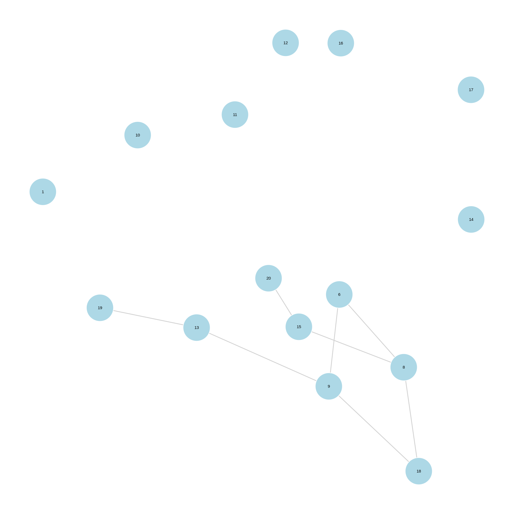

---
## Author
author:
  name: Верниковская Екатерина Андреевна
  degrees: DSc
  orcid: 
  email: 1132236136@rudn.ru
  affiliation:
    - name: Российский университет дружбы народов
      country: Российская Федерация
      postal-code: 117198
      city: Москва
      address: ул. Миклухо-Маклая, д. 6

## Title
title: "Доклад"
subtitle: "Сетевые модели"
license: "CC BY"
---

# Вводная часть

**Актуальность темы и проблема:** современный мир состоит из сложных сетевых структур - от транспортных систем и интернета до социальных и биологических сетей. Ключевая проблема заключается в том, что традиционные математические модели часто не учитывают структурные взаимосвязи между элементами системы. Сетевые модели позволяют описать и проанализировать эти связи, что делает их актуальным инструментом для решения задач оптимизации, прогнозирования и управления в самых разных областях

**Объект и предмет исследования:** в качестве объекта исследования выступают сложные системы различной природы, а предметом исследования являются сетевые модели, позволяющие описывать структуру связей между элементами этих систем и анализировать происходящие в них процессы

**Цель:** цель данного доклада - раскрыть понятие сетевых моделей и показать их роль в математическом моделировании

**Задачи исследования:** изучить основные понятия и элементы сетевых моделей, рассмотреть их классификации, а также проанализировать типовые математические задачи, решаемые на сетях

**Материалы и методы и инструменты исследования:** интернет-ресурсы, аналитика, методы теории графов, язык программирования Julia и специализированные пакеты для работы с сетевыми моделями

# Введение

В современном мире всё чаще приходится иметь дело с системами, состоящими из множества взаимосвязанных элементов: интернет, транспортные сети, социальные сообщества, биологические структуры. Анализ таких систем требует особого подхода, который учитывает не только свойства отдельных компонентов, но и характер связей между ними. Математическим аппаратом, позволяющим это сделать, выступают сетевые модели, основанные на теории графов.

## Что такое сетевая модель в математическом моделировании?

**Сетевая модель** - это математическая модель сложных систем, представляемая в виде графа G=(V,E), где вершины V обозначают объекты системы, а рёбра E отражают связи между ними. В качестве вершин могут выступать события, узлы, этапы работ, организации, устройства или отдельные участники процесса. Рёбра характеризуют зависимости, взаимодействия или потоки между объектами и могут иметь дополнительные параметры: время, стоимость, расстояние, пропускную способность и другие количественные характеристики.

**Важное замечание:** в отдельных видах сетевых моделей, в частности, в сетевом планировании и управлении проектами (методы CPM и PERT), вершины традиционно обозначают события (моменты начала или завершения работ), а рёбра - сами работы (операции с определённой продолжительностью).



Основная цель сетевых моделей - исследовать структуру связей, выявлять важные элементы системы, анализировать её устойчивость и решать оптимизационные задачи [@ieeexplore].

## Значение сетевых моделей в современном мире 

Сетевые модели являются универсальным аппаратом анализа и оптимизации. Они широко применяются в различных областях:

- в информатике - для работы поисковых систем (алгоритм PageRank), анализа социальных сетей и обеспечения кибербезопасности
- в транспортной логистике и управлении потоками
- в эпидемиологии - для моделирования распространения инфекций
- в биологии и нейронауках - при изучении метаболических сетей и структуры мозга
- в экономике и управлении проектами - для анализа цепочек поставок и сетевого планирования

# Структура сетевой модели

Сетевая модель, независимо от области применения, строится на основе нескольких фундаментальных компонентов.

## Основные элементы сетевой модели

Любая сетевая модель состоит из следующих базовых элементов:

- **Вершины (узлы)** - представляют собой объекты или сущности системы. В качестве вершин могут выступать участники процесса, устройства, организации, этапы работ, события или любые другие элементы, между которыми существуют связи
- **Рёбра (связи, дуги)** - отражают отношения, взаимодействия, зависимости или потоки между вершинами

Дополнительно в графах могут присутствовать петли (ребро, соединяющее вершину с самой собой) и кратные рёбра (несколько рёбер между одной и той же парой вершин), хотя в большинстве прикладных моделей они используются относительно редко.

## Виды связей

Связи между вершинами могут существенно различаться в зависимости от характера взаимодействия объектов в реальной системе [@habr]. По своим свойствам рёбра можно классифицировать следующим образом:

- **По направленности:**
	+ Неориентированные (ненаправленные) связи - связи, действующие в обе стороны. Если вершина A связана с вершиной B, то и B связана с A
	+ Ориентированные связи (дуги) - связи, имеющие направление. Движение от вершины A к вершине B не означает наличия связи в обратном направлении

- **По наличию веса:**
	+ Невзвешенные связи - фиксируют только факт наличия или отсутствия связи (бинарный характер: есть/нет)
	+ Взвешенные связи - каждому ребру присваивается числовое значение (вес), которое может отражать расстояние, стоимость, время, пропускную способность или интенсивность взаимодействия.

Такая классификация связей позволяет выбирать подходящий математический аппарат для дальнейшего анализа сети.

## Способы формального задания сетевых моделей

Для математического описания, хранения и компьютерной обработки сетевых моделей используются специальные способы их представления. Наиболее распространёнными являются следующие:

- **Матрица смежности** - квадратная матрица размером $n \times n$, где $n$ - количество вершин. Элемент $a_{ij}$ равен 1 (или весу ребра), если вершины $i$ и $j$ связаны, и 0 - в противном случае. Этот способ обеспечивает быстрый доступ к информации о наличии связи, однако требует значительного объёма памяти $O(n^2)$ при больших разреженных сетях

- **Список смежности** - для каждой вершины хранится список всех смежных с ней вершин (с указанием весов при необходимости). Данный формат является наиболее эффективным и широко используемым на практике, особенно для разреженных графов, так как требует памяти порядка $O(n + m)$, где $m$ - количество рёбер

- **Список рёбер** - простой перечень всех рёбер в виде пар $(i, j)$ или троек $(i, j, w)$ для взвешенных графов. Удобен для ввода данных, но менее эффективен при частом поиске конкретных связей

Кроме того, существует **матрица инцидентности** - матрица размером $n \times m$, элементы которой показывают связь между вершинами и рёбрами. Используется значительно реже и в основном в теоретических исследованиях.

# Классические модели структуры сложных сетей

В теории сетей не существует одной «универсальной» модели. В зависимости от того, как возникают связи между узлами, выделяют три базовых типа, которые служат эталонами для анализа реальных сетей.

## Случайные графы (модель Эрдёша-Реньи, 1959)

В этой модели каждое возможное ребро между вершинами появляется с фиксированной вероятностью ```p``` [@unibo].

Основные свойства: распределение степеней вершин близко к пуассоновскому, отсутствуют ярко выраженные «лидеры». 

Модель служит «нулевой» базой для сравнения с реальными сетями.



## Модели малого мира (Уоттс-Строгатц, 1998)

Объясняет эффект «шести рукопожатий». Сеть начинается как регулярная решётка, после чего часть связей случайным образом перебрасывается на дальние вершины [@stanford].

Результат: высокая локальная кластеризация (соседи хорошо связаны между собой) при очень малой средней длине пути между любыми двумя вершинами.

Применение: социальные сети, нейронные сети мозга, энергосистемы.



## Безмасштабные сети (модель Барабаши-Альберт, 1999) {#sec-scale-free}

Основана на механизме предпочтительного присоединения: новые вершины с большей вероятностью подключаются к уже популярным узлам [@geeksforgeeks].

В результате возникает небольшое количество хабов (вершин с очень высокой степенью) и много слабо связанных вершин. Распределение степеней подчиняется степенному закону.
Такие сети устойчивы к случайным сбоям, но очень уязвимы к целенаправленным атакам на ключевые узлы.

Применение: интернет, социальные сети, научное цитирование, метаболические сети.



# Типовые математические задачи, решаемые на сетевых моделях

Сетевые модели позволяют эффективно решать широкий класс оптимизационных задач. Рассмотрим наиболее важные из них.

## Задача о кратчайшем пути

**Постановка задачи.** Дан взвешенный граф, рёбра которого имеют неотрицательные веса (расстояние, время, стоимость). Требуется найти путь от заданной начальной вершины до конечной с минимальной суммарной стоимостью.

**Метод решения.** Наиболее известным и эффективным алгоритмом решения данной задачи является **алгоритм Дейкстры.** Его идея заключается в пошаговом «расширении фронта» известных кратчайших расстояний от исходной вершины. Алгоритм гарантирует нахождение оптимального решения при условии неотрицательности весов рёбер.

**Области применения:** навигационные системы (построение оптимальных маршрутов), маршрутизация данных в компьютерных сетях, логистика и планирование доставок.

## Задача о максимальном потоке

**Постановка задачи.** В ориентированном взвешенном графе заданы источник и сток. Каждое ребро обладает определённой пропускной способностью. Требуется найти максимальный поток из источника в сток, не превышающий пропускные способности рёбер.

**Метод решения.** Классическим методом решения является **алгоритм Форда–Фалкерсона,** основанный на поиске увеличивающих путей. Теорема о максимальном потоке и минимальном разрезе утверждает, что величина максимального потока равна пропускной способности минимального разреза.

**Области применения:** транспортные и трубопроводные системы, распределение ресурсов в компьютерных сетях, управление логистическими потоками.

## Задача о минимальном остовном дереве

**Постановка задачи.** Дан связный взвешенный граф. Требуется найти подмножество рёбер, которое соединяет все вершины графа, не содержит циклов и обладает минимальной суммарной стоимостью. Полученная структура называется **минимальным остовным деревом.**

**Методы решения.** Задача решается жадными алгоритмами:

- **Алгоритм Прима** - начинает с произвольной вершины и на каждом шаге добавляет ребро минимального веса, соединяющее дерево с новой вершиной.
- **Алгоритм Краскала** - сортирует все рёбра по возрастанию веса и добавляет их, если они не образуют цикл.

**Области применения:** проектирование дорожных сетей, прокладка линий электропередач и трубопроводов, построение минимально затратных коммуникационных сетей.

## Сетевое планирование и управление проектами

**Постановка задачи.** Имеется комплекс взаимосвязанных работ, образующих проект. Каждая работа имеет определённую продолжительность, а между работами существуют технологические зависимости (предшествование).

**Методы решения.** Проект представляется в виде сетевого графа, в котором вершины соответствуют событиям, а рёбра - работам. Основными методами являются:

- **Метод критического пути (CPM)** - позволяет определить минимальное время выполнения проекта и выявить критические работы (работы без временного резерва).
- **Метод PERT** - используется в условиях стохастической продолжительности работ и позволяет оценивать вероятность завершения проекта в заданные сроки.

**Области применения:** управление строительными проектами, разработка новых продуктов, планирование сложных мероприятий и научно-исследовательских работ.

## Задача о назначении

**Постановка задачи.** Имеется множество исполнителей и множество работ (задач). Каждый исполнитель может быть назначен на любую работу, однако эффективность (стоимость или время выполнения) зависит от конкретной пары «исполнитель-работа». Требуется найти такое назначение, при котором суммарная стоимость (или время) будет минимальной, при условии, что каждый исполнитель выполняет ровно одну работу и каждая работа выполняется ровно одним исполнителем.

**Метод решения.** Задача может быть сведена к задаче о потоке минимальной стоимости в сети или решена с помощью **венгерского алгоритма.** В графовой постановке она представляется как задача поиска совершенного паросочетания минимального веса в двудольном графе.

**Области применения:** распределение сотрудников по проектам, назначение транспортных средств на маршруты, составление расписаний, оптимальное распределение ресурсов.

# Практическая реализация

В теоретической части (@sec-scale-free) было отмечено, что безмасштабные сети демонстрируют высокую устойчивость к случайным отказам узлов, но крайне уязвимы к целенаправленным атакам на хабы. Для проверки этого свойства на практике была разработана вычислительная экспериментальная установка на языке программирования Julia с использованием библиотек ```Graphs.jl``` и ```GraphPlot.jl```:

```{julia}
using Graphs, GraphPlot, Random, Compose, Cairo, Fontconfig, Colors

Random.seed!(42)

N = 20
REMOVE_K = 5

NODE_SIZE = 0.002
EDGE_WIDTH = 2.0
LABEL_SIZE = 30
IMG_W = 500
IMG_H = 500

if !isdir("plots")
    mkdir("plots")
end

g = barabasi_albert(N, 2)

x, y = spring_layout(g)

function largest_comp_size(g)
    comps = connected_components(g)
    isempty(comps) ? 0 : maximum(length, comps)
end

function components_count(g)
    length(connected_components(g))
end

function density_graph(g)
    nv(g) <= 1 && return 0.0
    2ne(g) / (nv(g)*(nv(g)-1))
end

function save_png(name, plot)
    img = compose(
        Compose.context(),
        Compose.rectangle(),
        fill("white"),
        plot
    )
    draw(PNG(name, IMG_W, IMG_H), img)
end

function keep_coords(vec, removed)
    inds = setdiff(1:length(vec), removed)
    vec[inds]
end

function report(title, g)
    println(title)
    println("   Вершин:                 ", nv(g))
    println("   Рёбер:                  ", ne(g))
    println("   Компонент связности:    ", components_count(g))
    println("   Крупнейшая компонента:  ", largest_comp_size(g))
    println("   Плотность:              ", round(density_graph(g), digits=3))
    println()
end

g_rand = copy(g)
rand_vertices = shuffle(collect(1:N))[1:REMOVE_K]

println("Удалённые случайные вершины: ", rand_vertices)

for v in sort(rand_vertices, rev=true)
    rem_vertex!(g_rand, v)
end

x_rand = keep_coords(x, rand_vertices)
y_rand = keep_coords(y, rand_vertices)

g_hubs = copy(g)

degrees = [degree(g_hubs, v) for v in 1:nv(g_hubs)]
hubs = sortperm(degrees, rev=true)[1:REMOVE_K]

println("Удалённые хабы: ", hubs)

for v in sort(hubs, rev=true)
    rem_vertex!(g_hubs, v)
end

x_hubs = keep_coords(x, hubs)
y_hubs = keep_coords(y, hubs)

println("\nСохраняем изображения...")

# Исходный
p1 = gplot(
    g, x, y,
    nodelabel=1:nv(g),
    nodefillc=colorant"deepskyblue",
    nodesize=NODE_SIZE,
    edgelinewidth=EDGE_WIDTH,
    nodelabelsize=LABEL_SIZE
)

save_png("plots/1_original.png", p1)

# Случайное удаление
p2 = gplot(
    g_rand, x_rand, y_rand,
    nodelabel=1:nv(g_rand),
    nodefillc=colorant"orange",
    nodesize=NODE_SIZE,
    edgelinewidth=EDGE_WIDTH,
    nodelabelsize=LABEL_SIZE
)

save_png("plots/2_random_deletion.png", p2)

# Удаление хабов
p3 = gplot(
    g_hubs, x_hubs, y_hubs,
    nodelabel=1:nv(g_hubs),
    nodefillc=colorant"red",
    nodesize=NODE_SIZE,
    edgelinewidth=EDGE_WIDTH,
    nodelabelsize=LABEL_SIZE
)

save_png("plots/3_targeted_deletion.png", p3)

println("✓ 1_original.png")
println("✓ 2_random_deletion.png")
println("✓ 3_targeted_deletion.png")

println("\n" * "="^60)
println("РЕЗУЛЬТАТЫ ЭКСПЕРИМЕНТА")
println("="^60)

report("Исходная сеть:", g)
report("После случайного удаления:", g_rand)
report("После удаления хабов:", g_hubs)

println("ИНТЕРПРЕТАЦИЯ:")
println("Если после удаления хабов крупнейшая компонента резко меньше")
println("или число компонент больше — сеть уязвима к целевым атакам.")
println("="^60)

println("\nФайлы сохранены:")
println("plots/1_original.png")
println("plots/2_random_deletion.png")
println("plots/3_targeted_deletion.png")
```

## Описание эксперимента

1. **Генерация сети** - построена безмасштабная сеть по модели Барабаши–Альберт с 20 вершинами (параметр m = 2)
2. **Визуализация исходной сети** - отображена структура связей с выделением вершин
3. **Сценарий 1: случайный отказ** - из сети удалены 5 случайных вершин
4. **Сценарий 2: целенаправленная атака** - удалены 5 вершин с наибольшей степенью («хабы»)
5. **Анализ метрик для каждого сценария:**
	- количество вершин и рёбер
	- число компонент связности
	- размер крупнейшей компоненты
	- плотность графа

Результаты визуализированы на рисунках ([рис. @fig-001]), ([рис. @fig-002]), ([рис. @fig-003]), а числовые метрики сведены в (табл. \ref{table:table})

## Результаты эксперимента

- **Исходная безмасштабная сеть.** На изображении отчётливо видны узлы с высокой степенью (хабы), которые удерживают вместе крупные кластеры ([рис. @fig-001])

{#fig-001 width=70%}

- **После случайного удаления 5 вершин.** Сеть сохраняет связность, крупнейшая компонента незначительно уменьшается. Графически структура остаётся узнаваемой ([рис. @fig-002])

{#fig-002 width=70%}

- **После целенаправленного удаления хабов.** Сеть распадается на множество мелких изолированных компонент. Крупнейшая компонента резко сокращается ([рис. @fig-003])

{#fig-003 width=70%}

Для количественного подтверждения визуальных наблюдений были рассчитаны ключевые характеристики сети на каждом этапе эксперимента. Сопоставление этих параметров позволяет объективно оценить степень разрушения структуры при разных типах воздействия.

\begin{table}[H]
\centering
\footnotesize
\caption{Численные результаты эксперимента}
\label{table:table}
\begin{tabular}{|p{3cm}|p{2cm}|p{2cm}|p{2cm}|p{2cm}|p{2cm}|}
\hline
\textbf{Сценарий} & \textbf{Вершин} & \textbf{Рёбер} & \textbf{Компонент связности} & \textbf{Крупнейшая компонента} & \textbf{Плотность} \\ \hline
Исходная сеть & 20 & 36 & 1 & 20 & 0,189 \\ \hline
После случайного удаления & 15 & 19 & 1 & 15 & 0,181 \\ \hline
После удаления хабов & 15 & 8 & 8 & 8 & 0,076 \\ \hline
\end{tabular}
\end{table}


## Вывод по практической реализации

Эксперимент полностью подтверждает теоретическое положение о свойствах безмасштабных сетей:

- **При случайных отказах** сеть сохраняет связность, а крупнейшая компонента охватывает все оставшиеся вершины. Структура практически не разрушается.
- **При целенаправленном выводе хабов** сеть фрагментируется на множество мелких изолированных компонент, а размер крупнейшей из них резко сокращается. Плотность сети снижается более чем вдвое.

Это демонстрирует ключевой компромисс при проектировании реальных сетевых систем (интернет, энергосети, транспортные хабы): высокая эффективность в нормальном режиме достигается ценой опасной уязвимости к атакам на ключевые узлы. Защита хабов становится критической задачей обеспечения отказоустойчивости.

# Выводы

Таким образом, сетевые модели являются универсальным и эффективным языком описания сложных систем, где важно не просто наличие элементов, а структура связей между ними. Они позволяют выявлять скрытые закономерности, оценивать устойчивость системы к сбоям или атакам, прогнозировать распространение процессов (информации, инфекций, потоков) и решать широкий класс оптимизационных задач. Благодаря сочетанию наглядности, математической строгости и вычислительной реализуемости сетевые модели стали незаменимым инструментом в самых разных областях - от управления проектами и транспортной логистики до биоинформатики и анализа социальных сетей. Их ключевая сила заключается в том, что одна и та же математическая структура (граф) позволяет моделировать системы совершенно разной природы, а выбор конкретной модели (случайной, малого мира или безмасштабной) диктуется реальными свойствами исследуемой сети.

# Список литературы{.unnumbered}

::: {#refs}
::: 
